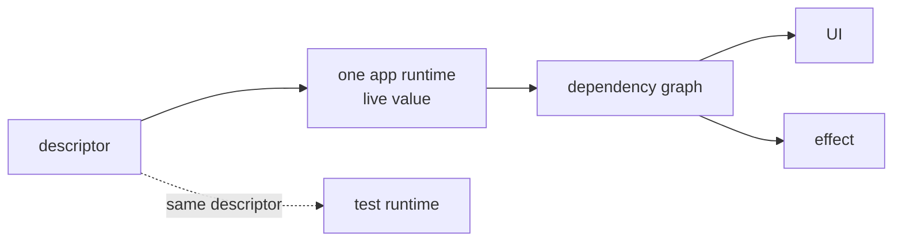

# Cog: shared state model

_Authored August 21, 2026._

Cog has separate Swift and Kotlin libraries. This page defines the behavior
they share. The [Swift](./swift/README.md) and [Kotlin](./kotlin/README.md) docs
define their own APIs, runtimes, UI support, and internal designs.

Platform choices do not become shared rules just because both libraries use
them. See [design history](./history.md) only when you need background.

## Why Cog exists

Cog manages an app as a graph of small state values. Some values are writable
sources. Others are computed from them. This gives each fact one source of
truth and lets the UI update only where a value changed.

Cog also solves two common problems:

- Heavy setup can push features to create their own state systems. Then one
  fact may have several writable copies.
- Separate streams can publish one at a time. A reader may then see a new
  input with an old computed value.

Cog keeps setup small and publishes each change as one complete state.

## Core rules

1. **Keep it simple.** State should be easy to declare, read, and change on
   each platform.
2. **Make every read correct.** A normal read uses the last complete turn and
   updates every value it needs first. It never returns a mixed or stale state.
3. **Keep overhead low.** Avoid extra user code, UI work, memory use, locks,
   and bookkeeping. Use measurements to choose internal designs.
4. **Keep one source of truth.** One running app has one Cog graph. Each
   mutable fact has one writable source in that graph. Screens and features do
   not create their own copies.

Speed must not weaken correctness or create more sources of truth. Internal
speed work must not make normal app code harder to read.

## Main parts

| Part               | Meaning                                                                     |
| ------------------ | --------------------------------------------------------------------------- |
| Descriptor         | A stable name for state; it does not hold the app's live value              |
| Source             | The one writable input for a mutable fact                                   |
| Automatic state    | A saved value computed from other state                                     |
| Keyed box          | One state shape used for many keys, such as account IDs                     |
| Runtime            | The app-wide owner of values, graph links, turns, lifetimes, and async work |
| Read capability    | The limited object used for tracked or untracked reads                      |
| Writer             | The turn-only object used to stage source values                            |
| Operation          | A named app action that changes the graph                                   |
| Reaction or effect | Work that changes something outside the graph                               |
| UI boundary        | Native UI tracking for the exact state a UI scope reads                     |

Platform names differ where needed:

| Shared part       | Swift                                        | Kotlin                                        |
| ----------------- | -------------------------------------------- | --------------------------------------------- |
| Runtime           | `Cogs`                                       | `CogStore`                                    |
| Keyed state       | `CogBox` and value references                | `CogBox` and descriptor-plus-key reads        |
| Operation         | a `CogOps` method                            | a `CogStore` extension                        |
| Side-effect owner | assembly `Mechanism`                         | lifecycle-owned `CogEffects`                  |
| Async state       | `CogStatus` through the optional status lens | `CogPhase`                                    |
| UI boundary       | Observation and the SwiftUI environment      | Compose `State` and a composition-local store |

### Descriptors name state; runtimes store it

A descriptor defines identity and behavior. It does not store a live app
value. The app runtime stores that value and its graph links. Tests can use the
same descriptor in a separate runtime without changing production state.

Production has one runtime. Features may own descriptor files, but they do not
own separate graphs. State that matters only to one view stays in the native
view-state tool. Rebuilding a screen must not reset Cog state. A named operation
resets it when the app calls for a reset.

### Sources and automatic state

Use a source where data enters the graph, such as a user choice, service result,
clock tick, or outside event. Most other state should be automatic: a read-only
value computed from the state it reads.

Each run records its real reads as dependencies. A branch can stop reading one
parent and start reading another. A keyed loop can add or remove parents. The
runtime updates the graph links after the run.

An untracked read is available when a value should affect an action but should
not trigger it again. Its API must stand out. Normal computed state and effects
use tracked reads.

A dependency cycle is a programmer error. The error must show the descriptor
and key path that formed the cycle.

### Keyed state

A keyed box defines one state shape for many items. The descriptor and key
together form the state identity. A change to one ZIP code, account, or row
does not notify every item in the box.

Unused keyed values may expire based on platform lifetime and cache rules. Each
platform chooses how keys are passed, hashed, and stored.

## Reads and turns

A **turn** is one complete graph change. A normal read uses the last finished
turn. Before it returns, the runtime updates, or **settles**, the needed path.
It does not update every possible value after every source write.

A writer read during a turn sees source values already staged by that turn.
This makes read-change-write work correct without showing partial state.

One outer `turn` call:

1. stages source writes through a writer;
2. drops writes equal to the current value;
3. marks possible changes below those sources;
4. settles live values that must be current;
5. publishes changed values to UI and stream readers; and
6. runs affected effects in a fixed order.

Unused branches stay lazy. If an automatic value stays equal, the change stops
there. A reaction may ask for another turn, but it cannot change the finished
turn it is reading.

Swift runs its graph on the MainActor. Kotlin's first design uses the Compose
snapshot system on the store lane with a small Cog policy layer. Both must meet
the read and turn rules above.

## Writes are named operations

App code calls a clear action such as `selectLocation`, `acceptWeather`, or
`increment`. That operation starts the turn and owns access to its private
sources. A button, effect, or service callback does not write directly to graph
storage.

This makes writes easy to find and keeps one writer for each fact. Swift uses
access control and CogLint. Kotlin uses private descriptors and writer-only
extensions.

Put related source writes in one turn when readers must see them together. For
example, publish a weather report and its warning flag in the same turn.

## Async state

A turn does not wait for outside work. A tracked selector reads its inputs and
describes the work. Starting, success, failure, replacement, and each stream
item enter the graph in their own complete turns.

Both platforms must show uncertainty clearly:

- pending, success, and failure are different states;
- no accepted value is different from an accepted optional value;
- an old result cannot publish after newer work replaces it; and
- overlap follows a named rule such as latest, queue, or exhaust-latest.

Swift normally returns the last accepted value, or its declared default, and
puts request details in `CogStatus`. Kotlin's first design returns `CogPhase`,
which includes the previous value. The case names may differ; honest status and
safe stale results may not.

Freshness and lifetime are separate. A saved value may be old but still kept.
A fresh value may have no users and be ready to release. Work that must survive
app shutdown belongs in platform storage and background tools, not a long-lived
Cog task.

## Effects stay outside computed state

Automatic state only computes state. It does not navigate, log, write files,
send notices, or call hardware. A named reaction or effect owns that work and
has a clear lifetime.

An effect may track graph state, make untracked reads, call services, and ask
for a later operation. Its writes never join the turn that triggered it.

- UI-only work uses the native UI lifetime.
- App-session work uses an app-owned effect or mechanism.
- Work promised after app shutdown needs saved input and an operating-system
  scheduler.

Swift registers mechanisms during app startup. Kotlin effect groups may belong
to the app or a screen and close with that owner. This is a platform difference,
not a change to the state/effect boundary.

## UI updates

UI code reads Cog through its platform bridge. The bridge tracks the exact
descriptor and key read by each UI scope. Only readers of a changed value update.
If an automatic value stays equal, its UI readers do not update.

One app runtime does not mean one large view model or full-screen update.
Features group declarations and operations. Views pass normal values and IDs.
They do not copy Cog values into another writable UI model.

Swift bridges UI-read values to Observation. Kotlin uses Compose snapshot state
if it can keep the same turn rules. The platform docs define exact tracking and
lifetime behavior.

## Lifetime and ownership

The runtime owns graph storage for the app session. UI reads, effects, streams,
and explicit hosts keep needed paths alive. When the last user leaves, automatic
or async keyed state may wait for a grace period, cancel work, remove graph
links, and release saved values.

Sources are kept longer because they are the source of truth. A source may reset
when unused only if it clearly opts into that behavior. Query freshness, cache
time, graph use, and app lifetime remain separate ideas.

Each test or preview is its own app runtime. It owns one isolated graph and
shuts down that graph as one unit.

## Identity and debugging

Runtime identity must stay stable for the life of a descriptor and key. A name
shown to a person is separate. Source locations can help label debug output,
but line numbers and stack traces are not stable identity.

Turn history and graph data should answer:

- What operation started this turn?
- Which sources changed?
- Which automatic values ran, and why?
- Which graph links changed?
- Which equal results were dropped?
- Which async jobs are active, replaced, failed, or complete?
- Which UI readers, streams, reactions, or effects were told?

A release need not include a full debugger. Its internal choices should still
keep enough data to build one. Do not put logging side effects in selectors.

## Tests and migration

Tests use isolated runtimes with controlled time and completion events. They
can set starting state, test automatic values, call operations, control async
order, check effect order and cleanup, and run the same public tests against
more than one internal design.

Silent test setup is not a production write path. To test app startup, use the
same mechanisms, effects, or startup inputs as production.

Migration tools may connect old observable state, streams, or data stores one
piece at a time. Each bridge must say which side can write. Do not keep two
writable copies in sync for the long term.

## Platform choices

Each platform chooses its own:

- actors, threads, snapshots, locks, and queues;
- public names and APIs;
- Observation, Compose, Flow, and AsyncSequence support;
- storage, key, graph-link, and specialization designs;
- effect lifetime and dependency injection;
- saved state and background work; and
- release plan and compatibility promises.

A platform may learn from the other's work, but it must record and test its own
choice before using it.
