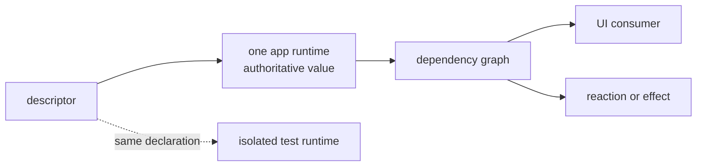

# Cog: shared state model

_Authored August 21, 2026._

Cog has separate Swift and Kotlin libraries, but they implement one state
model. This document owns that shared model: the problem Cog solves, the terms
the two designs use in common, and the behavior that should survive translation
between platforms. The [Swift](./swift/README.md) and
[Kotlin](./kotlin/README.md) documents own their public APIs, runtime
mechanics, UI integration, and implementation decisions.

This split is deliberate. A shared invariant is useful only when it says
something stronger than “the libraries resemble each other.” A Swift choice
does not become an Android requirement, or the reverse, merely because both
libraries implement the same invariant.

The project grew out of a Dart and Flutter state system. Its design lineage and
the decisions carried forward from that work live in [history.md](./history.md).

## Why Cog exists

Cog began with a graph of small state facts. Some facts were writable inputs;
others were pure functions of those inputs. That model gave each fact one
source of truth, made causes visible, and let the UI update only where a value
actually changed.

The old implementation lost those benefits in practice for two reasons.

First, adding state required enough framework ceremony that features often
built smaller state systems beside it. The app then had several writable
versions of the same fact and no longer had one authoritative state model.

Second, chains of independently notifying streams exposed intermediate
states. One observer could read a new upstream value with an old downstream
value while a change was still propagating. The original notes called this the
“telephone problem.” Fine-grained updates are not correct if they tear one
logical change into incompatible snapshots.

Cog keeps the graph and removes those failure modes. It should look like
ordinary declarations, reads, and domain operations while one runtime owns the
ordering, dependency, lifetime, and diagnostic machinery.

## Principles

Four principles constrain both libraries:

1. **Cog should feel simple.** Declaring, reading, and changing state should
   look natural on the host platform. Runtime complexity stays behind that
   surface.
2. **Every state read should be correct.** A normal read uses the latest
   completed turn and settles every dependency needed for the requested value.
   It never exposes a torn update or a stale automatic value.
3. **Cog should minimize runtime overhead.** Avoid unnecessary user-code
   execution, UI work, allocation, synchronization, and bookkeeping. Physical
   representations are chosen with measurements.
4. **Cog state should be singular.** One running app has one authoritative Cog
   graph, and each mutable fact represented in Cog has one writable source in
   it. Screens and features do not create state islands or mirror sources.

Correctness and singular state are constraints on performance, not costs to
trade away. Performance is likewise a constraint on internal design, not a
reason to make ordinary application code expose the runtime's machinery.

## The model

Both platforms use the same small set of jobs:

| Job                | Shared meaning                                                                 |
| ------------------ | ------------------------------------------------------------------------------ |
| Descriptor         | A stable name for state; it does not contain the app's live value              |
| Source             | The one writable input for a mutable fact                                      |
| Automatic state    | A cached value computed from other state                                       |
| Keyed box          | One declaration describing the same state shape for many keys                  |
| Runtime            | The app-wide owner of values, graph metadata, turns, lifetimes, and async work |
| Read capability    | The scoped object through which reads are tracked or deliberately untracked    |
| Writer             | The turn-scoped capability that stages source values                           |
| Operation          | A named domain action that asks the graph to change                            |
| Reaction or effect | Work at the graph's edge that changes something outside it                     |
| UI boundary        | The native observation mechanism that tracks exactly what a UI scope read      |

The spellings differ where the platforms differ:

| Shared job        | Swift                                          | Kotlin                                        |
| ----------------- | ---------------------------------------------- | --------------------------------------------- |
| Runtime           | `Cogs`                                         | `CogStore`                                    |
| Keyed family      | `CogBox` and its value references              | `CogBox` and descriptor-plus-key reads        |
| Domain operation  | a method on `CogOps`                           | a `CogStore` extension                        |
| Side-effect owner | bootstrap-registered `Mechanism`               | lifecycle-owned `CogEffects`                  |
| Async uncertainty | `CogStatus` behind an opt-in status lens       | `CogPhase`                                    |
| UI boundary       | Observation and SwiftUI environment resolution | Compose `State` and a composition-local store |

### Descriptors name; the runtime stores

A declaration is inert identity and behavior. The production runtime resolves
that declaration to the app's live value and graph state. An isolated test can
resolve the same declaration in a different runtime without resetting global
storage.

Production has one runtime. Declarations may live beside any feature, but
their values do not live in feature-owned graphs. State that is genuinely
local to one view and has no graph meaning stays in the platform's native
view-local facility. Recreating a screen does not silently create or reset an
authoritative Cog source; a named operation performs a reset when the domain
requires one.

### Sources, automatic state, and dependencies

Most state should be automatic. A source marks a boundary where information
enters the graph: a user choice, a service result, a clock tick, or another
external fact. An automatic declaration is read-only and computes a value from
the sources and automatic values it reads.

Dependencies come from actual reads on each run. A branch may stop reading one
parent and start reading another; a keyed loop may add and remove parents as
its input changes. The runtime reconciles the new dependency set with the old
one. This makes early returns ordinary control flow rather than a special
reactive operator.

An untracked read exists for cases where a value influences an action but must
not become a dependency. Its spelling is intentionally conspicuous. Normal
automatic and reactive code uses tracked reads.

Cycles are programmer errors. A failure should identify the descriptor-and-key
path rather than leave a value half-computed.

### Keyed state

Applications repeatedly need the same state shape for many entities. A keyed
box names that family once; a key selects one member. The runtime treats the
descriptor and key together as state identity.

Keys make entity boundaries explicit and permit fine-grained invalidation. A
change for one ZIP code, account, or row does not invalidate every member of
the family. Unused members may have shorter lifetimes than their declaration,
subject to the platform's lease and cache rules.

The common model does not prescribe how a key is carried, hashed, or passed
through an API. Those are platform and benchmark decisions.

## Reads, turns, and settlement

A normal read observes the latest completed turn. Before returning, it settles
the dependency path needed for that value. The graph does not eagerly
recompute every possible descendant after every source write.

A writer read is intentionally different: during a turn it sees source
values already staged by that turn. That makes read-modify-write and coordinated
writes correct without publishing an intermediate state.

One outer call to `turn` creates one graph turn. At a high level, that turn:

1. stages source writes behind a writer capability;
2. discards writes whose values are equal under their state policy;
3. marks possible downstream changes;
4. settles the live roots that must be current before publication;
5. exposes changed values to native UI and stream boundaries; and
6. runs affected reactions in a deterministic order.

Cold branches remain lazy. Equality at each automatic value stops propagation
when the result did not change. A reaction that requests another write creates
a later turn; it cannot mutate the completed turn it is observing.

The native transaction mechanism and exact flush algorithm are platform
choices. Swift owns its graph and runs it on the MainActor. Kotlin's first
design uses the Compose snapshot runtime on the store lane and retains a small
Cog policy layer around it. Both must satisfy the read and turn contract above.

## Writes are named domain operations

Application code calls a domain verb such as `selectLocation`, `acceptWeather`,
or `increment`. That operation owns the primitive turn and has access to the
private sources it may change. A button, effect, or service callback does not
open an anonymous write against graph storage.

This keeps the write surface searchable and preserves one writable owner per
fact without requiring a runtime “feature object.” Swift uses access control
and CogLint conventions; Kotlin uses private descriptors and writer-scoped
member extensions. The enforcement mechanism may differ, but the ownership
rule does not.

Several related source changes belong in one turn when observers must see them
together. A weather report and its advisory flag, for example, must not appear
as a new report paired with an old advisory.

## Async state

Async work does not suspend a turn until the outside world responds. The
tracked selector synchronously reads its inputs, then describes work. Starting,
succeeding, failing, being replaced, and producing a stream element enter the
graph as separate, coherent turns.

Both platforms make uncertainty explicit rather than smuggling it into an
ordinary value:

- a request distinguishes pending, successful, and failed work;
- a previous accepted value is not confused with no accepted value, including
  when the value type itself is optional;
- stale completions cannot publish after newer inputs or a newer request have
  superseded them; and
- overlap follows an explicit policy such as latest, queue, or exhaust-latest.

The public value shape is platform-specific. Swift normally returns the last
accepted success or declared default and exposes request state through
`CogStatus`. Kotlin's first design exposes `CogPhase`, including its previous
value. The shared contract is honest uncertainty and stale-result safety, not
identical cases or names.

Freshness and lifetime are separate. A value can be stale but retained, or
fresh but unused and eligible for release. Durable work that must survive
process death belongs in platform persistence and background facilities, not
in an unusually long-lived Cog task.

## Effects stay at the graph's edge

Automatic state describes state; it does not send notifications, navigate, log,
write files, or call hardware. Those consequences belong to a named reaction
or effect owner with an explicit lifetime.

An effect may track graph state, inspect other state without tracking it, call
services, and request a later domain operation. Its writes never join the turn
that triggered it. Work tied only to one UI scope stays in the native UI
lifecycle. Work tied to an app session belongs to an app-owned mechanism or
effect scope. Work promised beyond process death requires durable input and a
platform scheduler.

Swift registers every mechanism during app bootstrap. Kotlin effect groups may
be application- or screen-owned and close with their owner. This is an
intentional platform difference around the same state-versus-effect boundary.

## Native UI, precise invalidation

The UI reads state directly through its platform boundary and subscribes at
the smallest useful scope. A change invalidates only consumers that read the
changed descriptor and key. Automatic equality prevents an upstream change from
reaching UI whose actual value stayed equal.

One app runtime does not imply one giant view model or global recomposition.
Features organize declarations and operations; views pass ordinary domain
values and identities. They do not copy Cog values into a second writable UI
model merely to fit navigation or screen ownership.

Swift bridges the graph to Observation only for UI-seen values. Kotlin reuses
Compose snapshot state directly if the spike proves it can preserve Cog's turn
contract. Each platform document owns the exact tracking and lifetime rules.

## Lifetime and ownership

The runtime owns graph storage for the app session. Live UI reads, reactions,
streams, and explicit hosts keep the paths they need active. When the final
consumer leaves, automatic and async keyed state may enter a grace period, cancel
work, drop edges, and release cached values.

Source lifetime is more conservative because a source is authoritative. A
source that resets when unused must opt into that semantic explicitly. Query
freshness, cache retention, graph reachability, and app-runtime lifetime are
separate concepts even when one implementation uses the same timer or lease to
manage several of them.

Tests and previews are separate app runtimes, not exceptions inside the
production graph. Each owns exactly one isolated graph and tears it down as a
unit.

## Identity, history, and explanation

Runtime identity must be stable for the life of a declaration and key; a
human-readable label is separate from that identity. Source locations may
supply development labels, but line numbers, stack traces, or minified names
are not durable identity.

Named turns and graph metadata should make these questions answerable:

- Which operation started this turn?
- Which source values changed?
- Which automatic values ran, and which dependencies caused them to run?
- Which edges were added or removed?
- Which results were filtered out as equal?
- Which async generations are active, superseded, failed, or complete?
- Which UI boundaries, streams, reactions, or effects were notified?

Not every release must ship a full debugger, but implementation choices should
not erase the information needed to build one. Diagnostic history is part of
the state model, not a reason to put logging into selectors.

## Testing and migration

Behavior tests use isolated runtimes with deterministic time and completion
signals. They can:

- seed the world before observers or effects start;
- prove automatic computation from controlled dependencies;
- call a domain operation and inspect its writes and outside calls;
- drive overlapping async generations and out-of-order completions;
- verify reaction order, lifetime cleanup, and exact UI invalidation; and
- run the same public behavior suite across internal representations.

Quiet seeding is a testing capability, not an application write path. A test
that needs production initialization supplies the same mechanisms, effects, or
bootstrap inputs the app uses.

Migration adapters may bridge existing observable state, streams, or
repositories one boundary at a time. They should identify which side owns the
writable fact and avoid keeping two authorities synchronized indefinitely.

## What remains platform-specific

The shared model intentionally does not choose:

- actor, thread, snapshot, lock, or queue mechanics;
- public constructors, accessors, status cases, or naming conventions;
- Observation, Compose, Flow, or AsyncSequence integration details;
- storage layout, key representation, edge representation, or specialization;
- effect-owner lifetime and dependency-injection style;
- persistence and operating-system background-work facilities; or
- release milestones and compatibility promises.

Those decisions live in the platform sets. A platform may learn from the
other's measurements or API experience, but it records and validates its own
choice before adopting it.
