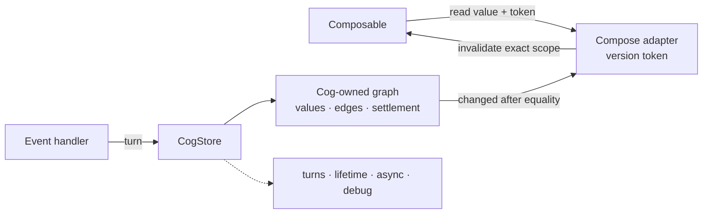

# Cog for Kotlin and Jetpack Compose

_Authored August 6, 2026._

Cog is a fine-grained state graph for Android UI. It uses the same runtime
model as Cog for Swift. Compose state connects each changed Cog value to the UI
scopes that read it.

The goal is small code that stays correct under change.

## Shared foundation

The [shared state model](../design.md) owns Cog's runtime behavior, principles,
and vocabulary. On Kotlin, its single runtime is one process-wide `CogStore`;
correct reads settle through the Cog-owned graph on the store lane; async
uncertainty is explicit in `CogPhase`; and a small Compose adapter tracks UI
reads and invalidates their scopes. The application value stays in the graph.

## Start here

1. [Shared state model](../design.md)
2. [§1–§5 and §7–§11: core design](exploration.md)
3. [Full weather feature](example.md)
4. [§5.4: Flow and reactive-library mapping](flows.md)
5. [§6: effects and background work](effects.md)
6. [Performance model and spike plan](perf.md)
7. [Design history](../history.md)

The section numbers match the Swift set where that helps comparison. The
Kotlin docs choose language spelling, physical representation, and native
adapters for the shared state model.

## The short version

One process-wide `CogStore` owns the production graph. A descriptor
such as `Cog<User>` names one value in that graph. A keyed descriptor
such as `CogBox<User, UserId>` names a set of values.

Cog owns the runtime parts:

- the app creates one store and shares it across every screen;
- descriptors have stable identity and readable debug labels;
- the store owns source and cached automatic values;
- selectors record dynamic dependency edges in the Cog graph;
- writable descriptors stay private;
- named turns stage and publish complete changes;
- equality stops propagation before any UI notice;
- UI, reactions, and Flow collectors keep only the graph they need alive;
- async state is explicit in `CogPhase`;
- debug builds can explain why a value changed.

Compose tracks the scope that reads a small version token. Changing the token
invalidates that scope. Cog creates the token when a state first reaches
Compose and continues to hold and compute the value itself.



The common path stays small:

```kotlin
private val countSource = ManualCog(0)
val count = countSource.readOnly
val doubled = Cog { get(count) * 2 }

fun CogStore.increment() = turn("increment") {
    countSource.value += 1
}

@Composable
fun Counter() {
    val store = cogs
    val value = store[doubled]

    Button(onClick = store::increment) {
        Text(value.toString())
    }
}
```

The application or dependency-injection root creates the store once.
`CogProvider` exposes that same store at the root of Compose. A screen
or ViewModel never creates or closes the production store.
Production construction is guarded, so a second app graph fails fast.

Tests and previews may create isolated stores. That keeps test state separate
without changing the production singleton rule.

## Where things stand

The first design is ready for a prototype. The prototype must prove:

- parity with the shared Swift scenario and turn contracts;
- staged and atomic writes;
- escaped-writer failure in every build;
- dynamic automatic dependencies;
- lazy, equality-gated Compose boundary notices;
- ordered reactions;
- keyed state cleanup;
- async cancellation and stale-result guards;
- acceptable cost beside raw Compose state.

No Kotlin library exists yet. Performance representation choices remain open
until the spike and benchmarks in [§9](perf.md#9-spike-and-benchmark-plan).

## Reading rules

“Decision” means the first prototype should follow it. “Candidate” means the
spike must test it. Appendix material explains trade-offs but should not be
needed for normal use.

[Design history](../history.md) explains the Dart and Flutter lineage. It is
background only, not the Android design.
