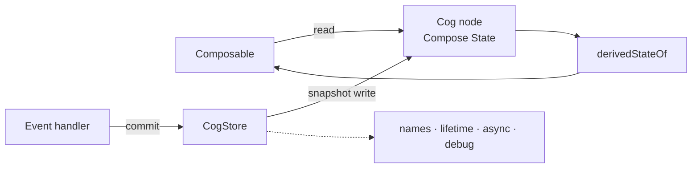

# Cog for Kotlin and Jetpack Compose

*Authored August 6, 2026.*

Cog is a fine-grained state graph for Android UI. It uses the Compose snapshot
runtime as its engine. Cog adds names, write rules, async work, lifetimes, and
debug tools.

The goal is small code that stays correct under change.

## Start here

1. [§1–§5 and §7–§11: core design](exploration.md)
2. [§5.4: Flow and reactive-library mapping](flows.md)
3. [§6: effects and background work](effects.md)
4. [Performance model and spike plan](perf.md)

The section numbers match the Swift set where that helps comparison. The
Kotlin choices stand on their own.

## The short version

`CogStore` owns one graph. A descriptor such as `Cog<User>` names one
value in that graph. A keyed descriptor such as `CogBox<User, UserId>`
names a set of values.

Compose already has the right low-level parts:

- `MutableState` stores source values.
- `derivedStateOf` caches derived values and tracks changing dependencies.
- snapshots make a group of writes visible at once.
- a `State` read invalidates only the Compose scopes that used it.

Cog builds policy around those parts:

- descriptors have stable identity and readable debug labels;
- writable descriptors stay private;
- all writes happen in a named `commit`;
- UI, reactions, and Flow collectors keep only the graph they need alive;
- async state is explicit in `CogPhase`;
- debug builds can explain why a value changed.



The common path stays small:

```kotlin
private val countSource = mutableCog(0)
val count = countSource.readOnly
val doubled = cog { get(count) * 2 }

fun CogStore.increment() = commit("increment") {
    countSource.value += 1
}

@Composable
fun Counter() {
    val store = cogs
    val value = store[doubled]

    Button(onClick = store::increment) {
        Text(value.toString())
    }
}
```

## Where things stand

The first design is ready for a prototype. The prototype must prove:

- staged and atomic writes;
- dynamic derived dependencies;
- exact Compose invalidation;
- ordered reactions;
- keyed node cleanup;
- async cancellation and stale-result guards;
- acceptable cost beside raw Compose state.

No Kotlin library exists yet. Performance representation choices remain open
until the spike and benchmarks in [§9](perf.md#9-spike-and-benchmark-plan).

## Reading rules

“Decision” means the first prototype should follow it. “Candidate” means the
spike must test it. Appendix material explains trade-offs but should not be
needed for normal use.

The dated [old Dart and Flutter dump](../dump-2026-08-06.md) is background
only. It is not the Android design.
