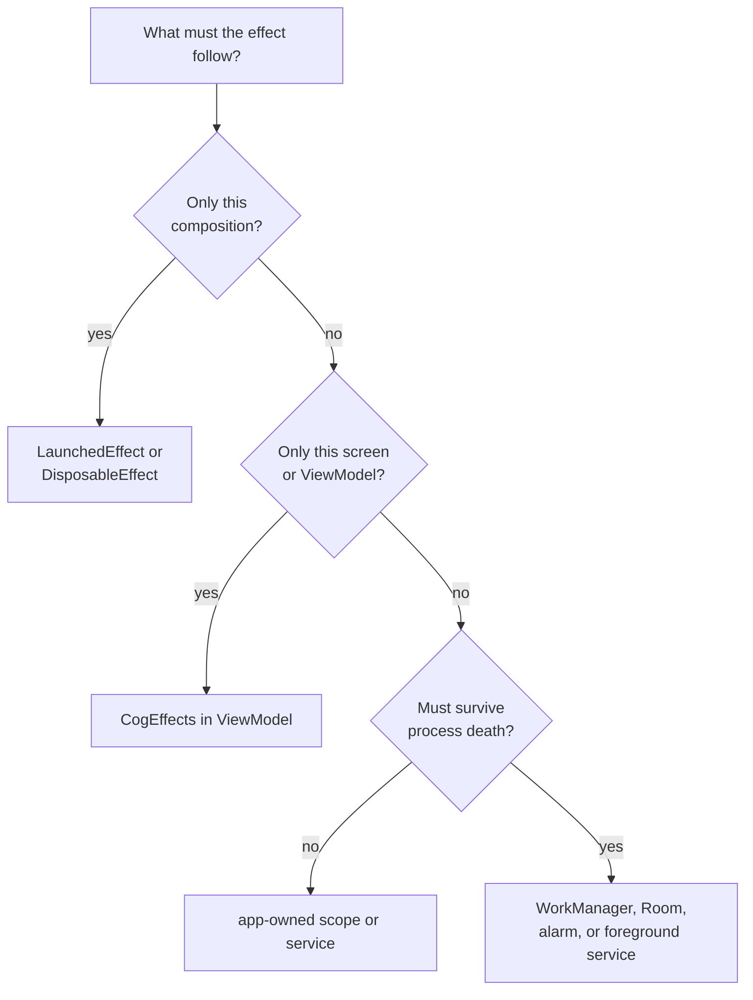
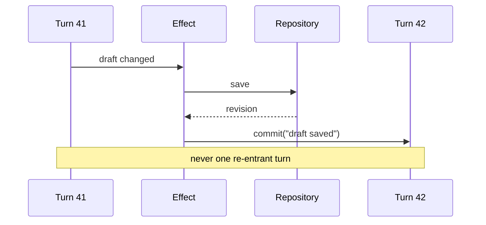
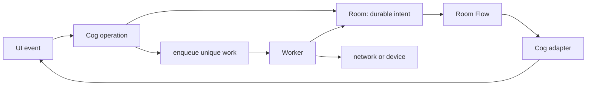

# Cog for Kotlin: effects and background work

*Authored August 6, 2026.*

## 6. Side effects, worked

State describes the app. An effect changes something outside the graph.

First ask if the UI result can be state. State can be restored and tested.
Use an effect for a real outside action or a short UI action that cannot be
modeled as lasting state.

Examples:

- send analytics;
- write a preference;
- navigate or show a one-time message;
- start a sync;
- call hardware;
- schedule durable work.

Put each effect at the smallest owner that matches its lifetime.



### 6.1 Choosing a home for an effect

| Need | Home |
|---|---|
| tied to one Compose call | `LaunchedEffect` or `DisposableEffect` |
| tied to a screen model | `CogEffects` owned by its `ViewModel` |
| tied to visible lifecycle | lifecycle-aware collection or repeat block |
| app-session work | explicit application owner and scope |
| guaranteed later work | WorkManager plus durable input |
| exact user alarm | AlarmManager, only when its rules fit |
| active user-visible long work | foreground service, when Android allows it |

A ViewModel is not durable. Its coroutine can die with the process.

### 6.2 A complete effect group

One group owns registrations and jobs:

```kotlin
class WeatherViewModel(
    repository: WeatherRepository,
    analytics: Analytics,
) : ViewModel() {
    val cogs = CogStore(scope = viewModelScope)
    private val effects = cogs.effects("weather")

    init {
        addCloseable(cogs)

        effects.watch(
            name = "analytics: selected zip",
            read = { get(currentZip) },
        ) { zip ->
            if (zip != null) analytics.selectedZip(zip)
        }

        effects.watchLatest(
            name = "load selected weather",
            read = { get(currentZip) },
        ) { zip ->
            if (zip == null) return@watchLatest
            val report = repository.weather(zip)
            cogs.acceptWeather(zip, report)
        }
    }
}
```

`watch` runs a plain ordered effect. `watchLatest` gives each run a
child job and cancels the old one when its tracked input changes.

Use an async cog instead when loading status or data is itself UI state.
Use a reaction when the result is only an outside action.

### 6.3 Registration and lifecycle

`CogEffects` is `AutoCloseable`. Closing it:

- removes all reaction observations;
- releases their graph leases;
- cancels child jobs;
- blocks late callbacks from writing through the group.

A ViewModel registers its `CogStore` with `addCloseable`. Closing the
store closes every child group. A group with a shorter owner may be closed on
its own.

The store creates its own supervisor job under the owner's scope. Closing the
store cancels that child job. It never cancels `viewModelScope` itself.

Registration order is effect order within one completed turn. A slow suspending
effect does not block later registrations; its launch order is still fixed.

Errors go to a group error handler with the effect name and turn. The default
prototype handler should report and cancel that run, not crash unrelated
effects. The final policy remains open.

### 6.4 Writing back into the graph

An effect writes only through a normal operation:

```kotlin
fun CogStore.markDraftSaved(revision: Revision) =
    commit("draft saved") {
        savedRevisionSource.value = revision
    }

effects.watchLatest(
    name = "save draft",
    read = { get(draft) },
) { value ->
    repository.saveDraft(value)
    cogs.markDraftSaved(value.revision)
}
```

The write-back is a later turn. It cannot become part of the turn that started
the effect.

Protect feedback loops:

- use equality to stop unchanged values;
- keep one owner for each writable value;
- include a revision or request id when two systems echo state;
- make retries explicit;
- fail with a readable turn chain when a loop exceeds a debug limit.



### 6.5 View-scoped effects

Use Compose effect tools for work that exists only because a composable exists:

```kotlin
@Composable
fun MapCameraEffect(target: CameraTarget, camera: Camera) {
    LaunchedEffect(target, camera) {
        camera.animateTo(target)
    }
}
```

Rules:

- keys must name when the effect should restart;
- use `rememberUpdatedState` for a callback that should update without a
  restart;
- clean up listeners in `DisposableEffect.onDispose`;
- do not launch business work directly from the composition body;
- send business events to the ViewModel.

For a Flow that should collect only while the UI is visible, use
`collectAsStateWithLifecycle` or `repeatOnLifecycle`. Direct Cog
reads do not need that adapter; their lease already follows composition, and
their store follows its ViewModel.

### 6.6 Testing effects

Tests use a test dispatcher and a store bound to the test lane.

A good effect test should:

1. install the group;
2. make one named commit;
3. advance the test scheduler;
4. assert the outside call;
5. assert any later write-back turn;
6. close the group;
7. prove later changes do nothing.

Also test cancellation, an error, and a dependency that switches at runtime.
Do not use real delays.

### 6.7 Work that outlives the screen or process

Use WorkManager when work must run after the screen and may need to resume
after process death. Give it small durable inputs, not a Cog descriptor or
in-memory lambda.



The durable table is the truth. WorkManager is the runner. Cog is the live
view. This lets a new process rebuild the same state.

Use unique work and a domain id so scheduling the same job twice has the same
result as scheduling it once. A worker should be safe to retry. Report progress
through WorkManager or durable storage, then adapt that state into Cog.

Do not use WorkManager for:

- work that must finish right now;
- an exact alarm;
- an endless socket;
- a task that only matters while one composable is present.

## Appendix A: Android background choices

- WorkManager is the normal choice for deferrable, persistent work.
- AlarmManager is for time-sensitive alarms and has permission and power
  limits.
- A foreground service is user-visible and restricted; it is not a general
  escape hatch.
- Room is a strong handoff point when work state must survive restarts.
- DataStore fits small durable settings, not relational queues.

Start with Android's
[background task guide](https://developer.android.com/develop/background-work/background-tasks/persistent),
[data transfer choices](https://developer.android.com/develop/background-work/background-tasks/data-transfer-options),
and [alarm guidance](https://developer.android.com/develop/background-work/services/alarms).

## Appendix B: sources

- [Compose side effects](https://developer.android.com/develop/ui/compose/side-effects)
- [Lifecycle-aware coroutines](https://developer.android.com/topic/libraries/architecture/coroutines)
- [Coroutine best practices](https://developer.android.com/kotlin/coroutines/coroutines-best-practices)
- [`ViewModel` and `addCloseable`](https://developer.android.com/reference/androidx/lifecycle/ViewModel)
- [Android UI events](https://developer.android.com/topic/architecture/ui-layer/events)
- [Offline-first data](https://developer.android.com/topic/architecture/data-layer/offline-first)
