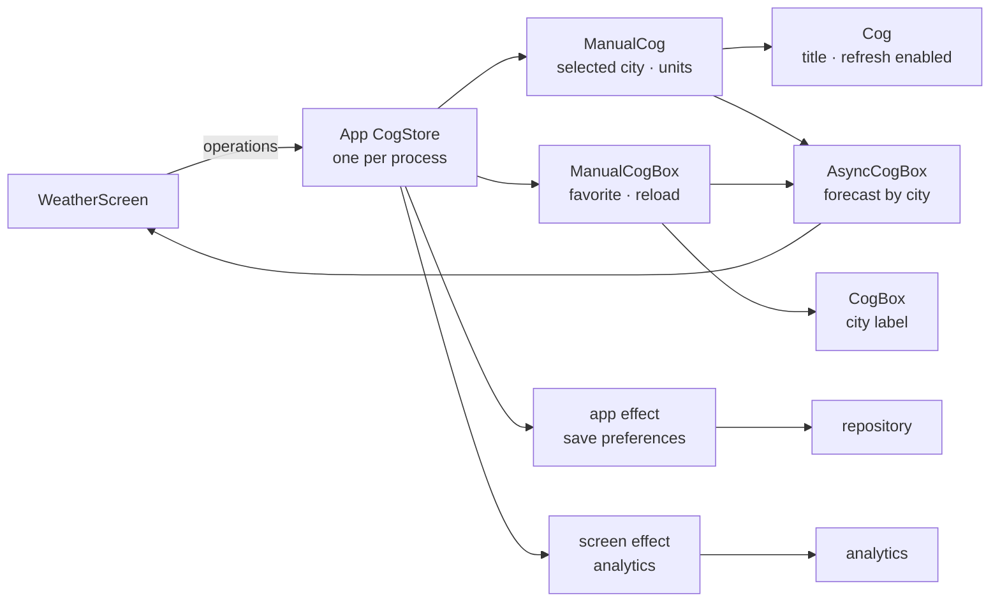
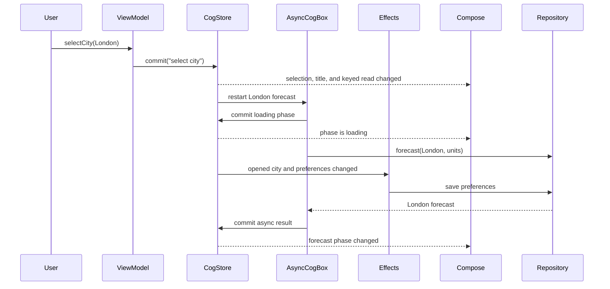

# Cog for Kotlin: worked weather example

_Authored August 6, 2026._

This example shows one small Android feature from end to end. It uses:

- `ManualCog` for writable single values;
- `Cog` for derived single values;
- `ManualCogBox` for writable keyed values;
- `CogBox` for derived keyed values;
- `AsyncCogBox` for keyed network work;
- `CogEffects` for analytics and saved preferences;
- direct Cog reads in Compose.

The library does not exist yet, so this is proposed API, not runnable code.
Imports and small theme details are left out.

The [core](exploration.md) and [effects](effects.md) documents work a
ZIP-code variant of this same weather feature. This example keys by
`CityId` instead so the keyed pieces read naturally in a picker; the graph
shapes are the same.



## 1. Domain types

The domain has no Cog code.

```kotlin
@JvmInline
value class CityId(val value: String)

data class City(
    val id: CityId,
    val name: String,
)

enum class Units {
    Fahrenheit,
    Celsius,
}

data class Forecast(
    val temperature: Int,
    val summary: String,
)

data class WeatherPreferences(
    val selectedCity: CityId,
    val units: Units,
    val favoriteCities: Set<CityId>,
)

object Cities {
    val NewYork = City(CityId("new-york"), "New York")
    val London = City(CityId("london"), "London")
    val Tokyo = City(CityId("tokyo"), "Tokyo")

    val all = listOf(NewYork, London, Tokyo)

    fun require(id: CityId): City =
        requireNotNull(all.find { it.id == id })
}

interface WeatherRepository {
    suspend fun forecast(city: CityId, units: Units): Forecast
    suspend fun savePreferences(value: WeatherPreferences)
}

interface WeatherAnalytics {
    fun openedCity(city: CityId)
}
```

Room or DataStore would own real saved preferences. The app singleton uses the
last saved value when it starts.

## 2. Graph declarations and operations

All writable descriptors are private to this file. Other files see only their
read-only views and operation functions.

```kotlin
// WeatherCogs.kt

private val repositorySource =
    ManualCog<WeatherRepository?>(null)

private val selectedCitySource =
    ManualCog(Cities.NewYork.id)

private val unitsSource =
    ManualCog(Units.Fahrenheit)

private val favoriteSource =
    ManualCogBox<Boolean, CityId> { false }

private val reloadSource =
    ManualCogBox<Int, CityId> { 0 }

val selectedCity = selectedCitySource.readOnly
val units = unitsSource.readOnly
val isFavorite = favoriteSource.readOnly
```

The first three public values are manual state. They change only through a
commit.

Now add normal derived state:

```kotlin
val selectedTitle = Cog {
    Cities.require(get(selectedCity)).name
}

val cityLabel = CogBox<String, CityId> { cityId ->
    val city = Cities.require(cityId)
    val star = if (get(isFavorite, cityId)) "★ " else ""
    star + city.name
}
```

`selectedTitle` is one derived value. `cityLabel` is one derived
descriptor with a separate node for each city key.

The forecast is async and keyed:

```kotlin
val forecast = AsyncCogBox<Forecast, CityId>(
    policy = AsyncPolicy.Latest,
) { cityId ->
    val repository = checkNotNull(get(repositorySource)) {
        "installWeather must run before forecast is read"
    }
    val requestedUnits = get(units)

    // This tracked read lets refresh restart only this city.
    get(reloadSource, cityId)

    load {
        repository.forecast(cityId, requestedUnits)
    }
}
```

The selector reads all Cog inputs before suspension. A unit change restarts
each live forecast. A reload change restarts only its keyed forecast.
`Latest` cancels old work. A generation guard also blocks a late result.

Normal cogs can derive from async cogs:

```kotlin
val selectedForecast = Cog {
    get(forecast, get(selectedCity))
}

val refreshEnabled = Cog {
    get(selectedForecast) !is CogPhase.Loading
}
```

The phase stays explicit. UI can show an old value while a new request loads.

The operations are the only write path:

```kotlin
fun CogStore.installWeather(
    repository: WeatherRepository,
    preferences: WeatherPreferences,
) = commit("install weather") {
    repositorySource.value = repository
    selectedCitySource.value = preferences.selectedCity
    unitsSource.value = preferences.units

    Cities.all.forEach { city ->
        favoriteSource[city.id] =
            city.id in preferences.favoriteCities
    }
}

fun CogStore.selectCity(city: CityId) =
    commit("select city") {
        selectedCitySource.value = city
    }

fun CogStore.setUnits(value: Units) =
    commit("set weather units") {
        unitsSource.value = value
    }

fun CogStore.toggleFavorite(city: CityId) =
    commit("toggle favorite") {
        favoriteSource[city] = !favoriteSource[city]
    }

fun CogStore.refreshSelectedCity() =
    commit("refresh selected city") {
        val city = get(selectedCity)
        reloadSource[city] += 1
    }
```

Writer reads see values already staged in the same commit. No public caller can
write `repositorySource`, `selectedCitySource`,
`favoriteSource`, or `reloadSource`.

## 3. App singleton, ViewModel, and effects

The application or dependency-injection root creates `AppCogState`
once per process. It owns the one production store.

```kotlin
@Singleton
class AppCogState(
    repository: WeatherRepository,
    initialPreferences: WeatherPreferences,
    appScope: CoroutineScope,
) {
    val store = CogStore.installApp(scope = appScope)
    private val effects = store.effects("app")

    init {
        store.installWeather(
            repository = repository,
            preferences = initialPreferences,
        )

        effects.watchExhaustLatest(
            name = "save weather preferences",
            read = {
                WeatherPreferences(
                    selectedCity = get(selectedCity),
                    units = get(units),
                    favoriteCities = Cities.all
                        .asSequence()
                        .filter { get(isFavorite, it.id) }
                        .map { it.id }
                        .toSet(),
                )
            },
        ) { value ->
            repository.savePreferences(value)
        }
    }

}
```

The `@Singleton` annotation is only an example. Without a dependency
injection tool, the Android `Application` creates
`AppCogState` once. `installApp` fails if production tries
to install a second graph. The application scope uses
`SupervisorJob() + Dispatchers.Main.immediate`.

The preference effect is app-wide because the state is app-wide. It lets an
active save finish, then saves only the newest waiting value. Old and new saves
never race.

The ViewModel receives the singleton. It owns only its screen effect group:

```kotlin
class WeatherViewModel(
    appCogs: AppCogState,
    analytics: WeatherAnalytics,
) : ViewModel() {
    private val store = appCogs.store
    private val effects = store.effects("weather screen")

    init {
        addCloseable(effects)

        effects.watch(
            name = "analytics: opened city",
            read = { get(selectedCity) },
        ) { city ->
            analytics.openedCity(city)
        }
    }

    fun selectCity(city: CityId) {
        store.selectCity(city)
    }

    fun toggleFavorite(city: CityId) {
        store.toggleFavorite(city)
    }

    fun useUnits(value: Units) {
        store.setUnits(value)
    }

    fun refresh() {
        store.refreshSelectedCity()
    }
}
```

The save body reads no cogs. Its full input was captured by the tracked read
block. Closing the ViewModel closes the analytics group. It does not close the
store or erase state. Production keeps the store for the process. Tests may
create and close one isolated store through the testing artifact.

This demo has three fixed cities, so the save effect can track every favorite
key. For an unbounded list, persist one changed id from the operation or use a
durable database. Do not keep thousands of box keys live for one effect.

## 4. Compose UI

The app root provides the singleton once, above navigation:

```kotlin
@Composable
fun CogApp(appCogs: AppCogState) {
    CogProvider(appCogs.store) {
        AppNavHost()
    }
}

@Composable
fun WeatherRoute(viewModel: WeatherViewModel) {
    WeatherScreen(
        onSelectCity = viewModel::selectCity,
        onToggleFavorite = viewModel::toggleFavorite,
        onUseUnits = viewModel::useUnits,
        onRefresh = viewModel::refresh,
    )
}
```

The screen reads only the values it needs:

```kotlin
@Composable
private fun WeatherScreen(
    onSelectCity: (CityId) -> Unit,
    onToggleFavorite: (CityId) -> Unit,
    onUseUnits: (Units) -> Unit,
    onRefresh: () -> Unit,
) {
    val store = cogs
    val selected = store[selectedCity]
    val title = store[selectedTitle]
    val selectedUnits = store[units]
    val phase = store[forecast, selected]
    val canRefresh = store[refreshEnabled]

    Column(
        modifier = Modifier
            .fillMaxSize()
            .padding(16.dp),
        verticalArrangement = Arrangement.spacedBy(16.dp),
    ) {
        Text(
            text = title,
            style = MaterialTheme.typography.headlineMedium,
        )

        CityPicker(
            store = store,
            selected = selected,
            onSelectCity = onSelectCity,
            onToggleFavorite = onToggleFavorite,
        )

        UnitsPicker(
            selected = selectedUnits,
            onSelect = onUseUnits,
        )

        ForecastPanel(
            phase = phase,
            units = selectedUnits,
        )

        Button(
            enabled = canRefresh,
            onClick = onRefresh,
        ) {
            Text("Refresh")
        }
    }
}
```

Each city row reads its own two box nodes:

```kotlin
@Composable
private fun CityPicker(
    store: CogStore,
    selected: CityId,
    onSelectCity: (CityId) -> Unit,
    onToggleFavorite: (CityId) -> Unit,
) {
    LazyRow(
        horizontalArrangement = Arrangement.spacedBy(8.dp),
    ) {
        items(
            items = Cities.all,
            key = { it.id.value },
        ) { city ->
            val label = store[cityLabel, city.id]
            val favorite = store[isFavorite, city.id]

            Column {
                FilterChip(
                    selected = city.id == selected,
                    onClick = { onSelectCity(city.id) },
                    label = { Text(label) },
                )

                TextButton(
                    onClick = { onToggleFavorite(city.id) },
                ) {
                    Text(if (favorite) "Unfavorite" else "Favorite")
                }
            }
        }
    }
}
```

Changing London's favorite node updates London's row and the save effect. It
does not update the New York or Tokyo box nodes.

The units picker has no Cog knowledge:

```kotlin
@Composable
private fun UnitsPicker(
    selected: Units,
    onSelect: (Units) -> Unit,
) {
    Row(horizontalArrangement = Arrangement.spacedBy(8.dp)) {
        Units.entries.forEach { units ->
            FilterChip(
                selected = units == selected,
                onClick = { onSelect(units) },
                label = { Text(units.name) },
            )
        }
    }
}
```

The async phase is also plain input:

```kotlin
@Composable
private fun ForecastPanel(
    phase: CogPhase<Forecast>,
    units: Units,
) {
    val suffix = when (units) {
        Units.Fahrenheit -> "°F"
        Units.Celsius -> "°C"
    }

    Column(verticalArrangement = Arrangement.spacedBy(8.dp)) {
        phase.latestOrNull?.let { forecast ->
            Text(
                text = forecast.temperature.toString() + suffix,
                style = MaterialTheme.typography.displaySmall,
            )
            Text(forecast.summary)
        }

        when (phase) {
            CogPhase.Initial -> Text("Choose a city")
            is CogPhase.Loading -> LinearProgressIndicator()
            is CogPhase.Ready -> Unit
            is CogPhase.Failed -> {
                Text(
                    text = phase.error.message ?: "Could not load weather",
                    color = MaterialTheme.colorScheme.error,
                )
            }
        }
    }
}
```

The leaf UI gets values and callbacks. It does not collect a Flow or start a
coroutine.

## 5. What happens on a tap

Selecting London starts one turn. That turn changes the selected city. Derived
state, async work, effects, and UI then react to the completed turn.



No grouped read sees London with New York's phase. The selection turn switches
the keyed dependency to London's phase. Loading gets the next turn. The result
gets another later turn.

## 6. Why each piece exists

| Piece                | Job                                     |
| -------------------- | --------------------------------------- |
| `selectedCitySource` | writable single state                   |
| `favoriteSource`     | writable state per city                 |
| `selectedTitle`      | cached single derivation                |
| `cityLabel`          | cached derivation per city              |
| `forecast`           | keyed async work and phase              |
| operations           | named, atomic writes                    |
| effects              | analytics and durable preference writes |
| direct UI reads      | precise Compose invalidation and leases |

The app singleton owns current state. The repository owns durable data and
network work. The ViewModel owns screen effects. Compose renders values and
sends events back.

## Appendix A: production details left out

A real app still needs:

- dependency injection;
- a Room or DataStore preferences adapter;
- network error types;
- retry and offline rules;
- string resources;
- accessibility text;
- process-state restoration;
- tests with a fake repository and test dispatcher.

Those details do not change the graph shape above.
