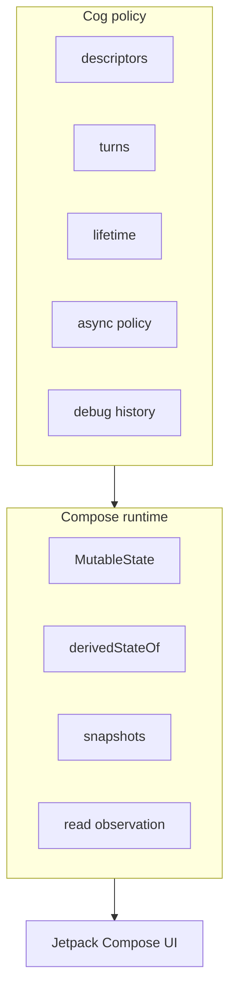
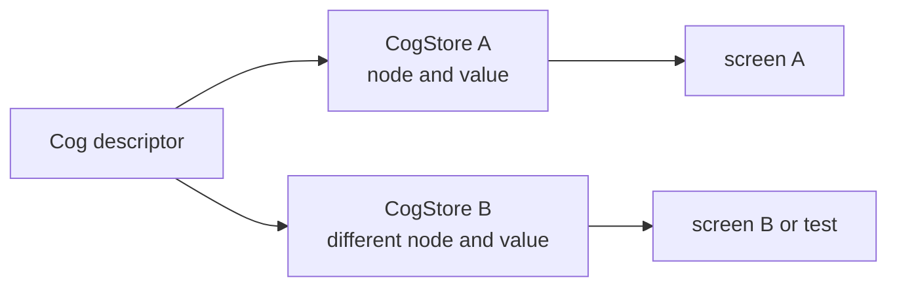
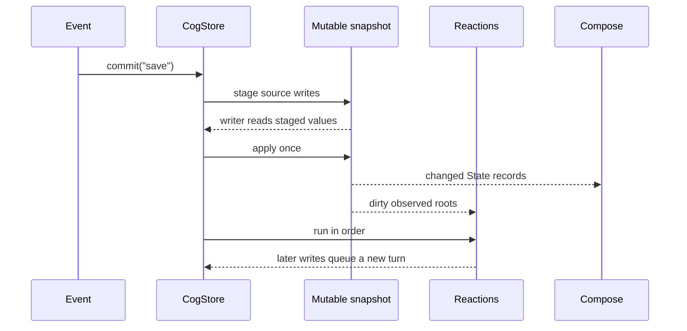

# Cog for Kotlin: core design

*Authored August 6, 2026.*

Cog should feel like normal Kotlin and normal Compose. It should not ask an app
to learn a second UI model.

The three rules are:

1. Cog is simple to use, read, and reason about.
2. Every read is correct.
3. Cog cuts runtime cost without weakening the first two rules.

The main decision is to build on the Compose snapshot runtime. It already gives
us tracked reads, cached derived state, atomic writes, and exact UI
invalidation. Cog adds the missing product rules.

## 1. What the platform gives us, and what it does not

Compose state is already a signal graph:

- `MutableState` is a writable signal.
- `derivedStateOf` is a cached computed signal with dynamic dependencies.
- a snapshot gives many values one consistent view of state;
- reading `State.value` in Compose records the exact UI scope to update.

That is the hard base. Cog should reuse it.

Compose does not give the app one clear place for:

- stable identity and readable labels for graph nodes;
- private write rights;
- a record of one business change;
- keyed node cleanup;
- ordered reactions;
- async status and stale-result rules;
- graph history and inspection.

`CogStore` supplies those rules.



### 1.1 The graph stays on one lane

Normal graph work is confined to the store's UI lane. On Android that is the
main thread. Plain JVM tests may bind the store to their test thread.

This rule makes turns ordered. It also avoids locks around graph metadata.
Network, disk, and heavy CPU work still run off-main. Their results return to
the store lane before they enter the graph.

A store fails fast when used from the wrong lane. It does not silently post a
read or write, since that would change order.

### 1.2 One source of truth

Cog state may point at Room, DataStore, `SavedStateHandle`, or a repository.
Cog does not replace durable data. It gives UI a fine-grained view of it.

Do not keep the same business value writable in both Cog and a repository.
Pick one owner. Adapt the other side.

## 2. The core architecture

### 2.1 Four small parts

1. A descriptor names a node.
2. A `CogStore` owns node values and runtime state.
3. Compose snapshot state stores and derives values.
4. Leases say which graph roots must stay hot.

A descriptor has no app value inside it. The same descriptor can be used in
two stores and get two values.



### 2.2 Reads settle what they need

A normal read sees the latest completed turn. It settles every derived node
needed for that value before it returns.

A grouped read pins one read-only snapshot:

```kotlin
val header = cogs.read {
    Header(name = get(userName), count = get(unreadCount))
}
```

Both fields come from one completed view. A reader never sees half a turn.

A writer read is different. Inside `commit`, it sees source values already
staged by that same turn. Derived reads also settle against those staged
values.

### 2.3 Descriptors name state; the store holds it

The first API has four common descriptor shapes:

| Shape | Meaning |
|---|---|
| `Cog<T>` | one read-only value |
| `MutableCog<T>` | one writable source |
| `CogBox<T, K>` | read-only values of `T`, keyed by `K` |
| `MutableCogBox<T, K>` | writable values of `T`, keyed by `K` |

Async descriptors return `CogPhase<T>`. Manual sources use the same
read-only and writable split.

Descriptor object identity names a node within the process. An optional
`name` gives it a human label. In debug builds, an unnamed descriptor
falls back to its declaration source location. This adds no release hot-path
reflection. Descriptor classes are final and compare by reference, never by
label.

Keys use Kotlin `equals` and `hashCode`. A key must not change while it
is in a store.

### 2.4 Dependencies are captured on every run

A derived body calls `get`. Each call becomes a dependency for that run.
Old dependencies are removed after the run.

```kotlin
val displayName = cog<String> {
    if (get(isSignedIn)) get(accountName) else "Guest"
}
```

When signed out, changes to `accountName` do not dirty `displayName`.
After sign-in, they do.

`peek` reads a value without making an edge. It should be rare and loud.

### 2.5 Equality stops needless work

Every node has an equality rule. The default is Kotlin `==`. A derived
node uses an explicit Compose structural equality policy.

If a new value equals the old value:

- downstream Cog nodes stay clean;
- reactions do not run;
- Compose readers do not recompose for that node.

Custom equality is allowed for a real domain reason. “Always changed” is
allowed for event-like adapters, not normal state.

## 3. API sketch

### 3.1 Declarations

Writable names are private. Public code gets a separate read-only type.

```kotlin
private val currentZipSource = mutableCog<ZipCode?>(null)
val currentZip = currentZipSource.readOnly

private val weatherSource =
    mutableCogBox<WeatherReport?, ZipCode> { null }
val weather = weatherSource.readOnly

val isNiceOutside = cogBox<Boolean, ZipCode> { zip ->
    val report = get(weather, zip) ?: return@cogBox false
    report.temperatureF in 65..82 && report.rainChance < 0.2
}
```

The read-only wrapper is not a cast. It has no write API.

Boxes are the normal way to model keyed entity state. The hot path accepts the
descriptor and key directly:

```kotlin
val report = cogs[weather, zip]
```

An optional `weather.at(zip)` handle is for APIs that need a named
reference. Normal reads should not allocate one.

### 3.2 Ops and turns

Business writes live in small operation functions:

```kotlin
fun CogStore.selectZip(zip: ZipCode) = commit("select zip") {
    currentZipSource.value = zip
}

fun CogStore.acceptWeather(
    zip: ZipCode,
    report: WeatherReport,
) = commit("weather loaded") {
    weatherSource[zip] = report
}
```

The commit receiver grants write access through member extensions. Code
outside it cannot assign to `MutableCog`.

One outer `commit` is one turn:

1. run the body in an isolated mutable snapshot;
2. let reads see staged source values;
3. apply all writes at once;
4. settle hot roots;
5. run dirty reactions in registration order;
6. notify debug tools.

Nested commits join the outer turn. A writer that escapes its body traps in
debug builds. A failed body applies nothing.



A reaction may request a commit. That commit goes into a FIFO queue and starts
after the current flush. It never changes the turn that caused the reaction.

### 3.3 Reactions

Reactions are for effects outside Compose:

```kotlin
effects.watch(
    name = "analytics: signed in",
    read = { get(isSignedIn) },
) { signedIn ->
    analytics.setSignedIn(signedIn)
}
```

The read block tracks dependencies. The effect body does not. The first API
runs once on install, then once per completed turn when its result changes.

Each reaction belongs to an effect group. Closing the group removes its lease,
observation, and child jobs. See [§6](effects.md).

### 3.4 Compose

Provide a store near the screen root:

```kotlin
@Composable
fun WeatherRoute(viewModel: WeatherViewModel) {
    CogProvider(viewModel.cogs) {
        WeatherScreen()
    }
}
```

Read values like normal values:

```kotlin
@Composable
fun WeatherHeader(zip: ZipCode) {
    val report = cogs[weather, zip]
    Text(report?.summary ?: "No report")
}
```

`cogs` is a short composition-scoped accessor for the provided store.
Code outside composition uses a store it owns.

This read does two jobs:

- it reads the node's Compose `State`, so Compose tracks the exact scope;
- it owns a remembered lease until that call leaves composition.

The operator is `@Composable`. An event callback cannot call it by
accident. Call a normal operation in the callback:

```kotlin
Button(onClick = { viewModel.refresh(zip) }) {
    Text("Refresh")
}
```

Pass plain values and callbacks into reusable leaf UI. A screen does not need
to hide every parameter behind a global store.

## 4. Write ownership and runtime rules

### 4.1 The snapshot runtime is the data engine

Candidate node storage:

- source node: private `MutableState<T>`;
- derived node: `State<T>` from
  `derivedStateOf(structuralEqualityPolicy())`;
- reaction observation: `SnapshotStateObserver`;
- turn: one isolated mutable snapshot applied on the store lane.

Observer callbacks only mark reactions dirty. The store coalesces those marks
and flushes reactions once for the turn.

Cog keeps its own small node table for names, keys, leases, async state,
dependency summaries, and debug data. It does not reach into private Compose
runtime types.

The spike must test this candidate. If public snapshot APIs cannot preserve a
turn rule, the fallback is a small Cog graph with Compose `State` only at
live UI boundaries.

### 4.2 Correctness rules

The runtime must enforce:

- a normal read sees the latest completed turn;
- a grouped read is internally consistent;
- a writer sees its turn's staged writes;
- a derived body is pure and cannot commit;
- a composition body cannot commit;
- a reaction cannot alter the turn it is observing;
- a cycle fails with the full descriptor-and-key path;
- an exception never leaves a node marked as computing;
- a stale async result cannot publish;
- a wrong-lane call fails.

Code should never depend on the order in which sibling derived nodes settle.

### 4.3 Collections

Do not mutate an object already stored in a Cog. Replace it with a new value.
Prefer immutable data classes and persistent immutable collections.

Do not expose `SnapshotStateList` or `SnapshotStateMap` as a Cog
value. Their inner writes would bypass the writer and the turn log. A box
also gives finer invalidation than one large map.

### 4.4 Lifetime

These things own root leases:

- a direct Compose read;
- an installed reaction;
- an active Flow collector;
- an explicit host lease.

A root keeps its needed derived path alive. When the last root goes away, the
store can release keyed nodes, stop async work, and drop cached edges after a
short grace period.

`CogStore` is also `AutoCloseable`. Closing it ends all leases,
observers, effects, and async jobs at once.


Source defaults remain available. Derived values use
`whileObserved(gracePeriod)` by default. Query-like boxes may opt into
a bounded cache. Exact cache layout is benchmark-gated.

Compose owns UI read tracking. Cog must also record coarse descriptor edges for
lifetime and debug tools, because Compose's private dependency graph is not an
app API. The spike will measure this extra edge record.

## 5. Async cogs

### 5.1 Values and work

Async state is a value, not a hidden flag:

```kotlin
sealed interface Previous<out T> {
    data object None : Previous<Nothing>
    data class Some<T>(val value: T) : Previous<T>
}

sealed interface CogPhase<out T> {
    data object Initial : CogPhase<Nothing>
    data class Loading<T>(val previous: Previous<T>) : CogPhase<T>
    data class Ready<T>(val value: T) : CogPhase<T>
    data class Failed<T>(
        val error: Throwable,
        val previous: Previous<T>,
    ) : CogPhase<T>
}
```

`Previous` keeps “no old value” distinct from “the old value was null.”
Convenience properties may expose `latest`, `latestOrNull`,
`isLoading`, and `errorOrNull`. The full phase stays available.

An async selector is synchronous and tracked. It reads input cogs, then returns
work:

```kotlin
val weatherRequest = asyncCogBox<WeatherReport, ZipCode>(
    policy = AsyncPolicy.Latest,
) { zip ->
    val units = get(temperatureUnits)
    load { repository.weather(zip, units) }
}
```

No Cog read is allowed after suspension. Inputs must be captured before
`load` starts. A stream form accepts a `Flow<T>`.

Each loading state, result, failure, and stream emission enters the graph in
its own named turn.

### 5.2 Scheduling policies

| Policy | New input does this |
|---|---|
| `Latest` | cancel old work and keep only the newest result |
| `Queue` | run each request in order |
| `ExhaustLatest` | finish current work, then run the newest waiting input |
| `Merge` | run all requests, with an explicit concurrency limit |

`Latest` is the default. Streams are latest-only in the first release.

Cancellation is not enough. Every launch has a generation token. Completion
publishes only when its token is still current. This blocks results from work
that ignored cancellation.

### 5.3 Freshness and lifetime

The async node owns its child `Job`. Its root leases decide when work is
needed. Losing the final lease starts the same grace period as sync nodes, then
cancels work.

Screen work uses a scope owned by the screen's `ViewModel`. Durable work
uses WorkManager and durable storage. It is not an extra-long coroutine. See
[§6.7](effects.md#67-work-that-outlives-the-screen-or-process).

### 5.4 Where Flow operators went

Dynamic state reads replace many `combine` and `flatMapLatest`
chains. Async policies control work, not state dependencies. Flow remains the
right boundary for repositories and streams.

See the full [Flow map](flows.md).

## 6. Side effects, worked

Effects, ViewModel ownership, WorkManager, and tests live in
[§6: effects and background work](effects.md).

## 7. What the Compose boundary must handle

The UI bridge must:

- use a static composition local for the store itself;
- read the exact node `State` at the call site;
- remember one lease by store, descriptor, and key;
- close the lease in `DisposableEffect`;
- keep the last completed value during normal recomposition;
- show explicit `CogPhase` for async uncertainty;
- give previews and tests a small store with overrides.

It must not:

- copy every Cog into `collectAsStateWithLifecycle`;
- launch one coroutine per sync value;
- turn event callbacks into graph reads;
- hide a process-wide mutable singleton in a composition local.

## 8. Interop and migration

Adopt Cog one screen or feature store at a time.

- Repository `Flow`: adapt it to an async stream or write it into a manual
  source in an owned effect.
- `StateFlow`: expose a Cog as Flow when an old consumer needs it.
- Room: keep the database as truth and observe its query Flow.
- DataStore: keep preferences as truth and adapt its Flow.
- `SavedStateHandle`: persist only small screen-restoration inputs.
- LiveData: convert at the feature edge during migration; do not add it to the
  Cog core.

Cog should not implement `StateFlow`. That interface is not a stable
inheritance target. A small `flow(cog)` adapter is clearer.

## 9. Availability strategy

The first prototype targets the current stable Kotlin, Compose runtime,
coroutines, and Lifecycle lines. The release must publish its exact minimums
after the spike.

Core graph code should stay Android-light. The Compose bridge, ViewModel
helpers, saved-state adapters, and WorkManager adapters belong in separate
artifacts. This keeps plain JVM tests fast and avoids forcing all Android
dependencies on every consumer.

Candidate modules:

```text
cog-core
cog-compose
cog-lifecycle
cog-work
cog-testing
```

Do not raise an app's minimum Android API just to use a faster internal
collection. Measure the gain and offer a compatible fallback.

## 10. Decision record

### Settled for the first spike

- Compose snapshots are the first graph engine to test.
- `CogStore` is store-scoped, not process-global.
- graph access is confined to one UI lane;
- descriptors are separate from stored values;
- writable descriptors have distinct read-only wrappers;
- all source writes happen inside one `commit` primitive;
- nested commits join the outer turn;
- derived dependencies are dynamic;
- equality gates publication;
- UI reads a node directly as Compose `State`;
- boxes use direct descriptor-and-key reads on the hot path;
- UI, reaction, and Flow use leases;
- async state uses `CogPhase` and generation guards;
- `Latest` is the default async policy;
- durable work stays in Android's durable systems;
- representation and performance claims wait for benchmarks.

### Still open

- whether public Compose snapshot APIs can implement every turn rule cleanly;
- whether `SnapshotStateObserver` is the final reaction bridge;
- the exact grace period and keyed-cache limits;
- whether primitive-specialized cogs pay for their API weight;
- descriptor, key, node-table, and edge layouts;
- whether `at(key)` handles are interned, inline, or short-lived;
- whether an optional property-delegate form is worth its access cost just to
  infer debug labels;
- exception policy for reaction bodies;
- exact module and version floors;
- saved-state adapter shape;
- debug-history size and payload.

## 11. Spike plan

Build a small vertical slice before freezing names.

1. Implement source, derived, box, grouped read, and commit.
2. Prove staged reads and atomic apply with hostile tests.
3. Add direct Compose reads and count recompositions.
4. Add dynamic dependencies, equality, cycles, and exceptions.
5. Add reactions and queued write-back.
6. Add leases and show keyed nodes and jobs are released.
7. Add latest async work with a cancellation-ignoring fake.
8. Run the benchmark matrix in [§9](perf.md#9-spike-and-benchmark-plan).
9. Compare the snapshot-backed graph with the small custom-graph fallback.
10. Freeze the public API only after both correctness and cost gates pass.

## Appendix A: why not only StateFlow?

`StateFlow` is strong at repository and ViewModel boundaries. It is hot,
thread-safe, conflated by equality, and familiar.

It is a weaker base for this graph:

- each derived chain must be wired by hand;
- changing dependencies become `flatMapLatest` trees;
- separate flows do not form one atomic multi-value turn;
- collecting each leaf adds coroutines and UI adapters;
- updating one StateFlow walks its active subscribers.

One large `StateFlow<ScreenState>` is a good simple choice for many
screens. Cog is for apps that need fine-grained shared derivation, keyed state,
and graph tools.

## Appendix B: prior art and research

The Android design was checked against:

- [Compose state and snapshots](https://developer.android.com/develop/ui/compose/state)
  for observable state and UI read tracking;
- [Compose `Snapshot` API](https://developer.android.com/reference/kotlin/androidx/compose/runtime/snapshots/Snapshot)
  for isolated, consistent, atomic mutable snapshots;
- [`derivedStateOf` API](https://developer.android.com/reference/kotlin/androidx/compose/runtime/package-summary)
  and its [runtime source](https://android.googlesource.com/platform/frameworks/support/+/androidx-main/compose/runtime/runtime/src/commonMain/kotlin/androidx/compose/runtime/DerivedState.kt)
  for caching, dynamic dependencies, and mutation policy;
- [`SnapshotStateObserver`](https://developer.android.com/reference/kotlin/androidx/compose/runtime/snapshots/SnapshotStateObserver)
  and its [runtime source](https://android.googlesource.com/platform/frameworks/support/+/androidx-main/compose/runtime/runtime/src/commonMain/kotlin/androidx/compose/runtime/snapshots/SnapshotStateObserver.kt)
  for non-UI read observation;
- [Compose state hoisting](https://developer.android.com/develop/ui/compose/state-hoisting)
  for screen state ownership and plain-value leaf UI;
- [Android UI state production](https://developer.android.com/topic/architecture/ui-layer/state-production)
  for ViewModel and lifecycle boundaries;
- [Molecule](https://github.com/cashapp/molecule), which uses the Compose
  runtime to produce `Flow` and `StateFlow` presentation models;
- [Circuit](https://github.com/slackhq/circuit), a larger Compose-driven UI
  architecture;
- [ReactiveState-Kotlin](https://github.com/ensody/ReactiveState-Kotlin), a
  StateFlow-based dynamic dependency design;
- [Fenrur Signal](https://github.com/Fenrur/Signal), a small Kotlin signal
  runtime with batching and Flow interop;
- [Reactively](https://github.com/milomg/reactively/blob/main/Reactive-algorithms.md)
  and [alien-signals](https://github.com/stackblitz/alien-signals) for
  glitch-free graph algorithms.

These projects guide the design. None is an API contract for Cog.

## Appendix C: terms

- **descriptor:** a stable Kotlin object that names a value;
- **node:** one descriptor, or descriptor-and-key, inside one store;
- **turn:** one outer commit and its atomic publication;
- **settle:** compute a dirty value before returning it;
- **root:** a value observed by UI, a reaction, Flow, or a host;
- **lease:** an owned reason that a root must stay live;
- **staged value:** a source write visible inside the current commit but not
  yet visible outside it;
- **hot:** kept observed and ready because a root needs it.

## Appendix D: research snapshot

These were the stable lines on August 6, 2026. They are research inputs, not
Cog's final minimums.

| Tool | Stable line checked |
|---|---|
| Kotlin | 2.4.10 |
| Compose runtime | 1.11.4 |
| AndroidX Lifecycle | 2.11.0 |
| AndroidX Work | 2.11.2 |
| AndroidX Collection | 1.6.0 |

Work 2.11 and Collection 1.6 list API 23 as their minimum. Keeping WorkManager
in `cog-work` stops that adapter from deciding the core artifact's floor.
The spike must check the full dependency graph before it picks final minimums.

Recheck them when the spike starts:

- [Kotlin releases](https://kotlinlang.org/docs/releases.html)
- [Compose runtime releases](https://developer.android.com/jetpack/androidx/releases/compose-runtime)
- [Lifecycle releases](https://developer.android.com/jetpack/androidx/releases/lifecycle)
- [WorkManager releases](https://developer.android.com/jetpack/androidx/releases/work)
- [Collection releases](https://developer.android.com/jetpack/androidx/releases/collection)
