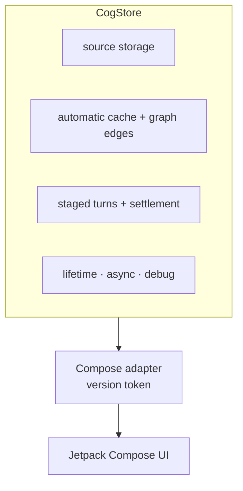
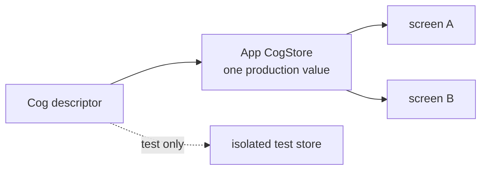
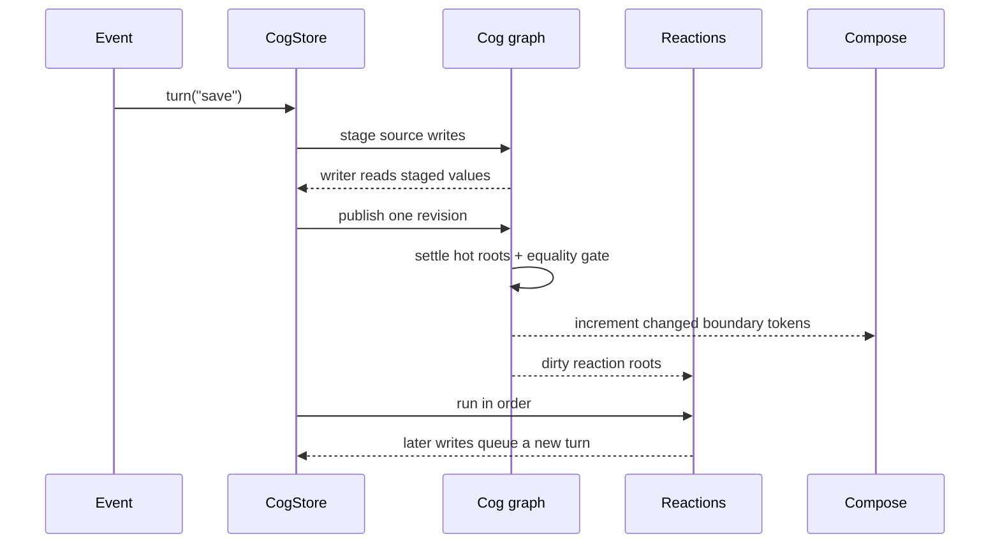
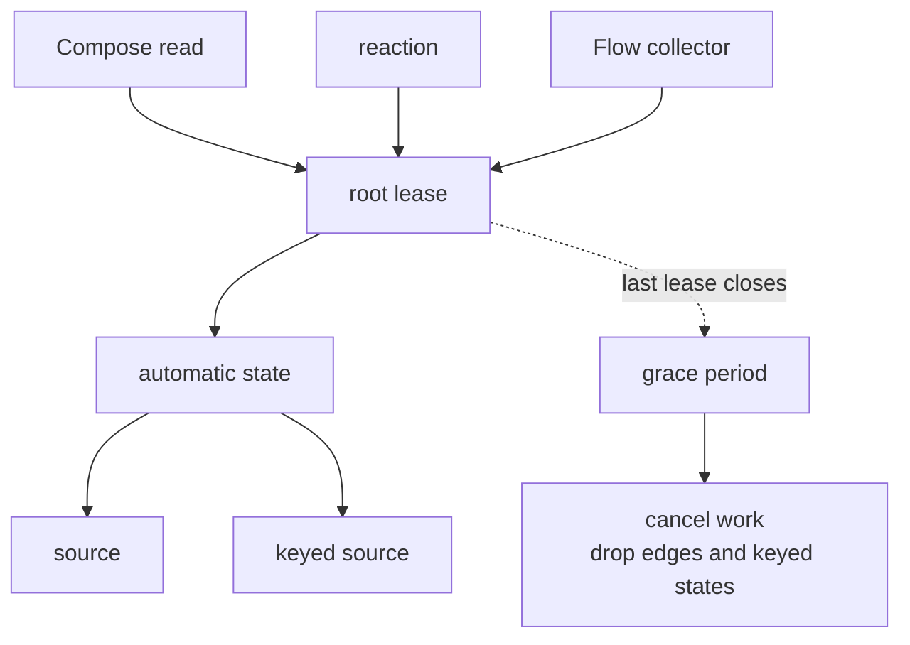

# Cog for Kotlin: core design

_Authored August 6, 2026._

Cog should feel like normal Kotlin and normal Compose. It should not ask an app
to learn a second UI model.

The [shared state model](../design.md) defines the runtime, principles,
vocabulary, and behavioral invariants Swift and Kotlin have in common. This
document maps that model onto Kotlin and owns its language spelling, physical
representation, Compose adapter, and Android integration.

`CogStore` owns the graph. A state-specific Compose token records which
recomposition scopes read a value and invalidates them after a completed Cog
turn changes it. Source storage, automatic values, dependency capture, and
turn atomicity remain in Cog.

For all pieces in one place, see the
[worked weather feature](example.md).

## 1. What the platform gives us, and what it does not

Compose gives the UI adapter two useful operations:

- reading a `State` records the exact recomposition scope;
- changing that state requests recomposition of scopes that read it.

Cog uses those operations through a small version token. `CogStore` supplies
the rest of the shared runtime:

- stable identity and readable labels for graph states;
- private write rights;
- a record of one business change;
- keyed state cleanup;
- ordered reactions;
- async status and stale-result rules;
- graph history and inspection.

The Kotlin implementation follows the Swift runtime model with
JVM-appropriate storage.



### 1.1 The graph stays on one lane

Normal graph work is confined to the store's UI lane. On Android that is the
main thread. Plain JVM tests may bind the store to their test thread.

This rule makes turns ordered. It also avoids locks around graph metadata.
Network, disk, and heavy CPU work still run off-main. Their results return to
the store lane before they enter the graph.

A store fails fast when used from the wrong lane. It does not silently post a
read or write, since that would change order.

### 1.2 One source of truth

Cog state may point at Room, DataStore, `SavedStateHandle`, or a repository.
Cog does not replace durable data. It gives UI a fine-grained view of it.

Do not keep the same business value writable in both Cog and a repository.
Pick one owner. Adapt the other side. Inside Cog, do not copy one mutable fact
into two `ManualCog` sources. Keep one source and compute every other
view.

### 1.3 Production has one store

An Android app creates one `CogStore` for its process. Every screen,
ViewModel, effect group, and non-UI consumer uses that same instance.

Production construction is guarded. The normal `CogStore`
constructor is not public. App bootstrap creates it once; a second production
install fails fast. The testing artifact exposes an isolated-runtime factory.
The exact bootstrap names remain open.

The singleton is a lifetime rule, not durable storage. Process death clears
it. Room, DataStore, saved state, and repositories rebuild needed values in the
new process.

Tests and previews may create isolated stores. They do not share state with
each other or with the production singleton.

One store does not mean every state stays hot forever. Leases still stop unused
async work and release keyed caches. Recreating a screen does not reset manual
state; an explicit operation does.

## 2. The core architecture

### 2.1 Four small parts

1. A descriptor names a state.
2. One app-wide `CogStore` owns state values and runtime state.
3. The Cog-owned graph stores sources, caches automatic values, and captures
   dependencies.
4. Leases say which graph roots must stay hot, and native UI adapters notify
   scopes that read changed roots.

A descriptor has no app value inside it. Production resolves it in the app
store. An isolated test resolves the same descriptor in its test store.



### 2.2 Reads settle what they need

A normal read sees the latest completed turn. It settles every automatic state
needed for that value before it returns.

A grouped read pins one completed Cog revision:

```kotlin
val header = cogs.read {
    Header(name = get(userName), count = get(unreadCount))
}
```

Both fields come from one completed view. A reader never sees half a turn.

A writer read is different. Inside `turn`, it sees source values already
staged by that same turn. Automatic reads also settle against those staged
values.

### 2.3 Descriptors name state; the store holds it

The first API has four common descriptor shapes:

| Shape                | Meaning                               |
| -------------------- | ------------------------------------- |
| `Cog<T>`             | one read-only value                   |
| `ManualCog<T>`       | one writable source                   |
| `CogBox<T, K>`       | read-only values of `T`, keyed by `K` |
| `ManualCogBox<T, K>` | writable values of `T`, keyed by `K`  |

Async descriptors return `CogPhase<T>`. Manual sources use the same
read-only and writable split.

Descriptor object identity names a state within the process. An optional
`name` gives it a human label. In debug builds, an unnamed descriptor
falls back to its declaration source location. This adds no release hot-path
reflection. Descriptor classes are final and compare by reference, never by
label.

Keys use Kotlin `equals` and `hashCode`. A key must not change while it
is in a store.

### 2.4 Dependencies are captured on every run

An automatic body calls `get`. Each call becomes a dependency for that run.
Old dependencies are removed after the run.

```kotlin
val displayName = Cog<String> {
    if (get(isSignedIn)) get(accountName) else "Guest"
}
```

When signed out, changes to `accountName` do not dirty `displayName`.
After sign-in, they do.

`peek` reads a value without making an edge. It should be rare and loud.

### 2.5 Equality stops needless work

Every state has an equality rule. The default is Kotlin `==`. The Cog value
column applies that rule when a source publishes or an automatic state
recomputes.

If a new value equals the old value:

- downstream Cog states stay clean;
- reactions do not run;
- Compose readers do not recompose for that state.

Custom equality is allowed for a real domain reason. “Always changed” is
allowed for event-like adapters, not normal state.

## 3. API sketch

### 3.1 Declarations

Writable names are private. Public code gets a separate read-only type.

```kotlin
private val currentZipSource = ManualCog<ZipCode?>(null)
val currentZip = currentZipSource.readOnly

private val weatherSource =
    ManualCogBox<WeatherReport?, ZipCode> { null }
val weather = weatherSource.readOnly

val isNiceOutside = CogBox<Boolean, ZipCode> { zip ->
    val report = get(weather, zip)
    report != null &&
        report.temperatureF in 65..82 &&
        report.rainChance < 0.2
}
```

The read-only wrapper is not a cast. It has no write API.

Boxes are the normal way to model keyed entity state. The hot path accepts the
descriptor and key directly:

```kotlin
val report = cogs[weather, zip]
```

An optional `weather.at(zip)` handle is for APIs that need a named
reference. Normal reads should not allocate one.

### 3.2 Ops and turns

Business writes live in small operation functions:

```kotlin
fun CogStore.selectZip(zip: ZipCode) = turn("select zip") {
    currentZipSource.value = zip
}

fun CogStore.acceptWeather(
    zip: ZipCode,
    report: WeatherReport,
) = turn("weather loaded") {
    weatherSource[zip] = report
}
```

The `turn` closure's receiver grants write access through member extensions. Code
outside it cannot assign to `ManualCog`.

One outer call to `turn` creates one graph turn:

1. stage source writes in a turn-owned buffer;
2. let writer reads see those staged values;
3. publish changed sources under one new graph revision;
4. propagate dirtiness and settle hot roots;
5. notify changed UI and Flow boundaries;
6. run dirty reactions in registration order; and
7. finish history and drain later turns from the FIFO.

Nested turns join the outer turn. Writer access carries its turn. When the
outer body returns, the turn closes, and an escaped writer fails in every
build, debug and release; a silent late write would break read correctness
exactly where it is hardest to see. A failed body applies nothing.



A reaction may request a turn. That turn goes into a FIFO queue and starts
after the current flush. It never changes the turn that caused the reaction.

### 3.3 Reactions

Reactions are for effects outside Compose:

```kotlin
effects.watch(
    name = "analytics: signed in",
    read = { get(isSignedIn) },
) { signedIn ->
    analytics.setSignedIn(signedIn)
}
```

The read block tracks dependencies. The effect body does not. The first API
runs once on install, then once per completed turn when its result changes.

Each reaction belongs to an effect group. Closing the group removes its lease,
observation, and child jobs. See [§6](effects.md).

### 3.4 Compose

Provide the app store once, above navigation:

```kotlin
@Composable
fun CogApp(appCogs: AppCogState) {
    CogProvider(appCogs.store) {
        AppNavHost()
    }
}
```

Read values like normal values:

```kotlin
@Composable
fun WeatherHeader(zip: ZipCode) {
    val report = cogs[weather, zip]
    Text(report?.summary ?: "No report")
}
```

`cogs` is a short composition-scoped accessor for the app store.
Code outside composition receives the same singleton from the application or
dependency-injection root.

This read does two jobs:

- it settles the Cog-owned value, reads that state's Compose version token so
  Compose tracks the exact scope, and then returns the value;
- it owns a remembered lease until that call leaves composition.

The operator is `@Composable`. An event callback cannot call it by
accident. Call a normal operation in the callback:

```kotlin
Button(onClick = { viewModel.refresh(zip) }) {
    Text("Refresh")
}
```

Pass plain values and callbacks into reusable leaf UI. A screen does not need
to hide every parameter behind a global store.

## 4. Write ownership and runtime rules

### 4.1 The Cog runtime is the data engine

The first prototype follows the shared runtime shape:

- source values live in Cog-owned typed storage;
- automatic values live in a Cog-owned cache;
- tracked selector and reaction reads create Cog dependency edges;
- a turn-owned buffer stages source writes before one graph revision publishes;
- dirty propagation and parent-first settlement update only needed paths;
- equality gates graph propagation, boundary notices, exports, and reactions;
- a lazily created `MutableIntState` version token adapts one UI-seen state to
  Compose without holding the Cog value.

The token carries notification metadata. Reading it lets Compose maintain its
scope subscriptions; incrementing it after settlement requests recomposition.
Cog's tables continue to own every source, automatic value, dependency edge,
and turn.

Benchmarks choose the Kotlin state tables, typed value columns, and edge
layouts. Those representations may differ from Swift's arena. The runtime
state machine and scenario results stay the same.

### 4.2 Correctness rules

The runtime must enforce:

- a normal read sees the latest completed turn;
- a grouped read is internally consistent;
- a writer sees its turn's staged writes;
- a writer cannot write after its turn has closed, in any build;
- an automatic body is pure and cannot mutate;
- a composition body cannot mutate;
- a reaction cannot alter the turn it is observing;
- a cycle fails with the full descriptor-and-key path;
- an exception never leaves a state marked as computing;
- a stale async result cannot publish;
- a wrong-lane call fails.

Code should never depend on the order in which sibling automatic states settle.

### 4.3 Collections

Do not mutate an object already stored in a Cog. Replace it with a new value.
Prefer immutable data classes and persistent immutable collections.

Do not expose `SnapshotStateList` or `SnapshotStateMap` as a Cog
value. Their inner writes would bypass the writer and the turn log. A box
also gives finer invalidation than one large map.

### 4.4 Lifetime

These things own root leases:

- a direct Compose read;
- an installed reaction;
- an active Flow collector;
- an explicit host lease.

A root keeps its needed automatic path alive. When the last root goes away, the
store can release keyed states, stop async work, and drop cached edges after a
short grace period.

`CogStore` is also `AutoCloseable` for tests and controlled
hosts. Closing it ends all leases, observers, effects, and async jobs at once.
The Android app does not close and recreate it during navigation.



Source defaults remain available. Automatic values use
`whileObserved(gracePeriod)` by default. Query-like boxes may opt into
a bounded cache. Exact cache layout is benchmark-gated.

Compose maps each boundary token to its recomposition scopes. Cog records
selector and reaction dependencies, root leases, settlement, and debug data
in its own graph.

## 5. Async cogs

### 5.1 Values and work

Async state is a value, not a hidden flag:

```kotlin
sealed interface Previous<out T> {
    data object None : Previous<Nothing>
    data class Some<T>(val value: T) : Previous<T>
}

sealed interface CogPhase<out T> {
    data object Initial : CogPhase<Nothing>
    data class Loading<T>(val previous: Previous<T>) : CogPhase<T>
    data class Ready<T>(val value: T) : CogPhase<T>
    data class Failed<T>(
        val error: Throwable,
        val previous: Previous<T>,
    ) : CogPhase<T>
}
```

`Previous` keeps “no old value” distinct from “the old value was null.”
Convenience properties may expose `latest`, `latestOrNull`,
`isLoading`, and `errorOrNull`. The full phase stays available.

An async selector is synchronous and tracked. It reads input cogs, then returns
work:

```kotlin
val weatherRequest = AsyncCogBox<WeatherReport, ZipCode>(
    policy = AsyncPolicy.Latest,
) { zip ->
    val units = get(temperatureUnits)
    load { repository.weather(zip, units) }
}
```

No Cog read is allowed after suspension. Inputs must be captured before
`load` starts. A stream form accepts a `Flow<T>`.

Each loading state, result, failure, and stream emission enters the graph in
its own named turn.

### 5.2 Scheduling policies

| Policy          | New input does this                                    |
| --------------- | ------------------------------------------------------ |
| `Latest`        | cancel old work and keep only the newest result        |
| `Queue`         | run each request in order                              |
| `ExhaustLatest` | finish current work, then run the newest waiting input |
| `Merge`         | run all requests, with an explicit concurrency limit   |

`Latest` is the default. Streams are latest-only in the first release.

Cancellation is not enough. Every launch has a generation token. Completion
publishes only when its token is still current. This blocks results from work
that ignored cancellation.

### 5.3 Freshness and lifetime

The async state owns its child `Job`. Its root leases decide when work is
needed. Losing the final lease starts the same grace period as sync states, then
cancels work.

Async states use child jobs of the app store scope. UI leases decide when
screen-driven work stays active. Durable work uses WorkManager and durable
storage. It is not an extra-long coroutine. See
[§6.7](effects.md#67-work-that-outlives-the-screen-or-process).

### 5.4 Where Flow operators went

Dynamic state reads replace many `combine` and `flatMapLatest`
chains. Async policies control work, not state dependencies. Flow remains the
right boundary for repositories and streams.

See the full [Flow map](flows.md).

## 6. Side effects, worked

Effect ownership, WorkManager, and tests live in
[§6: effects and background work](effects.md).

## 7. What the Compose boundary must handle

The UI bridge must:

- provide the app singleton through a static composition local above
  navigation;
- settle the exact Cog state before establishing its Compose baseline;
- lazily create and read one version token for that descriptor and key;
- remember one lease by store, descriptor, and key;
- close the lease in `DisposableEffect`;
- keep the last completed value during normal recomposition;
- increment the token only after equality proves that state changed in a
  completed turn;
- show explicit `CogPhase` for async uncertainty;
- give each preview or test runtime one isolated store with overrides.

It must not:

- store or compute the Cog value in Compose state;
- use `derivedStateOf` or `SnapshotStateObserver` as the Cog graph;
- retain and invalidate `RecomposeScope` objects itself;
- copy every Cog into `collectAsStateWithLifecycle`;
- launch one coroutine per sync value;
- turn event callbacks into graph reads;
- create or replace a production store at a screen boundary;
- treat the singleton as durable across process death.

## 8. Interop and migration

Create the app store once, then adopt Cog one feature at a time.

- Repository `Flow`: adapt it to an async stream or write it into a manual
  source in an owned effect.
- `StateFlow`: expose a Cog as Flow when an old consumer needs it.
- Room: keep the database as truth and observe its query Flow.
- DataStore: keep preferences as truth and adapt its Flow.
- `SavedStateHandle`: persist only small screen-restoration inputs.
- LiveData: convert at the feature edge during migration; do not add it to the
  Cog core.

Cog should not implement `StateFlow`. That interface is not a stable
inheritance target. A small `flow(cog)` adapter is clearer.

## 9. Availability strategy

The first prototype targets the current stable Kotlin, Compose runtime,
coroutines, and Lifecycle lines. The release must publish its exact minimums
after the spike.

Core graph code has no Compose dependency. Separate artifacts hold the Compose
bridge, ViewModel helpers, saved-state adapters, and WorkManager adapters.
Plain JVM tests can then exercise the shared scenario contract without UI, and
core consumers avoid Android dependencies.

Candidate modules:

```text
cog-core
cog-compose
cog-lifecycle
cog-work
cog-testing
```

Do not raise an app's minimum Android API just to use a faster internal
collection. Measure the gain and offer a compatible fallback.

## 10. Decision record

### Settled for the first spike

- Kotlin implements the shared Cog-owned runtime model, with Compose snapshots
  confined to UI notification;
- production has one process-wide `CogStore`;
- screens and ViewModels never create or close that production store;
- tests and previews may use isolated stores;
- production construction prevents a second graph;
- graph access is confined to one UI lane;
- descriptors are separate from stored values;
- writable descriptors have distinct read-only wrappers;
- all source writes happen inside one `turn` primitive;
- nested turns join the outer turn;
- an escaped writer fails in every build, not only in debug;
- automatic dependencies are dynamic;
- equality gates publication;
- each UI-seen state lazily owns a Compose version token that contains no Cog
  value;
- a direct UI read settles the Cog state, reads its token, and returns the
  Cog-owned value;
- boxes use direct descriptor-and-key reads on the hot path;
- UI, reaction, and Flow use leases;
- async state uses `CogPhase` and generation guards;
- `Latest` is the default async policy;
- durable work stays in Android's durable systems;
- representation and performance claims wait for benchmarks.

### Still open

- the exact grace period and keyed-cache limits;
- whether primitive-specialized cogs pay for their API weight;
- descriptor, key, state-table, and edge layouts;
- the version-token table layout and whether one turn batches token writes in
  a mutable Compose snapshot;
- whether `at(key)` handles are interned, inline, or short-lived;
- whether an optional property-delegate form is worth its access cost just to
  infer debug labels;
- exception policy for reaction bodies;
- exact module and version floors;
- exact application bootstrap and dependency-injection helpers;
- whether Kotlin should mirror Swift's settled nested shape families through
  companion factories; Kotlin permits explicit generic arguments on functions,
  so its analogous spelling is deferred to implementation rather than copied
  from Swift;
- saved-state adapter shape;
- debug-history size and payload.

## 11. Spike plan

Build a small vertical slice before freezing names.

1. Port the shared source, automatic, box, grouped-read, and turn scenarios to
   a headless Kotlin runtime with the same scenario IDs and expected traces.
2. Prove staged reads and atomic publication with hostile tests.
3. Add dynamic dependencies, equality, cycles, and exceptions.
4. Add direct Compose reads through lazy version tokens and count
   recompositions.
5. Add reactions, exports, and queued write-back in the shared phase order.
6. Add leases and show keyed states and jobs are released.
7. Add latest async work with a cancellation-ignoring fake.
8. Run the benchmark matrix in [§9](perf.md#9-spike-and-benchmark-plan).
9. Compare the Cog-owned runtime with raw Compose, Flow, and relevant signal
   baselines. The Cog engine stays fixed.
10. Prove a second production install fails and navigation does not reset
    manual state.
11. Freeze the public API only after parity, correctness, singularity, and cost
    gates pass.

## Appendix A: why not only StateFlow?

`StateFlow` is strong at repository and ViewModel boundaries. It is hot,
thread-safe, conflated by equality, and familiar.

It is a weaker base for this graph:

- each automatic chain must be wired by hand;
- changing dependencies become `flatMapLatest` trees;
- separate flows do not form one atomic multi-value turn;
- collecting each leaf adds coroutines and UI adapters;
- updating one StateFlow walks its active subscribers.

One large `StateFlow<ScreenState>` is a good simple choice for many
screens. Cog is for apps that need fine-grained shared automatic state, keyed state,
and graph tools.

## Appendix B: prior art and research

The Android design was checked against:

- [Compose state and snapshots](https://developer.android.com/develop/ui/compose/state)
  for version-token reads and exact UI invalidation;
- [Compose `Snapshot` API](https://developer.android.com/reference/kotlin/androidx/compose/runtime/snapshots/Snapshot)
  for the optional batching of boundary-token notices;
- [`derivedStateOf` API](https://developer.android.com/reference/kotlin/androidx/compose/runtime/package-summary)
  and its [runtime source](https://android.googlesource.com/platform/frameworks/support/+/androidx-main/compose/runtime/runtime/src/commonMain/kotlin/androidx/compose/runtime/DerivedState.kt)
  as a raw Compose comparison;
- [`SnapshotStateObserver`](https://developer.android.com/reference/kotlin/androidx/compose/runtime/snapshots/SnapshotStateObserver)
  and its [runtime source](https://android.googlesource.com/platform/frameworks/support/+/androidx-main/compose/runtime/runtime/src/commonMain/kotlin/androidx/compose/runtime/snapshots/SnapshotStateObserver.kt)
  as prior art for read observation;
- [Compose state hoisting](https://developer.android.com/develop/ui/compose/state-hoisting)
  for screen state ownership and plain-value leaf UI;
- [Android UI state production](https://developer.android.com/topic/architecture/ui-layer/state-production)
  for ViewModel and lifecycle boundaries;
- [Molecule](https://github.com/cashapp/molecule), which uses the Compose
  runtime to produce `Flow` and `StateFlow` presentation models;
- [Circuit](https://github.com/slackhq/circuit), a larger Compose-driven UI
  architecture;
- [ReactiveState-Kotlin](https://github.com/ensody/ReactiveState-Kotlin), a
  StateFlow-based dynamic dependency design;
- [Fenrur Signal](https://github.com/Fenrur/Signal), a small Kotlin signal
  runtime with batching and Flow interop;
- [Reactively](https://github.com/milomg/reactively/blob/main/Reactive-algorithms.md)
  and [alien-signals](https://github.com/stackblitz/alien-signals) for
  glitch-free graph algorithms.

These projects guide the design. None is an API contract for Cog.

## Appendix C: terms

- **descriptor:** a stable Kotlin object that names a value;
- **state:** one descriptor, or descriptor-and-key, inside the app store or an
  isolated test store;
- **process singleton:** the one production store inside one Android process;
  it is not durable or shared with another process;
- **turn:** one outer call to `turn` and its atomic publication;
- **settle:** compute a dirty value before returning it;
- **root:** a value observed by UI, a reaction, Flow, or a host;
- **lease:** an owned reason that a root must stay live;
- **staged value:** a source write visible inside the current turn but not
  yet visible outside it;
- **hot:** kept observed and ready because a root needs it.

## Appendix D: research snapshot

These were the stable lines on August 6, 2026. They are research inputs, not
Cog's final minimums.

| Tool                | Stable line checked |
| ------------------- | ------------------- |
| Kotlin              | 2.4.10              |
| Compose runtime     | 1.11.4              |
| AndroidX Lifecycle  | 2.11.0              |
| AndroidX Work       | 2.11.2              |
| AndroidX Collection | 1.6.0               |

Work 2.11 and Collection 1.6 list API 23 as their minimum. Keeping WorkManager
in `cog-work` stops that adapter from deciding the core artifact's floor.
The spike must check the full dependency graph before it picks final minimums.

Recheck them when the spike starts:

- [Kotlin releases](https://kotlinlang.org/docs/releases.html)
- [Compose runtime releases](https://developer.android.com/jetpack/androidx/releases/compose-runtime)
- [Lifecycle releases](https://developer.android.com/jetpack/androidx/releases/lifecycle)
- [WorkManager releases](https://developer.android.com/jetpack/androidx/releases/work)
- [Collection releases](https://developer.android.com/jetpack/androidx/releases/collection)
