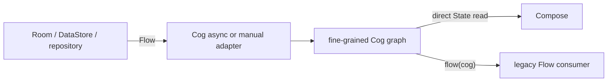

# Cog for Kotlin: Flow map

*Authored August 6, 2026.*

### 5.4 Where the Flow operators went

Cog does not replace Flow. It splits two jobs:

- Cog handles current state inside the UI graph.
- Flow carries async streams across system and repository boundaries.

This keeps derived state synchronous. It also keeps cancellation visible where
real work starts.



#### 1. Dynamic dependencies switch state

Write the branch as plain Kotlin:

```kotlin
val activeItems = cog<List<Item>> {
    when (get(selectedTab)) {
        Tab.All -> get(allItems)
        Tab.Saved -> get(savedItems)
    }
}
```

Only the chosen branch is a dependency. This covers much of
`combine` plus `flatMapLatest` when the inputs are current state.

#### 2. Async policies switch work

`AsyncPolicy.Latest` is like `flatMapLatest` for a request.
`Queue` is like sequential flattening. `Merge` is concurrent
flattening with a limit. `ExhaustLatest` finishes the active request, then
runs only the newest waiting input.

These names are domain policy. They do not expose an operator chain in the UI.

#### 3. Streams stay Flow

Use a stream adapter for Room queries, DataStore, sockets, sensors, and other
real multi-value sources:

```kotlin
val messages = streamCogBox<List<Message>, ThreadId> { threadId ->
    repository.observeMessages(threadId)
}
```

The first release collects only the latest selected Flow for an async node.
Each emission is one Cog turn.

#### 4. Exporting a Cog

Legacy code can collect a Cog:

```kotlin
val unread: Flow<Int> = cogs.flow(unreadCount)
```

The adapter is:

- cold until collected;
- current-value-first;
- equality-distinct by default;
- conflated by default;
- leased for the collector's lifetime;
- delivered from the store lane.

It does not implement `StateFlow`. Kotlin's docs warn that `StateFlow`
is not a stable interface for third-party inheritance.

For a keyed value:

```kotlin
val report: Flow<WeatherReport?> = cogs.flow(weather, zip)
```

#### 5. `snapshotFlow` is a lower-level bridge

`snapshotFlow { ... }` observes Compose snapshot reads and returns a cold
Flow. It is useful for a local Compose effect.

It is not the default Cog export because it knows nothing about:

- Cog leases and keyed cleanup;
- descriptor names;
- turns;
- reaction order;
- async generation;
- graph debug history.

It is equality-distinct and may skip fast state changes. Treat its block as a
read-only state calculation, not an event recorder.

#### Operator dictionary

| Flow or Rx idea | Cog shape |
|---|---|
| `map` | derived cog |
| `combine` | one derived body with several `get` calls |
| `distinctUntilChanged` | node equality policy |
| `flatMapLatest` over state | dynamic dependency |
| `flatMapLatest` over work | `AsyncPolicy.Latest` |
| `flatMapMerge` | `AsyncPolicy.Merge(limit)` |
| `onEach` for an effect | `CogEffects.watch` |
| `stateIn` | often a Cog node plus an owning store |
| `shareIn` | repository-owned shared Flow; adapt at the edge |
| `debounce` | async start policy or explicit effect helper |
| `retry` | repository or async work policy |
| `catch` | `CogPhase.Failed` or an effect error handler |
| `scan` | explicit writable source and operation |
| `buffer` | Flow boundary, not sync state |
| `collectLatest` | `watchLatest` or latest async work |

Do not copy an operator just because it exists. Add a Cog helper only when it
makes a common business rule clearer.

#### StateFlow trade-offs

`StateFlow` is a good boundary type. It is hot, thread-safe, always has a
value, and conflates equal updates.

It also has costs that matter for a large fine-grained graph:

- each update has linear cost in its active collectors;
- many combined flows create jobs and objects;
- two separate StateFlows do not publish as one multi-value transaction;
- dynamic dependency trees are verbose.

For a modest screen, one immutable `StateFlow<UiState>` may be simpler
than Cog. Cog should earn its place through shared fine-grained work, keyed
state, and precise invalidation.

#### Migration rules

1. Keep existing repository Flows.
2. Add one screen-owned `CogStore`.
3. Adapt repository streams at that store edge.
4. Move expensive or shared UI derivation into cogs.
5. Keep leaf composables on plain values and callbacks.
6. Export Flow only for old consumers that still need it.

#### Notes and sources

- [`StateFlow` API](https://kotlinlang.org/api/kotlinx.coroutines/kotlinx-coroutines-core/kotlinx.coroutines.flow/-state-flow/)
  defines equality conflation, hot behavior, thread safety, update cost, and
  the inheritance warning.
- [Compose `snapshotFlow`](https://developer.android.com/develop/ui/compose/side-effects#snapshotFlow)
  defines its cold, read-only, equality-distinct state semantics.
- [Collect Flow in Compose](https://developer.android.com/develop/ui/compose/state#use-other-types-of-state-in-jetpack-compose)
  covers lifecycle-aware UI collection.
- [Now in Android](https://github.com/android/nowinandroid) is a large official
  sample of StateFlow-based Android architecture.
- [Molecule](https://github.com/cashapp/molecule) shows the other direction:
  Compose runtime code can produce Flow and StateFlow.
