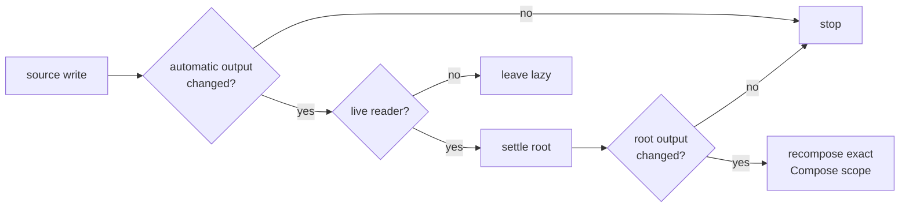
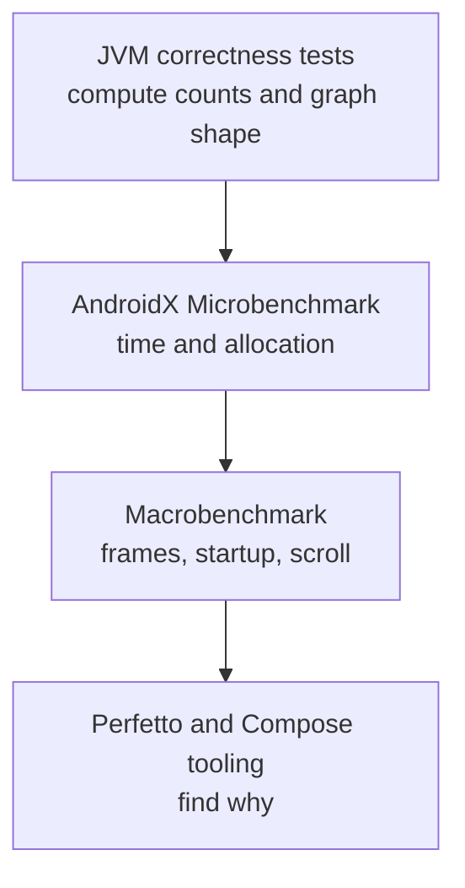

# Cog for Kotlin: performance model

_Authored August 6, 2026._

The [shared state model](../design.md) fixes the cross-platform runtime and puts
work avoidance before representation tricks. This document defines the Android
cost model. Its measurements choose the Kotlin representation.

Correct reads come first. The public API comes second. Data layout comes third.
An internal win is not a win if it weakens correctness, the public API, or the
singular graph.
Splitting features across stores is not a valid optimization; it would
fragment authoritative state.

## 1. Cost order

Optimize in this order:

1. do not recompute a state that cannot change;
2. do not recompose UI that did not read a changed value;
3. do not keep dead keyed states or jobs;
4. avoid allocation in a steady turn;
5. improve tables and edge layout;
6. specialize primitive storage only if measurements justify the API weight.

The first three usually beat a clever hash table.



The target is zero heap allocation for an ordinary steady turn after warm-up.
That target is a benchmark gate, not a claim.

## 2. Platform advantages to keep

Compose tracks UI reads, provides an efficient `MutableIntState`, schedules
recomposition, and supports compiler-driven skipping. Cog uses those tools at
the UI seam while keeping its graph in `CogStore`.

The first prototype must use:

- one lazily created version token per UI-seen Cog state and key;
- direct token reads in the smallest useful Compose scope;
- direct Cog value reads with no copied Compose value;
- equality-gated token writes after the Cog turn settles;
- stable descriptor objects;
- descriptor-and-key reads without a temporary handle.

Benchmarks will show whether a turn should batch changed token writes in a
mutable Compose snapshot. That choice affects boundary delivery; Cog still
owns the turn and graph.

## 3. Work avoidance

### 3.1 Dynamic edges

Capture only dependencies read on the current run. Remove old edges. When a
branch changes, stale sources must stop dirtying the state.

Measure both branch switching and steady branches. A design that rebuilds a
large edge set every read may lose even when it saves later work.

### 3.2 Equality gates

Use Kotlin `==` by default in Cog-owned value columns. A custom equality rule
belongs to the descriptor and gates downstream dirtiness, reactions, exports,
and Compose token changes in one place.

Equality itself can be costly for large values. Prefer small immutable values,
stable ids, or a domain equality policy with clear meaning. Do not use
referential equality just to hide in-place mutation.

### 3.3 Lazy and hot work

Cold automatic states compute on read. Hot roots settle after a turn so
reactions and UI have ready, equality-gated values.

The shared runtime settles live roots before it notifies their adapters. Kotlin
benchmarks may improve how it finds and walks those roots, but must preserve
that turn ordering. Cold branches remain lazy.

### 3.4 Read close to use

Compose can skip only when state is read in a scope it can restart. Do not read
a whole screen model at the route if one leaf needs one count.

For very hot visual state, pass a lambda and read in layout or draw when the
Compose API supports it. This can skip composition. Use it only after a trace
shows composition is the cost.

## 4. Storage candidates

### 4.1 Sources and automatic values

The shared design fixes the runtime shape. Benchmarks choose its Kotlin
representation:

| State data      | Required role                                     |
| --------------- | ------------------------------------------------- |
| source value    | Cog-owned typed storage                           |
| automatic value | Cog-owned cached storage                          |
| graph edges     | Cog-owned dynamic dependency representation       |
| turn            | Cog-owned staging buffer and revision             |
| UI boundary     | Compose `MutableIntState` token with no Cog value |

This shape matches the shared runtime and keeps one application value. The UI
token contains the version counter needed for native invalidation.

### 4.2 State and key tables

Candidates for descriptor and box lookup:

- Kotlin `HashMap`;
- AndroidX `MutableScatterMap`;
- an integer state id stored on an installed descriptor;
- a two-level table: descriptor id, then box key.

AndroidX scatter maps use flat arrays and avoid a separate entry object for
each insertion. That is promising, not settled. Library availability, code
size, key quality, and small-map speed also matter.

Production has one store, but tests and previews still create isolated stores.
Never put a store-specific state id directly on a shared descriptor unless that
mapping supports those isolated stores safely.

### 4.3 Edges

Cog owns correctness dependency edges, lease paths, and debug graph data.

Candidates:

- a small mutable set per state;
- packed integer arrays with tombstones;
- a shared edge arena;
- store only live-root paths and rebuild on automatic runs.

Measure dynamic churn, not only a fixed diamond. Any arena must reclaim edges
when keyed states die.

### 4.4 Primitive values

Compose provides `MutableIntState` for an unboxed UI version token. A generic
`Cog<T>` may still box domain values in Cog metadata or erased callbacks.

Possible specializations are `IntCog`, `LongCog`, `FloatCog`,
and `DoubleCog`. Do not add them until a realistic benchmark shows a
material end-to-end gain.

### 4.5 Key handles

The primary path is:

```kotlin
cogs[weather, zip]
```

It should not allocate a `Pair` or temporary value reference. Compare that with:

- `cogs[weather.at(zip)]`;
- an interned key handle;
- an `@JvmInline` handle;
- a cached state token remembered by Compose.

An inline class does not promise zero boxing in every generic or interface
call. Inspect bytecode and allocations.

## 5. Compose compiler and model stability

Strong skipping is on by default in current Kotlin Compose compiler releases.
It lets more composables skip, including ones with unstable parameters.

Still:

- model immutable data honestly;
- do not mutate public `var` fields behind Compose;
- prefer immutable collections when a collection crosses the UI boundary;
- use stable keys in lazy lists;
- check compiler stability reports before adding `@Stable`;
- treat `@Stable` and `@Immutable` as promises, not speed switches.

Wrong stability annotations can make UI stale. They are never a fix for a
mutable model.

## 6. Compose integration costs

Direct Cog reads should create no Flow collector and no coroutine. Each call
does need remembered lease ownership.

The prototype must count:

- recompositions;
- skipped recompositions;
- version-token `State` reads;
- leases created and released;
- allocations on first composition and steady recomposition;
- time to enter and leave a large lazy list;
- retained keyed states after list items leave.

Use stable lazy-list item keys. A box key should normally match the item's
domain id.

Do not wrap a direct Cog in `collectAsStateWithLifecycle`. That adds a Flow, a
collector job, and a second Compose state cell around a value whose boundary
token already provides exact invalidation.

## 7. Async and lifetime costs

Async churn can hide stale jobs and retained keys.

Measure:

- fast input changes under each scheduling policy;
- work that ignores cancellation;
- streams with fast equal and unequal emissions;
- grace-period cancel and restart;
- 1,000 keyed async states entering and leaving observation;
- process of clearing completed state cache entries.

Every async launch allocates a Job. The goal is not “no allocation” there. The
goal is no needless launch, collector, or retained job.

## 8. What to measure

Use layers:



Run Android benchmarks on physical devices in a release-like build. Debug
numbers are not release numbers. Pin inputs, warm-up rules, and library
versions in every result.

Key metrics:

- nanoseconds per turn at several graph sizes;
- allocations per steady turn;
- automatic compute count;
- dirty states visited;
- UI recomposition and skip count;
- frame timing and jank;
- memory after 1,000 and 10,000 keyed states;
- state and edge count after leases close;
- cold start and first-read cost;
- APK or AAR size change.

One number is not enough. Report median and tail values and keep raw benchmark
output.

<a id="9-spike-and-benchmark-plan"></a>

## 9. Spike and benchmark plan

### 9.1 Correctness corpus

The Kotlin runtime ports the shared Swift scenario IDs and expected turn
traces. Platform-specific tests then cover the Compose adapter and JVM
representation:

- chain, diamond, broad fan-out, and broad fan-in;
- dynamic branch switch;
- equal automatic result after unequal source writes;
- nested turn;
- staged writer read;
- escaped writer use after its turn closes;
- failed turn;
- read and write cycle;
- reaction order and reaction write-back;
- key collision and mutable-key misuse;
- lease loss and cache expiry;
- async cancel, stale completion, failure, and stream replacement;
- wrong-lane access;
- second production-store installation;
- screen recreation without manual-state loss.

Assert values and exact compute counts.

### 9.2 Microbenchmarks

Port useful shapes from
[js-reactivity-benchmark](https://github.com/milomg/js-reactivity-benchmark):

- 10, 100, 1,000, and 10,000 state chains;
- diamond and layered diamonds;
- one source with many readers;
- many sources with one sum;
- dependency switching;
- keyed create/read/release churn;
- one turn with 1, 10, and 100 writes;
- equal-output propagation;
- Compose lease enter/leave.

Compare:

1. the Cog-owned Kotlin graph with Compose version-token boundaries;
2. raw `MutableState` plus `derivedStateOf` as a platform baseline;
3. `MutableStateFlow` with `combine` and collection;
4. Molecule for whole-model cases where that comparison is fair.

Do not tune only to win a synthetic case.

### 9.3 UI benchmarks

Build three small apps:

- a settings form with independent fields;
- a feed with keyed rows and counters;
- a live dashboard with dynamic branches and fast updates.

Use Macrobenchmark and Perfetto for startup, scroll, updates, and navigation
away. Add a baseline profile only after measuring the unprofiled build. Keep
both results.

### 9.4 Gates

The first prototype passes only if:

- every shared scenario has the same observable result and phase ordering as
  Swift;
- every correctness test passes;
- direct UI reads recompose no wider than raw Compose state;
- a steady one-source turn does not allocate after warm-up, or the remaining
  allocation is understood and accepted;
- keyed states and jobs return near baseline after lease expiry;
- no compared common graph shape has an unexplained order-of-magnitude loss;
- tracing can name the states and turn behind a slow update.

These are design gates. Exact numeric budgets should be set on the reference
devices after the first run.

### 9.5 Decisions unlocked by data

Benchmarks decide:

- HashMap or scatter table;
- edge representation;
- key-handle representation;
- primitive-specialized APIs;
- hot-root queue and settlement representation;
- version-token storage and notification batching;
- grace-period defaults;
- history and tracing level in release builds.

Until then, all remain candidates.

## 10. Deliberate non-goals

- beating raw `MutableState` on a single value;
- making every value observable across threads;
- hiding mutable collections behind stability annotations;
- replacing Room, DataStore, Flow, or WorkManager;
- optimizing debug history before release behavior;
- promising zero allocation for async work or first composition;
- a benchmark result without source, device, mode, and versions.

## Appendix A: measurement tools

- [Microbenchmark overview](https://developer.android.com/topic/performance/benchmarking/microbenchmark-overview)
- [Macrobenchmark overview](https://developer.android.com/topic/performance/benchmarking/macrobenchmark-overview)
- [Baseline Profiles](https://developer.android.com/topic/performance/baselineprofiles/overview)
- [Compose performance](https://developer.android.com/develop/ui/compose/performance)
- [Compose performance best practices](https://developer.android.com/develop/ui/compose/performance/bestpractices)
- [Compose `derivedStateOf` guidance](https://developer.android.com/develop/ui/compose/side-effects#derivedStateOf)
- [Diagnose stability](https://developer.android.com/develop/ui/compose/performance/stability/diagnose)
- [Compose tooling and recomposition counts](https://developer.android.com/develop/ui/compose/tooling/debug)

## Appendix B: platform sources and comparison baselines

- [Compose `DerivedState` source](https://android.googlesource.com/platform/frameworks/support/+/androidx-main/compose/runtime/runtime/src/commonMain/kotlin/androidx/compose/runtime/DerivedState.kt)
- [Compose `SnapshotStateObserver` source](https://android.googlesource.com/platform/frameworks/support/+/androidx-main/compose/runtime/runtime/src/commonMain/kotlin/androidx/compose/runtime/snapshots/SnapshotStateObserver.kt)
- [Compose `SnapshotStateMap` source](https://android.googlesource.com/platform/frameworks/support/+/795cb9ba01d8d529758d00d225615880bce6149d/compose/runtime/runtime/src/commonMain/kotlin/androidx/compose/runtime/snapshots/SnapshotStateMap.kt)
- [AndroidX `MutableScatterMap`](https://developer.android.com/reference/androidx/collection/MutableScatterMap)
- [Compose primitive state](https://developer.android.com/reference/kotlin/androidx/compose/runtime/MutableIntState)
- [Strong skipping](https://developer.android.com/develop/ui/compose/performance/stability/strongskipping)
- [Molecule](https://github.com/cashapp/molecule)
- [Reactively algorithm notes](https://github.com/milomg/reactively/blob/main/Reactive-algorithms.md)
- [alien-signals](https://github.com/stackblitz/alien-signals)

Compose graph sources provide comparison data. Cog's tests and measurements
settle its layout.
