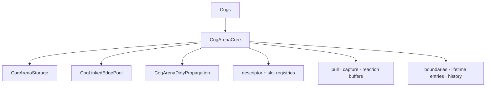
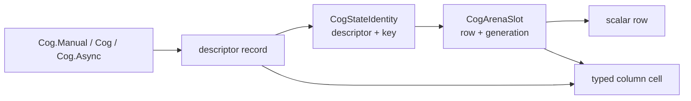
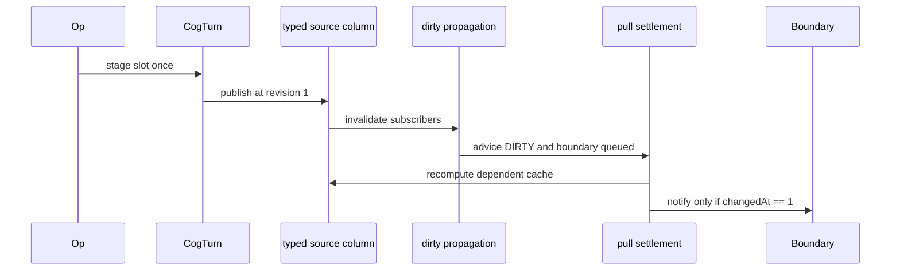

# Arena core

_August 22, 2026_

[Back to the architecture overview.](./index.md)

`Cogs` owns one `CogArenaCore`. The core is the context-local bridge from
stable public descriptor/key names to dense graph rows, typed values, and cold
runtime sidecars.

## Ownership

The **hot side** is data visited during ordinary resolution, propagation, or
settlement: scalar arrays, integer edges, typed value cells, descriptor indexes,
and reused scalar work stacks. The **cold side** is needed only for setup,
boundaries, async work, lifetime, diagnostics, or closures: descriptor records,
registrar objects, tasks, keys, sleepers, and debug history.



The core owns:

| Piece                                     | Purpose                                                           |
| ----------------------------------------- | ----------------------------------------------------------------- |
| `arena`                                   | `CogArenaStorage`: aligned scalar row columns and slot allocator. |
| `edges`                                   | `CogLinkedEdgePool`: dependency/subscriber topology.              |
| `propagation`                             | Reused invalidation stack and changed-boundary queue.             |
| `revision`                                | Latest turn revision, never allowed to wrap.                      |
| `contextIdentity`                         | Never-reused context token for declaration memos.                 |
| `slots`                                   | `CogStateIdentity` to exact live `CogArenaSlot`.                  |
| `recordsByIdentity`                       | Strong descriptor-object registry.                                |
| `records`                                 | Dense `Unmanaged` descriptor dispatch array for row walks.        |
| `pullFrames`, `captures`, `computingPath` | Reused iterative settlement and nested capture state.             |
| `reactionPullRoots`                       | Stable producer snapshot while a terminal settles.                |
| `observationEntries`                      | Cold registrar boundary plus exact slot.                          |
| `lifetimeEntries`                         | Cold sleeper generation and task per value row.                   |
| `historyLog`                              | Fixed-capacity integer history in debug builds only.              |

`CogTurn` and the FIFO remain on `Cogs` because they coordinate the public
publication boundary. Async tasks live in descriptor-local
`CogArenaAsyncColumn` sidecars because their concrete `Value` type belongs to
the descriptor, not the scalar graph.

## Value rows and terminal rows

A value row has a descriptor index. Its record identifies manual, synchronous
automatic, or async behavior and restores a typed column. A reaction terminal
is deliberately value-less: `descriptor == -1`, no boundary, no subscribers,
but a normal ordered dependency list and settlement flags.

| Row kind                 | Descriptor | Typed value                      | Dependencies            | Subscribers | Boundary  |
| ------------------------ | ---------- | -------------------------------- | ----------------------- | ----------- | --------- |
| manual                   | yes        | current + pending                | none                    | possible    | optional  |
| automatic                | yes        | cached, pending during recompute | ordered                 | possible    | optional  |
| async status             | yes        | `CogStatus` current + pending    | ordered selection reads | possible    | optional  |
| reaction/export terminal | no         | none                             | ordered tracked reads   | forbidden   | forbidden |

Example after `Dashboard` and one mechanism reaction read `adviceCog`:

```text
row 0  advice automatic   deps → row 1   subs → terminal row 2
row 1  temperature manual deps → none    subs → row 0
row 2  reaction terminal  deps → row 0   subs → none
```

Rows are allocated by demand, so these numbers are examples, not declaration
order.

## Cold identities, hot rows

Public references must remain stable across release and recreation, so they
cannot embed arena slots. Resolution is the only transition:



Once a slot is resolved, dirty propagation, pull frames, computing paths, and
edges carry `Int32` rows. They do not repeatedly hash keys or retain descriptor
objects.

## Trace: one automatic UI read

For `let advice = cogs[adviceCog]`, the exact handoffs are:

| Step | Symbol                                         | Work                                                                                                             |
| ---- | ---------------------------------------------- | ---------------------------------------------------------------------------------------------------------------- |
| 1    | `Cogs.subscript(_ valueReference: Cog<Value>)` | Selects the Observation-tracked UI path.                                                                         |
| 2    | `CogArenaCore.observedAutomaticValue`          | Resolves the automatic location and requests settlement.                                                         |
| 3    | `automaticLocation`                            | Tries the keyless descriptor memo and validates `contextIdentity` plus slot generation.                          |
| 4    | `resolvedAutomaticLocation`                    | On miss, calls `automaticRecord`, forms `CogStateIdentity`, finds or installs a slot, and marks a new row DIRTY. |
| 5    | `automaticRecord`                              | Restores or creates `CogArenaValueColumn<String>` and the erased descriptor closures.                            |
| 6    | `settle`                                       | Pushes an enter frame; a cold DIRTY row reaches descriptor `recompute`.                                          |
| 7    | `recompute`                                    | Calls `withDependencyCapture`, then `AutomaticCogDescriptor.compute`.                                            |
| 8    | `Reader.subscript(_ Cog<Value>.Manual)`        | Calls `CogArenaCore.read` for `temperatureSourceCog`.                                                            |
| 9    | `manualLocation` / `resolvedManualLocation`    | Resolves the manual descriptor, slot, and `CogArenaValueColumn<Double>`, inserting 68 on first use.              |
| 10   | `recordDependency`                             | Reuses the next matching edge or appends an edge from temperature to advice.                                     |
| 11   | `CogArenaValueColumn.insert`                   | Installs the cold automatic result; `recompute` stamps `changedAt` and `checkedAt`.                              |
| 12   | `accessObservationBoundary`                    | Lazily creates or accesses the exact row's `CogObservationBoundary`.                                             |
| 13   | `CogArenaValueColumn.current`                  | Returns the concrete cached `String`.                                                                            |

A warm keyless read normally takes steps 1–3, a clean `settle`, boundary access,
and typed current load. It bypasses both descriptor/slot dictionaries and the
checked downcast.

## Trace: one manual write and dependent read

Assume the rows above exist and a domain op stages 86.

```text
temperature row: current 68, pending absent, checkedAt 0
advice row:      current "Go outside", clean, checkedAt 0
```

| Step | Symbol                                           | Work                                                                                                |
| ---- | ------------------------------------------------ | --------------------------------------------------------------------------------------------------- |
| 1    | `Cogs.turn(_:to:name:)`                          | Opens or joins an accumulating turn.                                                                |
| 2    | `Cogs.writerStage`                               | Proves the writer's turn identity.                                                                  |
| 3    | `CogArenaCore.writerStage`                       | Resolves the manual location and stages 86.                                                         |
| 4    | `CogArenaValueColumn.stage`                      | Writes the pending typed cell.                                                                      |
| 5    | `touchArenaSource`                               | Sets `touched`; appends the slot once to `CogTurn`.                                                 |
| 6    | `Cogs.runOuterTurn`                              | Closes accumulation and calls `CogTurn.flushPendingSources`.                                        |
| 7    | `Cogs.advanceRevision`                           | Advances core revision from 0 to 1.                                                                 |
| 8    | `CogArenaCore.flushPendingSources`               | Dispatches through the manual record's `publishSource`.                                             |
| 9    | `CogArenaValueColumn.publishSource`              | Compares 68 and 86, publishes current, stamps source `changedAt=checkedAt=1`.                       |
| 10   | `CogArenaDirtyPropagation.invalidateSubscribers` | Queues the source boundary if any; marks direct advice DIRTY and descendants CHECK.                 |
| 11   | `flushObservationBoundaries`                     | Selects only queued boundary rows and settles advice.                                               |
| 12   | `settle` / `recompute`                           | Reuses the temperature edge, computes “Stay inside,” and publishes the changed cache at revision 1. |
| 13   | descriptor `notifyObservation`                   | Mutates the boundary's value key path.                                                              |
| 14   | `Cogs.flushReactions`                            | Offers exports, then settles and runs effect terminals.                                             |
| 15   | `finishTurn` / `drainQueuedTurns`                | Returns idle and drains write-back/system turns FIFO.                                               |



If 70 produces the same advice, step 12 advances advice `checkedAt` to 1 but
keeps its older `changedAt`; step 13 is skipped.

## Dispatch records

`CogArenaDescriptorRecord` is retained once per declaration per context. It
stores immutable identity, label, dense index, kind, lifetime policy, erased
typed column references, and descriptor-level closures for source publication,
recomputation, Observation notice, value removal, teardown, and memo eviction.
Keys form a cold descriptor-owned sparse side table by global row.

Indexed graph walks load `arena.descriptor[row]`, then use the dense `records`
array. There is one closure per descriptor, not per state row. `records` stores
unretained references because `recordsByIdentity` is the strong owner for the
same context lifetime.

## Reused work storage

The core and its helpers retain high-water capacity:

- `CogTurn.touchedArenaSources` for ordered source publication;
- dirty-propagation `stack` and `changedBoundaryRows`;
- `pullFrames` for iterative enter/exit settlement;
- `captures` for nested dependency reconciliation;
- `computingPath` for cycle detection;
- `reactionPullRoots` for topology-stable terminal settlement; and
- per-reaction current/scratch lease arrays.

Steady turns therefore reuse buffers instead of allocating work items.

## Invariants

- `Cogs` and every graph mutation remain MainActor-confined.
- Public references never expose or retain slots.
- Every live value row has one valid descriptor dispatch index; every terminal
  has none.
- Hot rows contain no objects, closures, keys, or values.
- Exact slots validate occupant generation at typed and cold boundaries.
- Descriptor records outlive all rows that refer to their dense index.
- Settlement/capture/propagation buffers are empty at their public idle barriers.

Next: [arena identity and caching](./arena-identity-and-caching.md).
