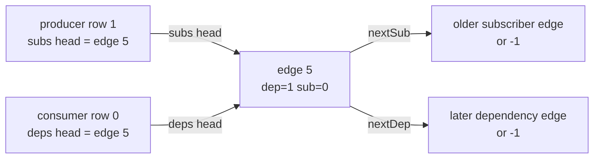
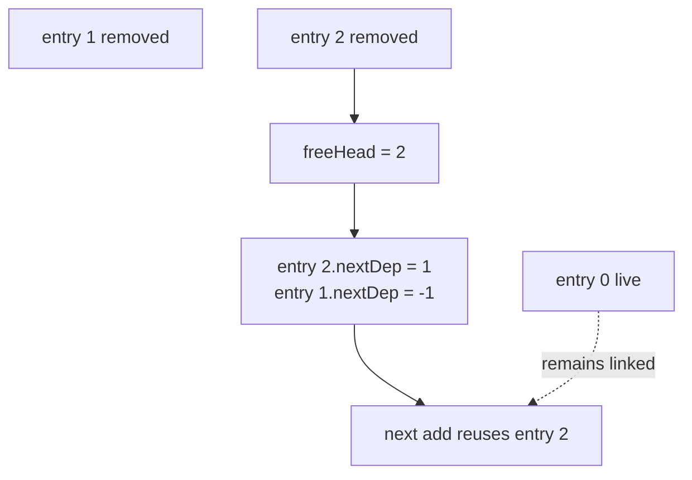
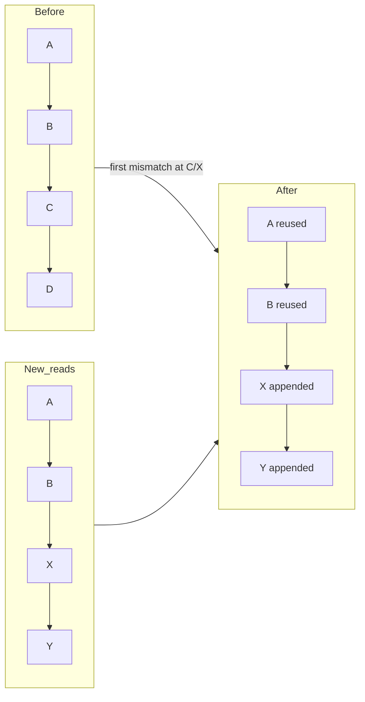

# Arena edges

_August 22, 2026_

[Back to the architecture overview.](./index.md)

`CogLinkedEdgePool` stores every producer-to-consumer relationship once and
links that entry into two views of the graph. The selected entry is 24 bytes:
six four-byte fields, no references, optional payloads, or pointers.

## The pool entry

```swift
// Implementation shape, abbreviated.
struct CogPoolEdge {
  var dep, sub: Int32
  var prevSub, nextSub: CogEdgeIndex
  var nextDep: CogEdgeIndex
  var version: UInt32
}
```

`dep` is the producer row; `sub` is the consumer row. `prevSub` and `nextSub`
form the producer's doubly linked subscriber list. `nextDep` forms the
consumer's ordered singly linked dependency list. `version` captures the
producer's `changedAt` when the consumer reads it and is refreshed when a
prefix edge is reused. Current settlement compares producer `changedAt` with
the consumer's scalar `checkedAt`; the captured field remains part of the
selected edge layout and capture record.

`CogEdgeIndex` wraps dense `Int32`; `-1` is the universal none sentinel. Free
entries set `dep` and `sub` to `-1` and reuse `nextDep` as the free-list link.

## One edge, two topologies

For `advice` reading `temperature`, edge 5 appears in both lists:



Adding pushes the edge onto the producer's subscriber head and appends it after
the supplied consumer dependency tail. The caller carries that tail, so
ordered append is O(1) without another per-row scalar.

The producer list is doubly linked because propagation and recapture need to
unlink an edge from an arbitrary producer in O(1). The consumer list needs only
selector read order and is singly linked. Full or suffix removal walks it once.

## Allocation and free-list reuse

The pool grows a contiguous array until an entry is removed. Removal repairs
both graph lists, overwrites the entry with a free record, and pushes its index
onto `freeHead`. The next add pops that exact entry before growing storage.



Entries have no independent generation. A free entry is rejected by `isLive`,
and state rows cannot be released until all their edges have been removed.
Exact slot generations are validated at the state boundary.

## Static-prefix reconciliation

Each selector capture starts with a cursor at the consumer's old dependency
head and `previous = none`. For every tracked read:

1. If the cursor edge names the same producer and consumer, update its captured
   version, advance both cursors, and keep it.
2. At the first mismatch, cut and recycle the entire old suffix after
   `previous` once.
3. Append a new edge after `previous`, then append every later read.
4. At capture end, remove any unread old tail still under the cursor.



This is a static-prefix algorithm: its edge-reconciliation step reuses every
stable edge without hashing or allocation; dynamic selectors pay only from
their first changed read onward. A keyed read may still hash during the earlier
descriptor/key-to-slot resolution.

## Example: unchanged dependencies

```swift
let comfortCog = Cog { c in
  let temperature = c[_temperatureCog]
  let humidity = c[_humidityCog]
  return Comfort(temperature, humidity)
}
```

If both reads occur in that order on every run, their two edges are reused and
their versions refreshed. Capture ends with `cursor == none`; nothing is added
or removed.

## Example: conditional branch

```swift
let shownCog = Cog { c in
  let indoor = c[_showIndoorCog]
  return indoor ? c[_indoorCog] : c[_outdoorCog]
}
```

The mode edge is a stable prefix. Switching branches preserves it, removes the
old temperature suffix, and appends the new temperature edge. A later write to
the abandoned producer no longer reaches `shownCog`.

## Duplicate reads

Read order is literal. Reading the same producer twice records two consecutive
edges because each reader subscript is one capture event:

```swift
let doubledCog = Cog { c in
  c[_temperatureCog] + c[_temperatureCog]
}
```

On the next identical run, both duplicate entries are reused in order. Push
invalidation may encounter the same consumer twice; row strength deduplication
cuts off the second branch. Application selectors should still bind and reuse a
local because it states intent and avoids redundant lookup.

```swift
let doubledCog = Cog { c in
  let temperature = c[_temperatureCog]
  return temperature + temperature
}
```

## Diamonds

In a diamond, each producer/consumer pair has its own edge. The shared source's
subscriber list reaches both arms. Each arm's subscriber list reaches the leaf.
The leaf's dependency list preserves arm read order.

```text
source.subs: edge(source,left) ↔ edge(source,right)
leaf.deps:   edge(left,leaf) → edge(right,leaf)
```

Push marking may schedule leaf CHECK through both arms. If one path later
delivers direct DIRTY, strength promotion wins and propagates the stronger mark
once.

## Keyed churn

Keys affect state resolution, not edge representation. After a keyed reference
resolves to a slot, an edge stores only its row. A selector alternating among
keys cuts and reuses suffix entries exactly like a branch among keyless
declarations. Released keyed rows first lose all edges; later pool entries may
reuse edge indexes independently of later scalar-slot reuse.

```swift
let selectedForecastCog = Cog { c in
  let zip = c[_selectedZipCog]
  return c[forecastCogs[zip]]
}
```

This selector typically preserves the `selectedZip` prefix and replaces the
keyed forecast suffix when `zip` changes.

## Reaction terminals

A reaction terminal uses the same ordered dependency list. Its direct reads
become producer subscriber edges, so propagation reaches the terminal with
DIRTY or CHECK. It has no descriptor, value, boundary, or subscribers.

Before a reaction body reruns, the core copies any stale producer slots into a
reused root buffer. Pulling one producer may recapture edges elsewhere in the
shared pool; the copy keeps traversal stable. The reaction's new capture then
uses the same static-prefix algorithm and reconciles direct lifetime leases.

## Removal costs

- Producer unlink: O(1) through `prevSub`/`nextSub`.
- Ordered dependency append: O(1) with caller-held tail.
- Full consumer removal: O(number of dependencies).
- Suffix removal: O(removed suffix), with one cut.
- Arbitrary edge removal: O(1) producer unlink plus a linear search for the
  predecessor in the singly linked consumer list; normal recapture avoids
  repeating this path.
- Entry allocation after warm-up: O(1) free-list pop.

## Invariants

- A live edge belongs to exactly one producer list and one consumer list.
- Producer links are mutually consistent; consumer links preserve read order.
- `dep` and `sub` name occupied rows until the edge is removed.
- A free entry appears in no graph list and uses only `nextDep` for free-list
  linkage.
- Capture removes abandoned edges before a row or producer can be released.
- `MemoryLayout<CogPoolEdge>` remains 24-byte size and stride; infrastructure
  tests pin it.

Next: [arena settlement](./arena-settlement.md).
