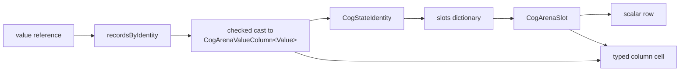
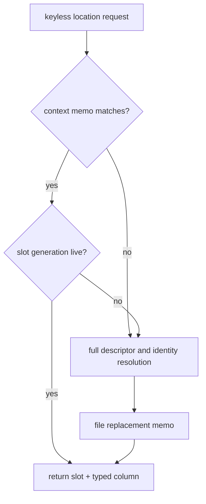
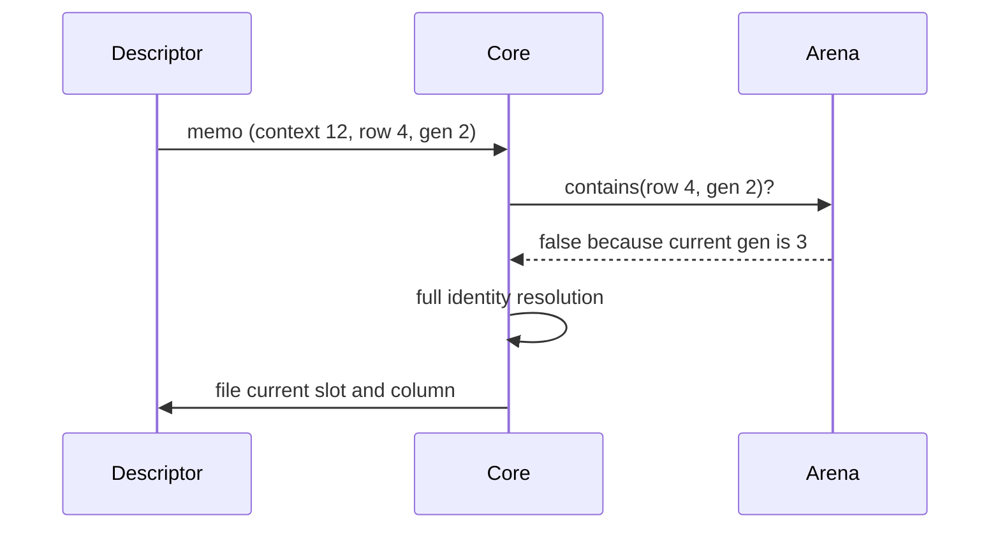

# Arena identity and caching

_August 22, 2026_

[Back to the architecture overview.](./index.md)

Resolution turns a stable public reference into a generation-checked arena slot
and a concrete typed column. Caches remove repeated identity and metadata work
without becoming alternate sources of state.

## Descriptor versus descriptor record

A declaration descriptor is a MainActor-confined object shared by every copy of
a public value reference and every context that uses it. It holds immutable
declaration metadata: label, selector or starting value, equality, lifetime,
and—only for keyless manual/automatic declarations—a one-context location
memo.

A `CogArenaDescriptorRecord` belongs to one `CogArenaCore`. It assigns the
descriptor a dense context-local index, owns erased references to concrete typed
columns and async sidecars, and forms one set of erased dispatch closures.

```text
static declaration descriptor
  ├─ app Cogs → app descriptor record → app typed column
  └─ test Cogs → test descriptor record → test typed column
```

Mutable values never live on the shared descriptor. A memo may retain one
context's column as a derived lookup cache, but the context remains the
authoritative owner and teardown evicts it.

## State identity

`CogStateIdentity` is descriptor `ObjectIdentifier` plus optional `CogKey`.
`CogKey` stores the original key as inline `AnyHashable`. The context supplies
the namespace, so the same identity value in two contexts intentionally maps to
different state.

```swift
let home = forecastCogs[ZipCode("10001")]
let copy = home
let office = forecastCogs[ZipCode("90210")]
// home and copy converge in one Cogs; office does not.
```

The public reference remains stable if a `whileObserved` state is released.
The next read resolves the same descriptor/key identity to a newly generated
slot and recomputes or restores its starting value.

## Full resolution path

The normal manual and automatic path is:



`manualRecord` or `automaticRecord` first checks `recordsByIdentity`. A hit
validates kind and casts `record.column` from `AnyObject` back to
`CogArenaValueColumn<Value>`. A miss constructs the column and record, adds the
record to both registries, and forms descriptor-level closures that retain the
typed resources.

`resolvedManualLocation` or `resolvedAutomaticLocation` then builds
`CogStateIdentity` and looks in `slots`. A missing state allocates a scalar row,
stores the record index and key, files the identity/slot pair, and initializes
the typed cell or DIRTY flag.

Async status uses this full path. `asyncRecord` restores
`CogArenaAsyncColumn<Value>`; `asyncLocation` installs its sidecars and marks
the new row DIRTY.

## Keyless memoized path

Keyless manual and synchronous automatic declarations memoize a tuple of
context identity, exact slot, and concrete typed column. `manualLocation` and
`automaticLocation` check:

1. the reference has no key;
2. the descriptor memo's context equals this core's `contextIdentity`; and
3. `arena.contains(slot)` proves the row is occupied at that generation.



A hit bypasses two dictionary lookups—descriptor registry and
descriptor/key-to-slot—plus the checked downcast that restores the typed
column. The downcast matters in unspecialized generic code because it may ask
the Swift runtime for generic metadata the caller already conceptually knows.

Example: after the first `cogs[adviceCog]`, later keyless reads normally go
directly from `adviceCog.descriptor` to its memoized slot and
`CogArenaValueColumn<String>`.

## Why context identity is a counter

`CogArenaCore.contextIdentity` comes from a MainActor-isolated, strictly
increasing `UInt64` counter; zero means no memo. An object address cannot be the
guard because allocators may reuse the address of a deallocated `Cogs`. A stale
memo compared with a recycled address could silently read another context.
A never-reused counter makes the stale memo fail closed.

Counter exhaustion traps instead of wrapping. The cost is one integer per core
and one per memoized descriptor, outside the scalar row.

## Slot-generation guard

Context match alone is insufficient. A keyless `whileObserved` automatic may
be released while its context remains alive. `CogArenaSlot` contains the row's
`Int32` index and `UInt16` occupant generation. Release clears the row, advances
generation, and only then makes the index reusable.

```text
memo: slot(index: 4, generation: 2)
release row 4 → arena generation becomes 3
replacement takes row 4 at generation 3
arena.contains(old memo) == false
```

The old memo cannot reach the replacement even before explicit memo eviction.
Eviction is still performed to stop a released declaration retaining the
context's typed column.



## Why keyed states do not memoize one location

One box descriptor names an arbitrary family of keys. A single-entry memo
would thrash whenever access alternated between keys, add invalidation surface,
and still require key equality to prove a hit. Keyed references therefore use
the ordinary descriptor and `slots` registries. Specialization makes their
typed path cheaper without changing identity.

## Async status and value projection

Async status rows do not have the keyless descriptor memo. They are not the
steady-turn path the memo was measured for, and another memo shape would widen
release and teardown logic. Their descriptor record uses a no-op
`forgetMemoizedLocation` closure.

The common value spelling does benefit indirectly. Each `Cog<Value>.Async` owns an
internal `AutomaticCogDescriptor<Value>` whose selector reads its async status
and returns `status.value`. A keyless projection follows the automatic location
memo; a keyed projection uses ordinary descriptor/key resolution. Both use the
automatic equality gate. A status consumer observes lifecycle changes; a value
consumer uses the cached projection.

## Cache ledger

“Cache” here includes derived values, revision proofs, dedupe marks, and reused
work storage. None is a second writable domain source.

| Cache or reuse point           | Owner                                  | Key                           | Stored value                                          | Hit path                                                     | Miss path                                          | Invalidation / stale guard                                                                                         |
| ------------------------------ | -------------------------------------- | ----------------------------- | ----------------------------------------------------- | ------------------------------------------------------------ | -------------------------------------------------- | ------------------------------------------------------------------------------------------------------------------ |
| descriptor record registry     | `CogArenaCore.recordsByIdentity`       | descriptor `ObjectIdentifier` | strong `CogArenaDescriptorRecord`                     | validate kind and typed downcast                             | create typed column, record, closures, dense index | context teardown releases whole core; descriptor identity lives while references do                                |
| descriptor/key slot registry   | `CogArenaCore.slots`                   | `CogStateIdentity`            | exact `CogArenaSlot`                                  | `existingSlot` validates generation and record index         | allocate/install row and typed state               | `releaseValueState` removes exact entry before row reuse                                                           |
| keyless location memo          | manual/automatic descriptor            | `contextIdentity`             | exact slot + typed column                             | context and `arena.contains` both match                      | full record/slot resolution, then replace memo     | keyless release and context teardown evict; context and slot generations guard stale entries                       |
| automatic value cache          | descriptor-owned `CogArenaValueColumn` | global arena row              | last completed `Value`                                | clean read returns current                                   | DIRTY or changed dependency recomputes             | equality controls publication; release clears cell before slot reuse                                               |
| `changedAt` / `checkedAt`      | scalar arena row                       | row                           | last changed and proved-current revisions             | dependency `changedAt <= consumer.checkedAt` skips recompute | DIRTY or newer dependency recomputes               | turn revisions never wrap; complete row reset on release                                                           |
| ordered dependency prefix      | consumer row + edge pool               | selector read position        | producer, consumer, version, links                    | next old producer matches next read                          | cut first mismatching suffix and append            | unread tail removed at capture end; row release removes full list                                                  |
| changed-boundary queue         | dirty propagator                       | row plus `noticeQueued` bit   | changed boundary row                                  | duplicate queue attempt sees bit and skips append            | append first marked boundary                       | flush clears bit and drops snapshotted prefix; permanent lease prevents reuse, and lookup validates the exact slot |
| invalidation stack             | dirty propagator                       | none; LIFO work               | row + strength frames                                 | capacity reused                                              | array grows to new high-water mark                 | successful walk drains; reentry traps                                                                              |
| pull/capture/computing buffers | `CogArenaCore`                         | nested stack position         | row frames and cursors                                | warm traversal reuses capacity                               | cold/deeper graph grows arrays                     | balanced scopes pop to prior boundary; idle barrier requires empty                                                 |
| reaction buffers               | core and each `CogReaction`            | terminal/run                  | pull roots, current leases, scratch leases, run queue | steady reaction reuses arrays                                | new high-water shape grows                         | runs reconcile leases and clear scratch/queues; exact slots guard occupants; cancellation clears all               |
| turn buffer                    | reusable `CogTurn`                     | `touched` row bit             | ordered touched slots                                 | repeated write only replaces pending                         | first touch appends                                | flush clears flags and removes all keeping capacity                                                                |
| async last success             | `CogArenaAsyncColumn`                  | descriptor + exact row        | absent or latest accepted `Value`                     | pending/failure reuses content                               | first success installs                             | release resets after generation advance; slot ownership validated                                                  |
| async work generation          | `CogArenaAsyncColumn`                  | exact row plus policy         | current counter, active generation/tasks, queues      | accepted completion matches policy state                     | reject without publication                         | generation never wraps; slot/descriptor/key and DIRTY/CHECK checks also required                                   |
| lifetime sleeper generation    | `CogArenaLifetimeEntry`                | exact row occupant            | monotonic token, pending token, task                  | deadline matches both slot and token                         | stale deadline returns                             | renewal/cancellation/release advances token; row reset clears sidecar                                              |

## Eviction and teardown

Release removes the typed value and key before removing `slots` and releasing
the scalar row. Keyless release also calls the record's erased memo-eviction
closure for this context. Context teardown visits every record, cancels async
sidecars, and evicts only memos whose context matches. This matters when a
declaration has since been used in another still-live context: the older
context must not clear the newer context's cache.

## Rules for caches

- Cache only values that can be re-derived from the authoritative graph.
- Name an exact context and row occupant wherever reuse can cross lifetime.
- Make wraparound a trap or retire the row; never let an ancient token become
  valid again.
- Keep keyed lookup and async status on their measured full paths until evidence
  supports a broader memo.
- Evict retained typed resources on release and teardown even when generation
  checks already make stale access impossible.

Next: [arena storage](./arena-storage.md).
