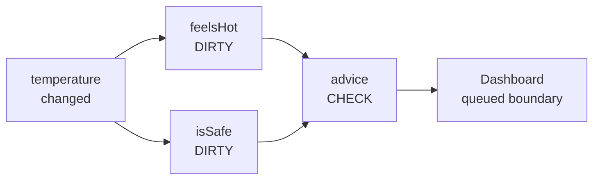
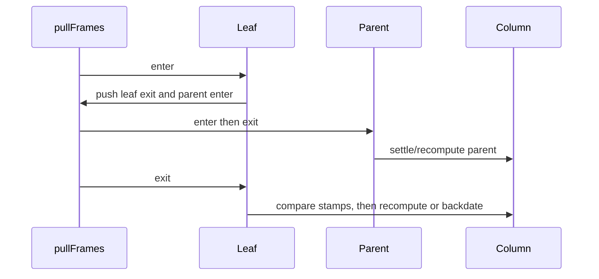
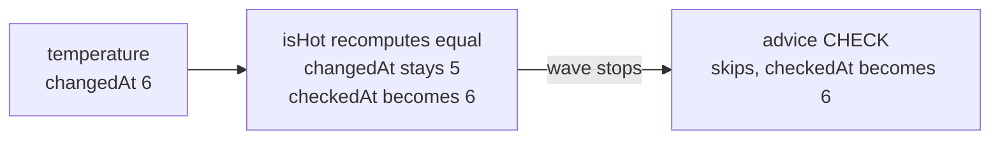

# Arena settlement

_August 22, 2026_

[Back to the architecture overview.](./index.md)

Settlement combines push invalidation with pull evaluation. A changed source
pushes small flags through possible paths. A boundary read or reaction then
pulls only its needed ancestors current. Equality stops waves before downstream
selectors run.

## Push strengths

When a source publishes a real change,
`CogArenaDirtyPropagation.invalidateSubscribers` marks its direct consumers
DIRTY: one of their own inputs changed, so they must recompute if pulled.
Further descendants receive CHECK: an upstream value may have changed, but
equality at an intervening automatic may stop the wave.



The invalidator uses a reused LIFO stack of `(row, strength)` frames. A row
already marked at equal or greater strength cuts off that branch. CHECK can be
promoted to DIRTY; DIRTY is never weakened. This makes diamonds bounded and
preserves a direct dependency even if an indirect path reaches the row first.

### Exact diamond flags

Suppose `source` directly feeds `left`, `right`, and `leaf`; both arms also feed
`leaf`, and `leaf` feeds `below`.

| Row    | Before   | After source invalidation | Why                                    |
| ------ | -------- | ------------------------- | -------------------------------------- |
| source | occupied | occupied                  | publisher is current at new revision   |
| left   | occupied | occupied + DIRTY          | direct subscriber                      |
| right  | occupied | occupied + DIRTY          | direct subscriber                      |
| leaf   | occupied | occupied + DIRTY          | indirect CHECK promoted by direct edge |
| below  | occupied | occupied + CHECK          | only downstream possibility            |

CHECK and DIRTY coexisting is a runtime invariant failure.

## Changed-boundary queue

Every changed producer and newly marked consumer is checked for a boundary.
The first hit sets `noticeQueued` and appends its row to
`changedBoundaryRows`. Another queue attempt through a diamond sees the bit and
skips the append; CHECK/DIRTY strength decides whether propagation continues.
Rows without UI boundaries cost two scalar loads and a branch but never enter
the queue.

At flush, the queue is sorted by the stored boundary index to restore boundary
creation order. Only that changed set is visited. Each row is settled before
the core tests `changedAt == revision`; an equal result therefore sends no
notice. The queue count is snapshotted so entries added by synchronous notice
handling wait for the next flush.

```text
10,000 pinned keyed rows; 3 invalidated this turn
→ settle and inspect 3 queued rows, not all 10,000 boundaries
```

## Iterative pull frames

`CogArenaCore.settle` uses a reused `pullFrames` array. An enter frame checks
whether the row still needs settlement, rejects manual rows and cycles, marks
the row computing, pushes its exit frame, then pushes stale automatic
dependencies. Exit runs only after those producers are current.



The exit decision is:

```text
mustRecompute = row is DIRTY
             or any dependency.changedAt > row.checkedAt
```

If false, the row advances `checkedAt` to the current revision and clears CHECK
and DIRTY without invoking its selector. If true, the descriptor record calls
its typed recompute closure.

## Revision example: changed result

Initial settled rows at revision 4:

| Row         | Value        | `changedAt` | `checkedAt` | Flags    |
| ----------- | ------------ | ----------: | ----------: | -------- |
| temperature | 68           |           4 |           4 | occupied |
| advice      | “Go outside” |           4 |           4 | occupied |

At revision 5, temperature publishes 86 and advice becomes DIRTY:

| Phase       | temperature          | advice                              |
| ----------- | -------------------- | ----------------------------------- |
| after push  | `changedAt=5`, clean | `changedAt=4`, DIRTY                |
| advice exit | unchanged            | recompute “Stay inside”             |
| complete    | `checkedAt=5`        | `changedAt=5`, `checkedAt=5`, clean |

The UI boundary sees advice's `changedAt == revision` and notifies.

## Equality and backdating

Now place a boolean `isHotCog` between temperature and advice. Temperature
changes from 86 to 88 at revision 6, but `isHotCog` remains `true`.

| Row         | Before revision 6     | After settlement                                |
| ----------- | --------------------- | ----------------------------------------------- |
| temperature | changed 5 / checked 5 | changed 6 / checked 6                           |
| isHot       | changed 5 / checked 5 | changed **5** / checked **6**                   |
| advice      | changed 5 / checked 5 | changed **5** / checked **6**, selector skipped |

`CogArenaCore.recompute` stages the new automatic value and lets the typed
column's equality gate publish it. Equal means `changed == false`, so
`changedAt` stays 5. The row still records `checkedAt=6` and clears its flags.
When advice exits, no dependency has `changedAt > advice.checkedAt`; it
backdates without running.



This is the core “run less user code” rule: cached automatic equality is a
semantic cutoff, not merely a UI optimization.

## Dynamic dependency capture

`withDependencyCapture` pushes a `CogArenaDependencyCapture` containing the
consumer slot, old dependency cursor, and prior accepted edge. Nested cold
automatic reads push their own capture above it. `requireTracking` demands that
the reader's consumer is the innermost capture, so an escaped or outer reader
cannot mutate another selector's edge list.

```swift
let selectedCog = Cog { c in
  let useIndoor = c[showIndoorSourceCog]
  return useIndoor ? c[indoorSourceCog] : c[outdoorSourceCog]
}
```

During a branch switch, `recordDependency` reuses `showIndoor`, cuts the old
temperature suffix at the first mismatch, then appends the new producer. A
`defer` removes any unread tail after early return. Selector value publication
happens after capture ends but before `endComputing`, so dependency topology,
equality, stamps, and computing state form one ordered completion.

## Nested capture and publication order

Suppose `adviceCog` reads a cold `isHotCog` while its own capture is active.
The nested `settle` computes `isHotCog` under a second capture, pops it, and
publishes its cache. Only then does the outer reader record the edge from
`isHotCog` to `adviceCog`. The producer is therefore current before the edge
captures its version or the outer selector uses its value.

```text
capture stack: [advice]
read cold isHot
capture stack: [advice, isHot]
finish isHot, pop
record isHot → advice
capture stack: [advice]
```

## Cycle detection

`beginComputing` sets the row's `computing` bit and appends it to
`computingPath`. Entering a row with that bit set scans the path only on the
error path, forms the closed suffix, renders descriptor labels and keys, and
traps.

```swift
// Pseudocode — A reads B and B reads A.
let a = Cog { c in c[b] + 1 }
let b = Cog { c in c[a] + 1 }
```

Normal settlement pays one bit check, not identity formatting. Balanced
`endComputing` requires LIFO path order and clears the bit after selector
publication and equality complete.

## Cold nesting versus warm depth

Warm invalidation is iterative: existing dependency edges let the parent
settlement push every stale producer frame before consumer exits, so deep
chains do not recurse.

Cold first reads are different. A selector may read an automatic whose row and
edges do not exist yet; that reader call must invoke a nested settle inline to
produce the value before the outer selector can continue. `Cogs.settleDepth`
limits this to 128 nested computations and reports the innermost names rather
than risking platform-dependent stack exhaustion.

```text
cold: leaf selector → read uncreated parent → nested selector → …
warm: one pullFrames stack schedules known parents iteratively
```

Reading a deliberately long graph from its source end warms each cache without
deep nesting. Ordinary feature graphs should be shortened rather than relying
on that technique.

## Reaction settlement

Propagation marks value-less reaction terminals just like automatic consumers.
Before a terminal runs, `settleReactionDependencies` copies stale producer
slots into `reactionPullRoots`, settles them, then evaluates the terminal's
DIRTY flag and dependency revisions. If all CHECK producers are equal, it calls
`completeReactionRun`: advance terminal `checkedAt`, clear flags, and skip user
code.

If the body must run, its `ReactionReader` captures a new edge sequence on the
same terminal. Direct `whileObserved` roots are leased after capture. A
graph-owned async turn requested during the body waits until the capture and
computing path are empty.

## Settlement invariants

- Source values and stamps publish before subscribers are marked.
- Direct consumers get DIRTY; descendants get CHECK unless promoted.
- Dependencies become current before consumer exit.
- `changedAt` advances only for a real value change; `checkedAt` advances for a
  completed proof.
- A row stays on `computingPath` through capture, equality, and publication.
- Changed UI roots are queued once and notified only after settlement.
- Reaction terminals use the same equality cutoff without owning values.
- Warm traversal is iterative; only cold undiscovered edges may nest, under the
  fixed depth guard.

The internal proofs live in `ArenaDirtyPropagationInfrastructureTests`,
`ArenaSettlementInfrastructureTests`, and `ArenaReactionInfrastructureTests`;
the public diamond, equality, cycle, and depth contracts remain scenario tests.

Next: [arena specialization](./arena-specialization.md).
