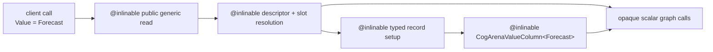
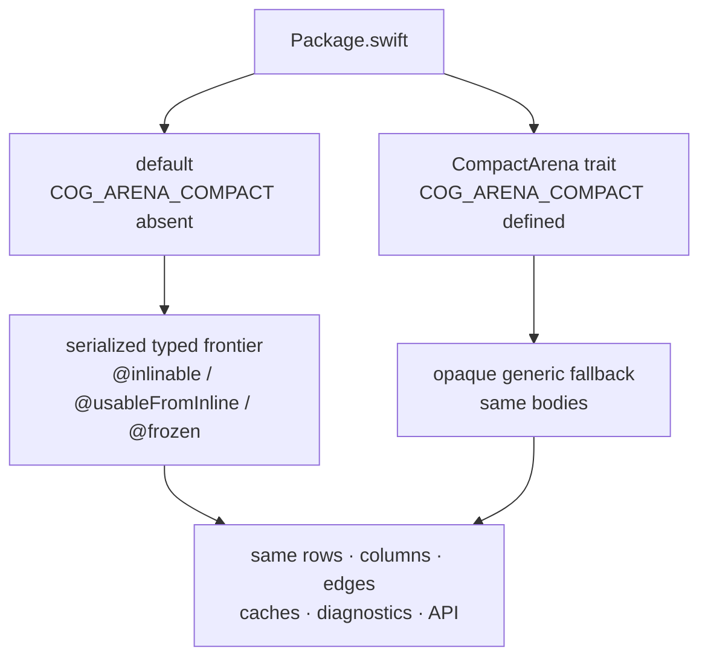

# Arena specialization

_August 22, 2026_

[Back to the architecture overview.](./index.md)

Cog ships one arena representation. The default build exposes a carefully
bounded generic frontier to client compilation so Swift can specialize
concrete value and key types. The `CompactArena` package trait suppresses those
attributes to reduce generated code size; it does not select another core.

## The erased generic-storage problem

One context must retain descriptor records for many unrelated `Value` types.
Each record therefore stores its concrete `CogArenaValueColumn<Value>` as
`AnyObject`. On a normal keyed resolution, generic code restores the column
with a checked cast and then executes generic array operations.

```swift
guard let column = record.column as? CogArenaValueColumn<Value> else {
  fatalError("Cog restored a descriptor with the wrong value type.")
}
```

Without client specialization, fresh keyed construction repeatedly asks the
runtime for generic metadata and executes unspecialized column code. A keyless
memo avoids much of that after first resolution, but one box descriptor names
many keys and deliberately has no one-entry location memo.

The implementation keeps the checked cast. Specialization makes the expected
concrete path cheap; it does not replace safety with an unchecked assumption.

## The selected typed frontier

The frontier includes operations whose caller knows a concrete `Value` type:

- public generic reads and writes on `Cogs`, `Reader`, and `Writer`;
- `manualLocation` / `automaticLocation` and their full resolution paths;
- manual/automatic descriptor record restoration and record-closure formation;
- typed selector recomputation; and
- `CogArenaValueColumn<Value>` initialization, storage growth, current/pending
  access, equality, publication, and removal.



Scalar graph operations deliberately remain opaque: invalidation walks,
boundary sorting, lifetime cascades, reaction queues, most async scheduling,
history, and general turn orchestration. Their work depends on rows and flags,
not `Value`, so cloning them per concrete type would add code without enabling
useful generic optimization.

## Conditional compiler attributes

In the default build, `#if !COG_ARENA_COMPACT` contributes:

- `@inlinable` on the generic function bodies the client compiler should see;
- `@usableFromInline` on internal declarations those bodies reference; and
- `@frozen` on internal value-layout types, such as `CogArenaSlot`, whose fields
  an inlinable body accesses directly.

The public value-reference structs remain resilient. Cog does not freeze public
layout merely for speed. `@usableFromInline` also does not make a symbol public
API: it makes an ABI-level implementation detail available to serialized
inlinable bodies.

Under `CompactArena`, those conditional attributes disappear. The same generic
function bodies compile inside the library as ordinary opaque fallbacks.



## What changes at compilation

Default example:

```swift
let advice = cogs[adviceCog]
```

The app compiler can see through the public generic read, descriptor/key
resolution, typed record setup, and `CogArenaValueColumn<String>` operations.
It can emit concrete `String` work at this call site while calling opaque
row-only helpers for settlement and propagation.

Compact example—the source is identical:

```swift
let advice = cogs[adviceCog]
```

The call uses library-compiled generic fallbacks at the same symbol boundaries.
State identity, slot generation checks, the checked cast, typed columns,
settlement, and returned value are unchanged.

Specialization cost for this frontier grows with the concrete value types and
generic call sites an app compiles through it, not with the number of runtime
arena rows. A thousand `Forecast` states may reuse the same specialized code.
Key types can still affect the app's other generic code without becoming part
of this conditionally serialized arena frontier.

## Behavior and representation are identical

Both configurations keep:

- `CogArenaCore` and `CogArenaStorage`;
- `CogLinkedEdgePool` and its shared 24-byte `CogPoolEdge` entries;
- inline `AnyHashable` keys in public value references;
- descriptor and slot registries;
- keyless location memos and their context/generation guards;
- typed sparse value/status columns;
- push/pull settlement and equality behavior;
- async task, generation, and lifetime sidecars;
- public API, diagnostics, debug history, and tests.

Only compiler visibility across the typed frontier changes. `CompactArena` is a
binary-size trade, not a semantic compatibility mode.

## Measurement summary

The authoritative numbers and environments live in
[performance record](../perf.md#compactarena-what-the-size-opt-out-costs).
The paired keyed build-and-settle run measured the typed frontier at:

| Measure                | Unspecialized arena | Specialized default |     Change |
| ---------------------- | ------------------: | ------------------: | ---------: |
| median p50             |            2,163 µs |            1,102 µs |     -49.1% |
| median instructions    |          55 million |          27 million | about -51% |
| standalone allocations |               5,697 |               1,699 |     -70.2% |

Retained executable measurements found +163,840 bytes of arm64 `__TEXT` over
the unspecialized arena (+6.5%) and about +20% for the Storefront executable
relative to its historical simple build. These are code-segment measurements,
not app download size. The
[performance record](../perf.md#typed-frontier-and-shipping-choice) explains the
profiles that identified generic metadata as the missing cost.

## Why the app chooses compact mode

SwiftPM traits are additive across a dependency graph. A reusable library that
forces `CompactArena` would make the binary-size choice for every final app and
could suppress specialization another consumer expected. The application owns
that trade.

```swift
// Package.swift — application dependency spelling, abbreviated.
.package(
  url: "https://github.com/skeswa/cog",
  traits: ["CompactArena"]
)
```

Use the actual SwiftPM syntax appropriate to the app's manifest and toolchain;
the root package's declared trait name is the stable contract.

## Retired selectors are hard errors

Historical experiments used environment variables to choose core, edge,
value-reference, and specialization layouts. Those alternatives were removed
after measurement. `Package.swift` traps if any of these are present:

- `COG_TEST_CORE`;
- `COG_TEST_EDGE`;
- `COG_TEST_VALUE_REFERENCE_LAYOUT`; or
- `COG_TEST_ARENA_SPECIALIZATION`.

Silently ignoring an old benchmark command could produce a green result while
measuring the shipping default, so a hard error is part of measurement
correctness. The supported choice is the public `CompactArena` trait.

## Contributor rules

When changing the typed frontier:

1. Keep generic fallback bodies behavior-identical.
2. Gate specialization attributes—not algorithms—with
   `#if !COG_ARENA_COMPACT`.
3. Expose only the minimum internal symbols as `@usableFromInline`; do not turn
   implementation details into public API.
4. Freeze only internal layouts required by serialized bodies; preserve public
   value-reference resilience.
5. Keep scalar graph, cold scheduling, and diagnostic work opaque unless a
   profile proves concrete types help.
6. Compare executable sections and representative apps, not source size or
   runtime row count.
7. Run `mise run test:arena-configurations` so the unset specialized default
   and `CompactArena` both build and pass the complete behavior suite.
8. Keep `ArenaSpecializationInfrastructureTests` as the manifest/library
   selector sentinel.

Next: [the codebase tour](./codebase-tour.md).
