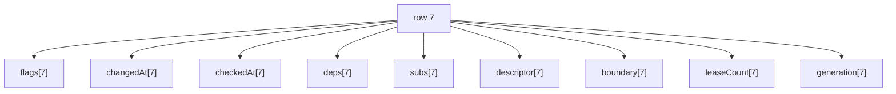
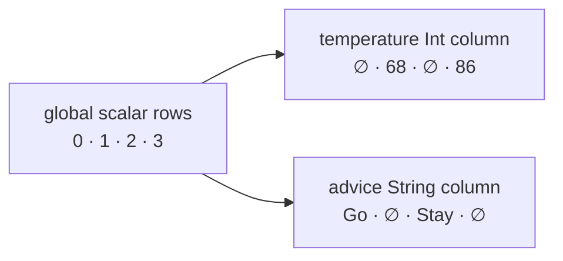
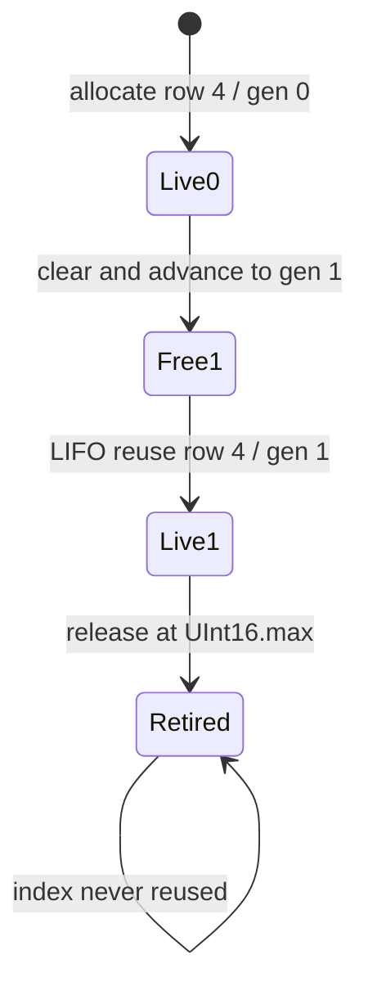

# Arena storage

_August 22, 2026_

[Back to the architecture overview.](./index.md)

`CogArenaStorage` is a structure of arrays: every scalar column uses the same
dense row index. This makes hot walks load only the metadata they need instead
of whole state objects containing values, keys, closures, tasks, and links.

## Why structure of arrays

Push invalidation mostly touches `flags`, `subs`, and sometimes `boundary`.
Pull settlement touches flags, dependency heads, and revisions. Allocation and
release touch every scalar. Separate contiguous columns keep common integer
loads close and avoid ARC or weak-reference traffic.



All scalar element types are trivial. Hot rows contain no objects, closures,
keys, tasks, errors, or user values.

## Scalar columns

| Column       | Type                           | Meaning                                                                  |
| ------------ | ------------------------------ | ------------------------------------------------------------------------ |
| `flags`      | `CogArenaStateFlags` / `UInt8` | Liveness, settlement, computation, turn-touch, and notice-dedupe bits.   |
| `changedAt`  | `UInt32`                       | Last revision in which the row's value actually changed.                 |
| `checkedAt`  | `UInt32`                       | Last revision through which dependencies were proved current.            |
| `deps`       | `CogEdgeIndex`                 | Head of the consumer's ordered dependency list.                          |
| `subs`       | `CogEdgeIndex`                 | Head of the producer's doubly linked subscriber list.                    |
| `descriptor` | `Int32`                        | Dense descriptor-record index, or `-1` for a reaction terminal/free row. |
| `boundary`   | `Int32`                        | Cold Observation-entry index, or `-1`.                                   |
| `leaseCount` | `UInt32`                       | Direct durable owners of a `whileObserved` value row.                    |
| `generation` | `UInt16`                       | Current occupant token at this reusable row index.                       |

The allocator also owns a private LIFO `reusableSlots` array plus `liveCount`.
`rowCount` includes live, reusable, and generation-exhausted retired rows.

## Flags by phase

`occupied` is orthogonal to the transient bits. `computing` can coexist with a
settlement strength while a row is on the active path. Once propagation owns a
row, CHECK and DIRTY must not coexist.

| Flag           | Set by                                                              | Cleared by                                | Contract                                                                 |
| -------------- | ------------------------------------------------------------------- | ----------------------------------------- | ------------------------------------------------------------------------ |
| `occupied`     | `allocate` / scalar reset                                           | `release` / scalar reset                  | The row has a live occupant.                                             |
| `check`        | indirect invalidation                                               | promotion to DIRTY; settlement completion | Something upstream may have changed.                                     |
| `dirty`        | cold automatic install; direct invalidation; stale async completion | successful or skipped settlement          | The selector must run because a direct input changed or no cache exists. |
| `computing`    | `beginComputing` after cycle check                                  | balanced `endComputing`                   | Row appears on the active synchronous computing path.                    |
| `touched`      | first source stage in a turn                                        | source flush                              | Pending typed source cell is listed once in the reusable turn buffer.    |
| `noticeQueued` | first invalidation of a row with a boundary                         | boundary flush                            | Row appears once in the changed-boundary queue.                          |

Example flags through a write:

```text
clean advice       = occupied
direct invalidated = occupied | dirty
during recompute   = occupied | dirty | computing
after publication  = occupied
```

## Typed sparse value columns

Each descriptor record owns one `CogArenaValueColumn<Value>`. Its
`currentValues` and `pendingValues` arrays are indexed by global arena row.
Rows belonging to other descriptors stay empty. This is sparse by descriptor
but concrete by type.



For example:

| Global row |          Descriptor index | Integer column | String column   |
| ---------: | ------------------------: | -------------- | --------------- |
|          0 |              1 (`advice`) | no cell        | `"Go outside"`  |
|          1 |         0 (`temperature`) | `68`           | no cell         |
|          2 |      1 (`advice[office]`) | no cell        | `"Stay inside"` |
|          3 | 0 (`temperature[office]`) | `86`           | no cell         |

Equal row numbers across two different `Cogs` also share nothing: every core
owns its scalar storage, records, and columns.

## Current and pending cells

The two arrays preserve turn isolation. `currentValues[row]` is the latest
completed value. `pendingValues[row]` is the final value staged by the active
turn or automatic publication.

Both arrays use `Value?`, but that outer optional represents cell presence. If
`Value == Int?`, these states are distinct:

```text
outer .none        → this descriptor has no cell at the row
.some(.none)       → the stored domain value is nil
.some(.some(42))   → the stored domain value is 42
```

`storedValue(at:)` preserves the distinction for a cold automatic cache. The
current cell may legitimately be absent until first recomputation. `current`
requires an installed value and traps on absence.

```swift
let optionalColumn = CogArenaValueColumn<Int?>(in: arena, equals: ==)
optionalColumn.insert(nil, at: slot)
// The row is installed even though the domain value is nil.
```

## Async status and cold sidecars

Async `CogStatus<Value>` uses an ordinary typed value column and scalar
revisions/topology. `CogArenaAsyncColumn<Value>` keeps reference-valued or
rarely used data outside scalar storage:

- installed-row markers;
- active task for latest/queue/exhaust;
- per-generation merged task dictionaries;
- active ordered-run generation;
- queued FIFO runs and exhaust-latest catch-up;
- monotonic work generation;
- last accepted success;
- refresh waiters by generation; and
- pending Observation field masks.

Observation registrar objects live in `observationEntries`; lifetime tasks and
tokens live in `lifetimeEntries`; erased descriptor keys live on descriptor
records. Debug history is a separate fixed-capacity integer log and compiles out
of release.

This division prevents an app with no async state or UI boundary from paying
reference-valued fields in every row.

## Allocation

Fresh allocation appends aligned defaults to all nine scalar columns and
returns generation zero. Reuse pops the latest released index, resets every
non-generation scalar, and returns the generation already advanced by release.



`allocate` checks `Int32` row exhaustion. `release` validates the exact slot,
clears flags, stamps, list heads, descriptor, boundary, and lease count, then
decrements live count. If generation is already `UInt16.max`, the row retires
instead of wrapping. Otherwise generation advances and the index enters the
free list.

Example reset:

| Field               | Live occupant                   | After release / before reuse |
| ------------------- | ------------------------------- | ---------------------------- |
| flags               | occupied, maybe transient marks | empty                        |
| changed/checked     | any revision                    | 0 / 0                        |
| deps/subs           | edge heads                      | `-1` / `-1`                  |
| descriptor/boundary | record indexes                  | `-1` / `-1`                  |
| leaseCount          | durable owners                  | 0                            |
| generation          | 12                              | 13                           |

Typed values and edges must be removed before `arena.release`; scalar reset
cannot safely discover their descriptor-specific owners.

## Exclusivity checks

Scalar columns and trivial work arrays use targeted
`@exclusivity(unchecked)`. Every access is MainActor-confined, element types are
trivial, and methods must not hold a column access across a call or pass a
column `inout`. Under those constraints dynamic exclusivity bookkeeping was
measured as pure overhead on dozens of per-turn class-property accesses.

Typed value columns intentionally retain normal exclusivity. A `Value` may be a
class or contain reference-valued storage; assignment or removal can run user
`deinit` code and reenter other runtime work. The scalar proof does not apply.

Incorrect future helper:

```swift
// Pseudocode — violates the scalar storage invariant.
func mutateFlags(_ body: (inout Flags) -> Void) {
  body(&flags[row]) // calls out with access open
}
```

Correct scalar methods load, update, and store without calling out during an
array subscript access.

## Storage invariants

- All scalar arrays grow in lockstep.
- A live slot passes both occupancy and generation checks.
- Scalar reset is complete before an index becomes reusable.
- A descriptor clears its typed current and pending cells before slot release.
- Reaction terminals never reach descriptor or typed-column dispatch.
- User values retain normal exclusivity and MainActor release semantics.
- Cold objects stay in generation-aware side tables, not hot rows.

The infrastructure proofs are
`ArenaStorageInfrastructureTests`, `ArenaValueColumnInfrastructureTests`, and
the public slot-reuse scenario `PERF-05`.

Next: [arena edges](./arena-edges.md).
