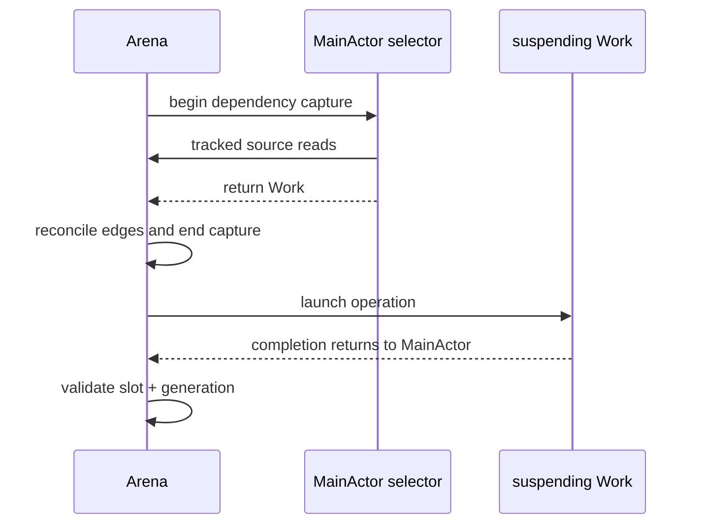
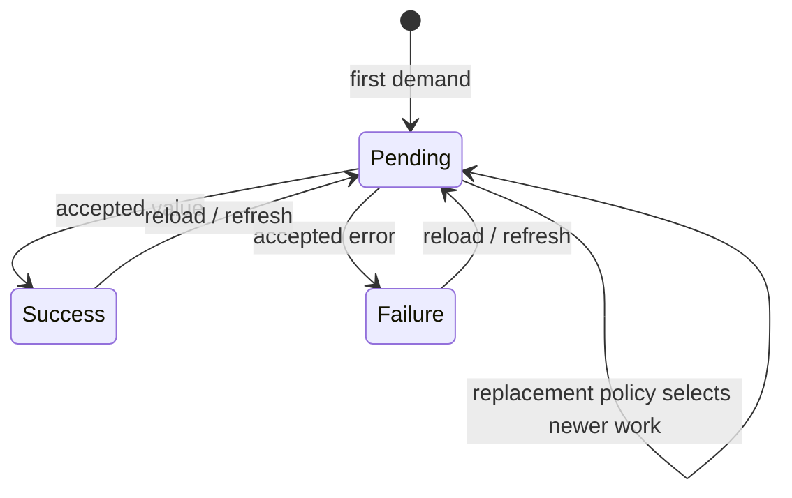
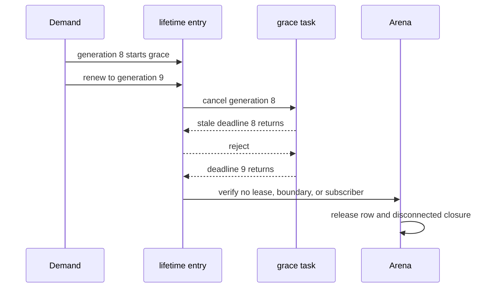
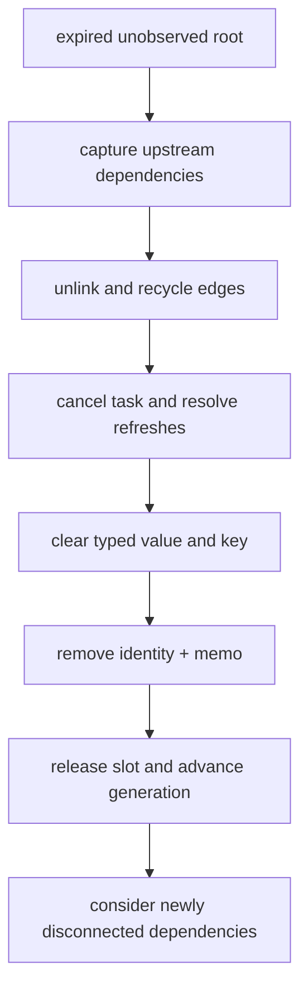

# Async work and lifetime

_August 22, 2026_

[Back to the architecture overview.](./index.md)

Async state separates synchronous dependency selection from suspending work.
The graph tracks only what chose the work; the operation can run on its own
isolation without holding a reader, capture scope, or turn open.

## Selection, then operation

An `AsyncCog` selector runs on the MainActor with a
`Reader<CogStatus<Value>>`. It reads dependencies and returns `Work` or
`RunWork`. Dependency capture ends before the operation starts.

```swift
let forecastCog = AsyncCog<Forecast>(default: .empty) { c in
  let zip = c[currentZipSourceCog]
  return Work.run { try await service.forecast(for: zip) }
}
```

The `zip` read controls invalidation. A Cog read attempted later inside the
suspending closure is outside selection and cannot accidentally become a graph
dependency.



## Total value and explicit status

An async declaration requires an honest default. Its normal value is always
available: the last accepted success, or that default before one exists.
Pending and failure retain the last success so the UI does not discard useful
content during a reload.

```swift
let forecast = cogs[forecastCog] // always a Forecast
let request = cogs.status[forecastCog]
if request.isLoading { ProgressView() }
```

`CogStatus` atomically carries `kind`, `value`, `hasSucceeded`, `error`, and
`isLoading`. A value read uses the async declaration's internal automatic
projection and its equality rule. A status read depends on every lifecycle
transition. At the UI boundary, individual status fields remain independently
observable.

## Pending, success, and failure turns

First demand selects a generation and establishes pending. Each accepted
completion stages success or failure in its own named graph-owned turn. Status
therefore has the same revision, invalidation, settlement, export, and reaction
ordering as a manual source.



An initial pending value may be inserted synchronously so the requesting
selector can return a total value. Its named system turn waits until capture
and settlement are idle, preventing Observation or reactions from reentering
the cold read.

## Explicit refresh

The `refresh` primitive forces a fresh selector run and returns a
`CogRefresh<Value>` for that exact generation. Application code wraps it in a
domain operation. Awaiting the handle's `outcome` never drifts to a later
request. It resolves as success, failure, superseded, or released.

```swift
extension CogOps {
  func refreshForecast() -> CogRefresh<Forecast> { refresh(forecastCog) }
}

let refresh = cogs.refreshForecast()
switch await refresh.outcome {
case .success(let forecast): show(forecast)
case .failure(let error): report(error)
case .superseded, .released: break
}
```

Refresh is one-shot demand. It adds no graph edge or UI boundary, and when
nothing else observes the state it starts or renews ordinary grace.

## Scheduling policies

Each exact async state—one descriptor and optional key—has an independent
scheduler and generation sequence. Streams support `.latest`; one-shot runs
support all four policies.

### `.latest`

New selection advances the generation, publishes pending, resolves superseded
refresh handles, registers the new handle when present, cancels the prior task,
and launches the replacement. A cancellation-ignoring old task still cannot
publish because its generation no longer matches.

```mermaid
gantt
  title latest — newer selection replaces eligibility
  dateFormat X
  axisFormat %L
  section generation 1
  run then stale :0, 5
  section generation 2
  pending and accepted run :2, 6
```



### `.queue`

The active run stays eligible. Later selections retain operations in FIFO
order. Pending is published when each deferred operation is admitted, not when
it first enters the queue. Failure advances to the next run.

```mermaid
gantt
  title queue — every selected run executes serially
  dateFormat X
  axisFormat %L
  section work
  generation 1 :0, 3
  generation 2 :3, 3
  generation 3 :6, 3
```



### `.exhaustLatest`

The active run finishes. While it runs, Cog retains only the newest deferred
selection; a later one supersedes the earlier catch-up. After the active result
publishes, at most one catch-up starts.

```mermaid
gantt
  title exhaustLatest — finish active, then newest catch-up
  dateFormat X
  axisFormat %L
  section work
  active generation :0, 5
  newest catch-up :5, 3
```



### `.merged`

Every selected run launches independently. Each generation stays eligible
while its task remains in the row's merged-task dictionary; accepted results
publish in landing order. There is no latest-wins generation comparison.

```mermaid
gantt
  title merged — runs overlap and land independently
  dateFormat X
  axisFormat %L
  section work
  generation 1 :0, 6
  generation 2 :1, 2
  generation 3 :2, 3
```



## Stale completion rejection

Before publishing, `CogArenaAsyncColumn.acceptsResult` checks:

1. the slot still names a live occupant;
2. the row still belongs to the same async descriptor and descriptor/key entry;
3. the policy-specific generation remains eligible; and
4. dependency invalidation has not left the row CHECK or DIRTY.

If dependencies changed while work was running, completion clears obsolete
active bookkeeping, leaves the row DIRTY, and publishes nothing. The next
demand or observed boundary selects work from current dependencies.

```text
generation 4 completes late
  slot reused? reject
  descriptor/key missing? reject
  latest generation is 5? reject
  selector invalidated? reject and preserve DIRTY
  otherwise accept in a success/failure system turn
```

Task cancellation is useful resource cleanup, but these checks guarantee
correctness even when an operation ignores cancellation.

## Streams

A latest stream owns one iterator task for its generation. Every element passes
the same exact-slot and generation checks. Equal consecutive values may avoid a
status turn under the declaration's value equality. Natural end clears the
active task without manufacturing a status. An accepted stream error publishes
failure while retaining the last successful value.

Replacing or releasing the state cancels the iterator and advances generation,
so a late element from the old sequence cannot enter the graph.

## Lifetime policies

Manual state defaults to app lifetime because releasing it would lose its sole
writable value. A source may explicitly choose
`.whileObserved(resetToInitial: true)`. Synchronous automatic and async state
default to `whileObserved` because they can be recreated from declarations and
current dependencies.

Durable observation means either:

- the first UI boundary on the exact row; or
- a reaction/export terminal directly leasing the exact `whileObserved` root.

Internal dependency edges can delay removal while a downstream subscriber
exists, but do not create durable observation or a fresh grace period.

One-shot `peek`, write, or refresh demand starts or renews grace when the row has
no durable owner. Each row owns at most one sleeper.

## Grace generations and release

A cold `CogArenaLifetimeEntry` stores a monotonic sleeper generation, pending
generation, and task. Renewal increments the token, cancels the old task, and
starts a replacement. Deadline completion must match both its exact arena slot
generation and lifetime generation.



Release order is deliberate: capture upstream dependency slots, cancel the
sleeper, remove all dependency edges, clear typed values and async sidecars,
drop the descriptor key and keyless memo, remove the descriptor/key slot entry,
then release the scalar row. The row generation advances before LIFO reuse.



The release cascade is iterative. A dependency whose own grace already expired
while it had a subscriber can leave in the same cascade. One with a still-live
independent deadline keeps that grace. UI-pinned, leased, subscribed, app-life,
computing, or touched rows cannot be released.

## Context teardown

`Cogs` teardown first cancels mechanism scopes and external bridges, then
cancels remaining export/effect registrations, then asks the arena to prepare
descriptor sidecars and sleepers. Async removal advances work generations,
resolves refresh handles as released, and cancels tasks. Descriptor memos are
evicted so static declarations do not retain a dead context's typed columns.

## Rules to keep

- Dependency selection is synchronous; suspending work never owns a reader.
- Values are total; uncertainty remains explicit in `CogStatus`.
- Pending, success, and failure are ordered graph turns.
- Slot identity plus policy-specific generation—not cancellation—decides
  whether a result may publish.
- UI boundaries and direct reaction roots are durable owners; graph reachability
  alone is not.
- Every stale sleeper, slot, task, and refresh handle has a generation-safe
  outcome.

Next: [the arena core](./arena-core.md).
