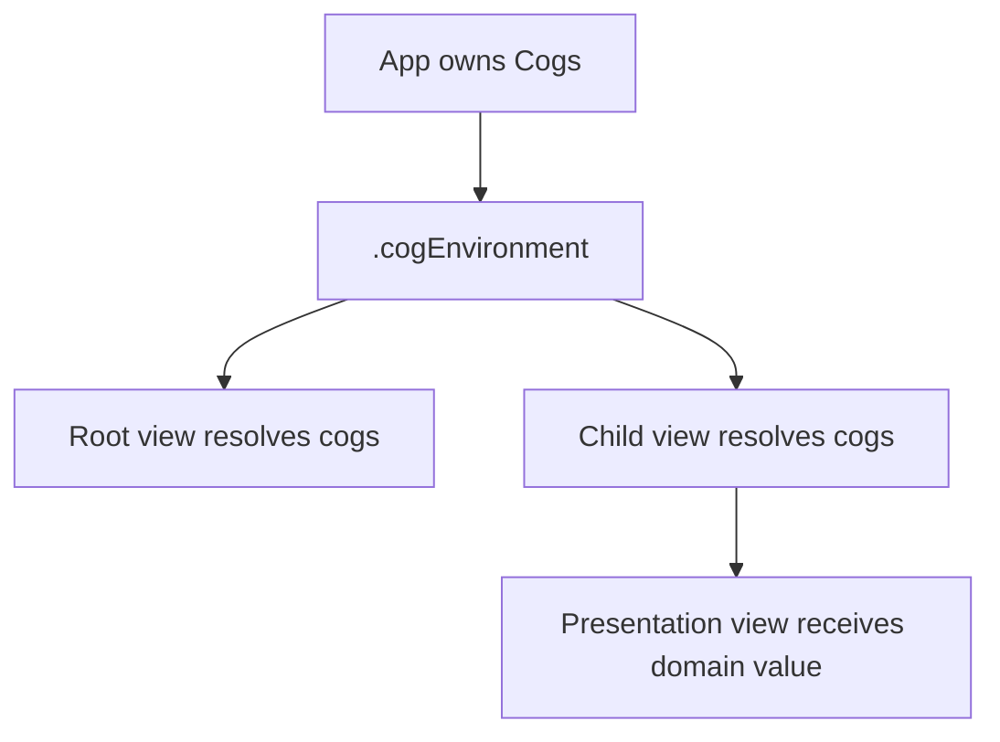
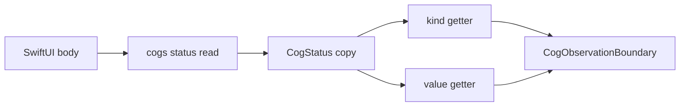
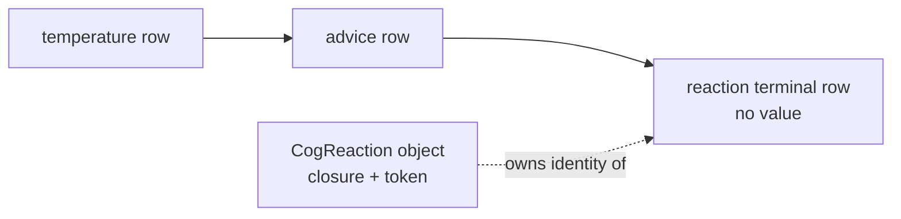
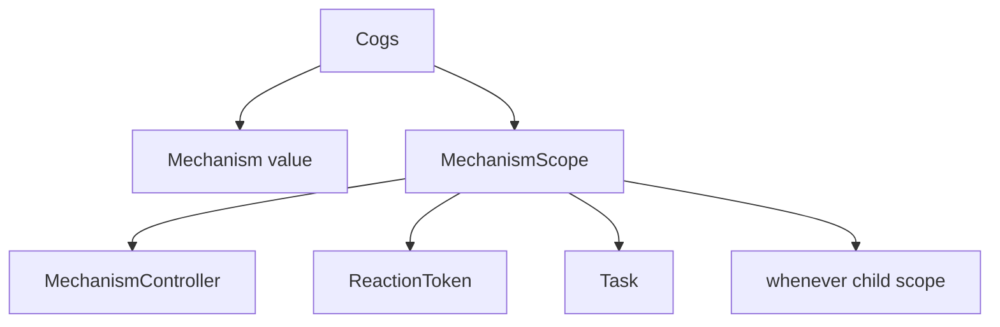

# Boundaries and effects

_August 22, 2026_

[Back to the architecture overview.](./index.md)

Cog keeps values, graph mutation, selector execution, Observation delivery,
and effect registration on the MainActor. Boundaries adapt that singular graph
to SwiftUI, UIKit/AppKit, async sequences, and side-effect code without moving
state ownership out of `Cogs`.

## Runtime ownership and isolation

The app entry point bootstraps one `Cogs`, retains it, and installs that exact
object above every scene. Tests and previews create their own isolated runtime
through `CogTesting`.

```swift
@main @MainActor
struct WeatherApp: App {
  private let cogs = Cogs.bootstrapApp(
    mechanisms: [WeatherMechanism(notifier: .live)]
  )
  var body: some Scene {
    WindowGroup { Dashboard().cogEnvironment(cogs) }
  }
}
```

`Cogs` is not passed through view initializers. Every view that interacts with
Cog resolves it itself:

```swift
struct Dashboard: View {
  @Environment(\.cogs) private var cogs
  var body: some View {
    let advice = cogs[adviceCog]
    Text(advice)
  }
}
```

Intermediate views receive domain values and identities only. This makes the
one runtime a scene-level dependency rather than an invisible initializer
thread.



## Lazy Observation boundaries

`cogs[valueReference]` is a UI read. It resolves and, for automatic state,
settles the state before recording Observation access. On first UI demand the
arena creates one `CogObservationBoundary`, stores its index on the row, and
retains the boundary with the exact generation-bearing slot in creation order.
Unread states allocate no registrar object.

The boundary is permanent for that context in v1. Its first creation adds a
durable lease, so a UI-read `whileObserved` state cannot be released and later
silently detach the registrar SwiftUI already tracked.

Manual and automatic values use one phantom `value` property. Async status has
one phantom property per public field. The phantom booleans carry no data; their
key paths connect registrar access and later mutation.



Obtaining a status local observes no field:

```swift
let forecast = cogs.status[forecastCogs[zip]]
if forecast.isLoading { ProgressView() }
Text(forecast.value.summary)
```

This body tracks only `isLoading` and `value`. A later error-only change does
not invalidate it. Async publication precomputes a field mask by comparing the
old and new atomic statuses, then the descriptor record tells the boundary to
mutate only those key paths.

## O(changed) notices

Push invalidation queues a row only if it already has a boundary. The row's
`noticeQueued` bit deduplicates boundary-queue insertion across diamond paths;
CHECK/DIRTY strength separately controls propagation. A flush sorts this
changed set by boundary index, not the full boundary registry, then settles each
automatic root. Equal recomputation clears the row without sending a notice
because its `changedAt` is older than the active revision.

The flush snapshots the queue count. A synchronous Observation handler may
cause another boundary to be queued; that entry belongs to a later flush and
cannot receive a notice for a change predating its baseline.

## UIKit and AppKit

UIKit and AppKit consumers use the same `Cogs` and Observation model. Enclose
the exact reads needed to update a control in Observation tracking, then re-arm
after change. The boundary tests under `CogBoundaryTests` prove this on native
framework consumers and keep the graph independent of SwiftUI view lifetime.

```swift
// Pseudocode — the platform adapter owns re-arming.
withObservationTracking {
  label.text = cogs[adviceCog]
} onChange: {
  scheduleMainActorRearm()
}
```

For external `@Observable` models read by Cog selectors, use `c.track(model,
keyPath)` or the closure form. The key-path overload shares one context-owned
bridge and hidden source per exact object and key path. The closure overload
owns one bridge per exact selector slot and source call site; a rerun replaces
its captured read. On current platforms `Observations` tracks those reads; the
compatibility path re-arms one-shot `withObservationTracking` after mutation.

## Mechanisms own side effects

A `Mechanism` is the bootstrap-registered owner of app-wide effects, timers,
tasks, external subscriptions, and initial production state. `operate` receives
a curated `MechanismController`, not unrestricted installation API. All
mechanisms are operated synchronously in list order before bootstrap returns.

```swift
struct AdviceMechanism: Mechanism {
  func operate(_ m: MechanismController) {
    m.run { c in
      let advice = c[adviceCog]
      guard advice == "Stay inside" else { return }
      notifier.sendHeatWarning()
    }
  }
}
```

Initial app state belongs in `operate`, through a domain op. Its turn settles
during bootstrap, before a watcher can observe a transient default. Test setup
passes the same mechanism to `Cogs.forTesting(mechanisms:)`; `seeding:` remains
a test-only quiet installation seam.

## Reactions are value-less terminals

A reaction object owns its closure, label, cancellation identity, registration
order, and cold lease buffers. The arena owns its dependency topology through a
generated row with no descriptor or value column. This **terminal** can be
marked CHECK or DIRTY like an automatic consumer but cannot be read or have
subscribers.



On a changed turn, the terminal first settles its automatic producers. If all
CHECK paths recompute equal, the terminal backdates itself and its body does
not run. Otherwise it captures a fresh ordered dependency set around one
synchronous body call.

A mechanism reaction's `ReactionToken` is retained by its `MechanismScope`; an
export reaction's token is retained by its `CogValues` subscription. The
non-generic token class uses `isolated deinit` because releasing the final
handle must cancel the MainActor registration synchronously. Most other runtime
classes use explicit `nonisolated deinit` because they only release fields and
must not pay an executor hop.

## Scopes and tasks

Each mechanism gets one `MechanismScope`. It owns the controller, reaction
tokens, tasks, and nested `whenever` scopes. A state-gated child exists only
while its predicate is true. Scope cancellation stops registrations and
requests task cancellation before releasing the mechanism value that may own
their dependencies.



Cancellation is about lifetime and resource release. A state write from a
reaction still enters the turn FIFO; an effect never mutates the graph through
its reader.

## Exports

`CogValues` exposes a settled value as an `AsyncSequence`. Internally each
iterator owns an export-phase reaction terminal and non-blocking buffer. Its
initial tracking run offers the current value. Later changed offers run after
Observation notices and before effect reactions, preserving the turn's public
boundary order.

```swift
for await advice in cogs.values(of: adviceCog) {
  await analytics.record(advice)
}
```

The iterator/token controls the export terminal's lifetime. Cancelling or
dropping it removes edges and leases; context teardown finishes surviving
sequences rather than leaving inert reaction bodies retained.

## Ownership ledger

| Owner                   | Retains                                                          | Release action                          |
| ----------------------- | ---------------------------------------------------------------- | --------------------------------------- |
| app/scene root          | the one `Cogs`                                                   | starts context teardown                 |
| `Cogs`                  | arena, mechanisms, scopes, reaction registries, external bridges | cancels scopes/bridges, then arena work |
| mechanism scope         | controller, reaction tokens, tasks, child scopes                 | cancels registrations and tasks         |
| reaction token          | exact reaction registration                                      | synchronous MainActor cancellation      |
| reaction                | closure, terminal slot, direct leases                            | removes edges, leases, and terminal     |
| arena boundary registry | boundary plus exact slot                                         | permanent context pin in v1             |
| values iterator         | export reaction/token and stream buffer                          | cancels terminal and finishes stream    |

## Rules to keep

- One app root owns and installs one `Cogs`; each Cog-reading view resolves it.
- UI boundaries stay lazy and field-specific.
- Observation adapts completed graph turns; it does not become internal graph
  storage.
- Mechanisms are the bootstrap-only home for app-wide effects and initial state.
- Reactions read synchronously through a terminal and write later through ops.
- Every owner has an explicit cancellation or teardown path.

Next: [async work and state lifetime](./async-and-lifetime.md).
