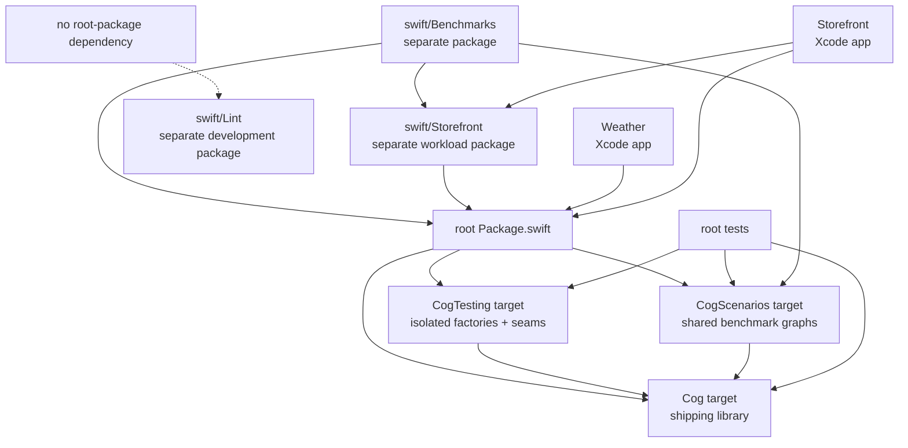

# Codebase tour

_August 22, 2026_

[Back to the architecture overview.](./index.md)

This chapter maps architecture concepts to source files, tests, examples, and
verification commands. Use it to trace a behavior before changing it.

## Products and packages

The git root is the consumer-facing SwiftPM package. It publishes `Cog`,
`CogTesting`, and the non-API `_CogScenarios` product. Development workloads
that must not enter a consumer's dependency graph live in separate packages.



## Source map

### Public names and boundaries

| Start here                                             | Responsibility                                                  |
| ------------------------------------------------------ | --------------------------------------------------------------- |
| `Cog+Manual.swift`, `CogBox+Manual.swift`              | Writable keyless and keyed references.                          |
| `Cog.swift`, `CogBox.swift`                            | Synchronous automatic references and selectors.                 |
| `Cog+Async.swift`, `CogBox+Async.swift`, `Work.swift`  | Async declarations, scheduling-policy types, and selected work. |
| `CogStatus.swift`, `CogsStatus.swift`                  | Total async status and value/status read split.                 |
| `Cogs.swift`, `Cogs+Subscript.swift`                   | Context ownership, one-shot reads, and UI Observation reads.    |
| `Reader.swift`, `ReactionReader.swift`, `Writer.swift` | Scoped tracking and staging capabilities.                       |
| `CogOps.swift`, `Cogs+Refresh.swift`                   | Application operation primitives and async demand.              |
| `CogEnvironment.swift`                                 | SwiftUI environment installation and resolution.                |
| `CogValues.swift`, `Cogs+Watch.swift`                  | Exported async sequences and external watch terminals.          |
| `Mechanism.swift`, `MechanismController.swift`         | Assembly-only effect declarations and controller surface.       |
| `Internal/MechanismScope.swift`                        | Mechanism, task, reaction-token, and child-scope ownership.     |

### Descriptors and identity

| File                                               | Responsibility                                                       |
| -------------------------------------------------- | -------------------------------------------------------------------- |
| `Internal/CogDescriptor.swift`                     | Shared descriptor protocol and object identity.                      |
| `Internal/ManualCogDescriptor.swift`               | Starting value, equality, lifetime, and keyless location memo.       |
| `Internal/AutomaticCogDescriptor.swift`            | Selector, equality, lifetime, and keyless location memo.             |
| `Internal/AsyncCogDescriptor.swift`                | Synchronous work selection, default, equality, policy, and lifetime. |
| `Internal/CogState.swift`, `Internal/CogKey.swift` | Descriptor/key state identity and inline `AnyHashable` key.          |
| `Internal/CogArenaCore+Descriptors.swift`          | Record registration and descriptor/key-to-slot resolution.           |

### Arena core

| File                                      | Responsibility                                                        |
| ----------------------------------------- | --------------------------------------------------------------------- |
| `Internal/CogArenaCore.swift`             | Core ownership, descriptor records, cold entries, and reused buffers. |
| `Internal/CogArenaStorage.swift`          | Scalar columns, exact slots, dense allocation, generation-safe reuse. |
| `Internal/CogArenaValueColumn.swift`      | Concrete current/pending values and equality publication.             |
| `Internal/CogLinkedEdgePool.swift`        | Shared 24-byte dependency/subscriber edges and free list.             |
| `Internal/CogArenaDirtyPropagation.swift` | DIRTY/CHECK push walk and changed-boundary queue.                     |
| `Internal/CogArenaCore+Settlement.swift`  | Iterative pull, recomputation, static-prefix capture, and cycles.     |
| `Internal/CogArenaCore+Values.swift`      | Staging, value reads, Observation flush, and slot-reuse probes.       |
| `Internal/CogArenaCore+Reactions.swift`   | Value-less terminals, tracked reads, leases, and terminal settlement. |
| `Internal/CogArenaCore+Lifetime.swift`    | Boundaries, leases, sleepers, release cascade, teardown.              |
| `Internal/CogArenaAsyncColumn.swift`      | Status column and typed async scheduling sidecars.                    |
| `Internal/CogArenaSpecialization.swift`   | Build sentinel for the typed frontier.                                |

### Turn and boundary orchestration

| File                                                 | Responsibility                                                      |
| ---------------------------------------------------- | ------------------------------------------------------------------- |
| `Internal/CogTurn.swift`                             | Turn phases, reusable staged-source buffer, flush, and FIFO.        |
| `Cogs+Reactions.swift`, `Internal/CogReaction.swift` | Export/effect phase order and reaction object lifetime.             |
| `Internal/CogObservationBoundary.swift`              | Registrar phantom fields and field-specific notices.                |
| `ExternalObservationTracking.swift`                  | Bridges from external `@Observable` properties into hidden sources. |
| `Internal/ReactionToken.swift`                       | Synchronous MainActor cancellation on handle release.               |

## Trace a read

For a UI automatic read such as:

```swift
let advice = cogs[adviceCog]
```

follow:

1. `Cogs+Subscript.swift` → automatic subscript.
2. `CogArenaCore+Values.swift` → `observedAutomaticValue`.
3. `CogArenaCore+Descriptors.swift` → `automaticLocation`; inspect memo hit and
   `resolvedAutomaticLocation` miss.
4. `CogArenaCore+Settlement.swift` → `settle` and `recompute`.
5. `AutomaticCogDescriptor.compute` → selector.
6. `Reader.swift` and `CogArenaCore+Reactions.swift` → tracked dependency reads.
7. `CogArenaValueColumn.current` → concrete result.
8. `CogArenaCore+Lifetime.ensureObservationBoundary` → UI boundary.

For `peek`, start in the reading extension of `Cogs.swift`; it settles but ends
with lifetime scheduling instead of Observation access.

## Trace a write

For a domain op that writes temperature:

```swift
cogs.recordTemperature(86)
```

follow:

1. The app's `CogOps` extension → `Cogs.turn` / `Writer`.
2. `CogArenaCore.writerStage` → typed pending cell and touched bit.
3. `CogTurn.flushPendingSources` → one revision.
4. `CogArenaValueColumn.publishSource` → equality, stamps, propagation.
5. `CogArenaDirtyPropagation.invalidateSubscribers` → DIRTY/CHECK and boundary
   queue.
6. `Cogs.runOuterTurn` → Observation flush, exports, effects, finish, FIFO.

Tests: `ArenaDirtyPropagationInfrastructureTests` and public `TURN-*`
scenarios.

## Trace a dependency change

For a conditional selector, put a breakpoint or start reading at
`CogArenaCore.withDependencyCapture`. `recordDependency` compares the old
cursor edge. At the first producer mismatch it calls
`CogLinkedEdgePool.removeDependencySuffix`, then `add`. Capture's `defer`
removes unread trailing edges.

The smallest proof is `ArenaSettlementInfrastructure recapture keeps candidate
storage bounded`; the public `GRAPH-09` and `GRAPH-10` behavior tests cover
dependency replacement and late capture without depending on edge layout.

## Trace equal recomputation

Start at `settle` exit:

1. `dependencyChanged` compares dependency `changedAt` with consumer
   `checkedAt`.
2. `recompute` captures and computes.
3. `CogArenaValueColumn.publish` invokes descriptor equality.
4. Equal returns `false`, so `recompute` does not update `changedAt` but does
   update `checkedAt` and clear flags.
5. Downstream CHECK consumers now skip.

`ArenaSettlementInfrastructure backdates an equal middle row without class
states` pins exact arrays. Public `GRAPH-05` proves the observable cutoff.

## Trace an async completion

Start in `CogArenaCore.recomputeAsync`, which selects `Work` under dependency
capture. Then follow `CogArenaAsyncColumn.startWork` into the selected policy.
An accepted one-shot success or non-cancellation failure reaches
`acceptsResult`, then `publish`, the named `stage` helper, and
`Cogs.withSystemTurn`. Cooperative cancellation and missing-owner exits return
earlier. A stream yield checks `acceptsResult` and stages a changed element
directly; natural stream completion only clears active task ownership.

For a stale result, read `stillStores` in
`CogArenaCore+Descriptors.swift`, then the policy-specific generation branch in
`acceptsResult`. `ASYNC-08` and `ASYNC-16` prove cancellation-ignoring and
concurrent rejection. `ASYNC-24` covers invalidation during grace; `ASYNC-13`
and `ASYNC-37` cover keyless and keyed release.

## Trace an Observation notice

Read `CogArenaDirtyPropagation.enqueueBoundaryNotice`, then
`CogArenaCore.flushObservationBoundaries`. The latter sorts the changed set,
settles automatic roots, gates on `changedAt == revision`, and dispatches the
descriptor's `notifyObservation` closure. Async rows compute a
`CogStatusObservationFields` mask when staging and consume it during notice.

The framework boundary lives in `CogObservationBoundary`. Public `UI-*` and
`REACT-19` scenarios prove lazy boundaries, notice count, field specificity,
and notice-before-effect order. `CogBoundaryTests` exercises native Observation
integration.

## Trace a reaction

Registration starts at `Cogs.register` and creates `CogReaction` plus a
descriptor-less arena terminal. A flush asks `reaction.needsFlush`, then
`settleReactionDependencies`. A needed body runs under
`captureReactionDependencies`; afterward `reconcileReactionLeases` swaps its
current/scratch exact-slot arrays.

Cancellation follows `ReactionToken` → `CogReaction.cancel` → release leases,
dependency suffix, and terminal row. `ArenaReactionInfrastructureTests` owns the layout and retirement proofs;
`REACT-*` and `LIFE-07` scenarios own public behavior.

## Trace lifetime release

Start at a one-shot read/write/refresh call to
`scheduleLifetimeReleaseIfUnobserved`. Follow the owned sleeper into
`releaseValueStateIfEligible`, then `releaseUnobservedClosure` and
`releaseValueState`.

To audit stale safety, check both generations: `CogArenaSlot.generation` rejects
a former row occupant; `CogArenaLifetimeEntry.generation` rejects an old or
renewed deadline for the same occupant. `ArenaLifetimeInfrastructureTests`, `LIFE-*`, and `PERF-05` cover the path.

## Worked graphs

The [Weather example](https://github.com/skeswa/cog/tree/main/swift/Examples/Weather/Weather)
is the best feature-sized map. Start with
[`WeatherState.swift`](https://github.com/skeswa/cog/blob/main/swift/Examples/Weather/Weather/WeatherState.swift),
then read `WeatherDashboard`, `WeatherCard`, and `WeatherMechanism` for UI and
effect boundaries.

The [Storefront workload](https://github.com/skeswa/cog/tree/main/swift/Storefront/Sources/CogStorefront)
is the large-graph map. `StorefrontState.swift` owns sources,
`StorefrontAutomatic.swift` contains long automatic chains and keyed selectors,
`StorefrontAsync.swift` contains async policies, and `StorefrontMechanism.swift`
owns effects. Its headless trace and SwiftUI app drive the same declarations.

## Test organization

- `swift/Tests/CogTests/Scenarios/<PREFIX>/`: public behavior proofs. A test
  owning a scenario ID imports `Cog` and `CogTesting`, never `@testable Cog`.
- `swift/Tests/CogTests/Infrastructure/<seam>/`: representation and internal
  invariant proofs. These may use `@testable import Cog` and green no scenario.
- `swift/Tests/CogBoundaryTests/`: native Observation, external Observation,
  UIKit, and AppKit boundaries on supported platform runtimes.
- `swift/Tests/CogTests/Scenarios/UI/`: public SwiftUI environment, binding,
  invalidation, and retracking behavior.
- `swift/Tests/CogScenarioTests/`: run-count proofs over shared benchmark-sized
  scenario graphs from `CogScenarios`.
- `swift/Storefront/Tests/`: declaration census, profile shape, and the shared
  eleven-phase workload trace.
- `swift/Benchmarks/`: separate package for measured graph shapes and Storefront
  cuts; benchmark numbers belong in `docs/swift/impl/benchmarks.md`.

Never turn an infrastructure detail into a scenario assertion. Behavior must
remain valid for both specialized default and `CompactArena`.

## Change checklists

### Public behavior

- Update design, scenario, and task obligations together when the contract
  changes.
- Add or amend a public scenario test without `@testable`.
- Check both value and status spellings, keyed isolation, equality, and actor
  isolation where relevant.
- Run the root wrapper, compile-fail fixtures if diagnostics changed, and both
  arena configurations.

### Arena storage

- Keep scalar arrays aligned and full reset exhaustive.
- Clear typed/cold owners before scalar release.
- Preserve slot-generation rejection and retire on exhaustion.
- Prove layout changes with infrastructure tests and benchmark them before
  claiming speed or memory wins.

### Settlement or edges

- Preserve direct DIRTY versus descendant CHECK strength.
- Exercise diamonds, dynamic suffix replacement, duplicate reads, equality
  cutoff, cycles, deep warm graphs, and reaction terminals.
- Reuse work buffers and leave idle stacks empty.
- Do not add identity/key/ARC work to the row-only hot walk without evidence.

### Specialization

- Keep one behavior-identical generic fallback.
- Gate only compiler attributes with `COG_ARENA_COMPACT`.
- Avoid new public API or frozen public layouts.
- Measure executable code and run `test:arena-configurations`.

### Async scheduling

- Separate synchronous selection from suspending operation.
- Test every policy's admission, pending timing, failure continuation, refresh
  outcomes, cancellation-ignoring completion, and keyed independence.
- Require slot, descriptor/key, generation, and invalidation checks before
  publication.
- Resolve refresh waiters on success, failure, supersession, and release.

### Lifetime ownership

- Name the durable owner and exact cancellation path.
- Distinguish UI pins, direct terminal leases, internal edges, and transient
  demand.
- Advance sleeper/work generations before cancellation and storage reuse.
- Test teardown and release cascades without timing guesses.

## Verification commands

Use the repository wrappers:

```sh
mise run fmt:check
mise run tasks:check
mise run docs:build
mise run test:arena-configurations
mise run changes:check
```

For focused exploration, pass a filter to the wrapper, never to raw
`swift test`:

```sh
mise run test --filter 'GRAPH-05|PERF-05'
```

Arena representation changes should also run `mise run test:release`; generic
class deinitialization and optimizer failures may appear only under `-O`.

Return to the [architecture overview](./index.md) or the
[Swift documentation map](../../README.md).
