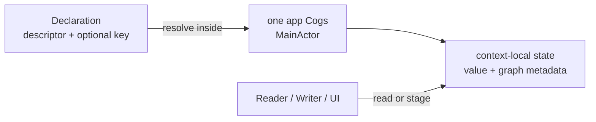
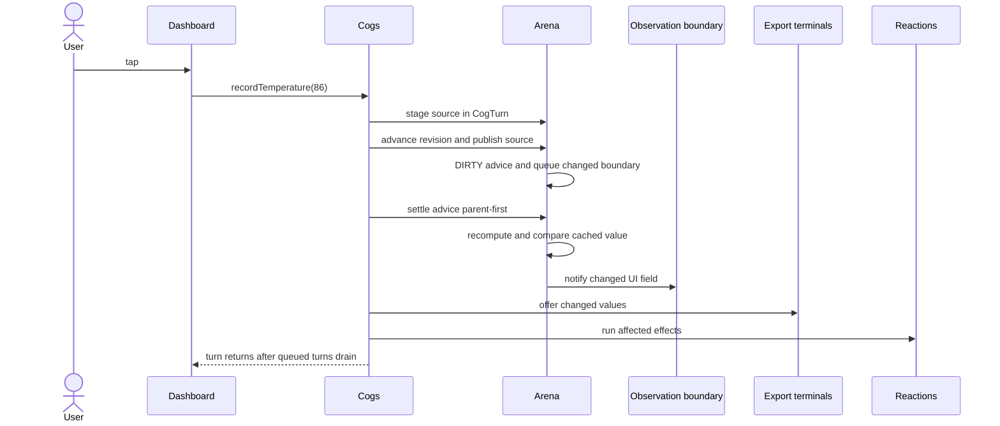
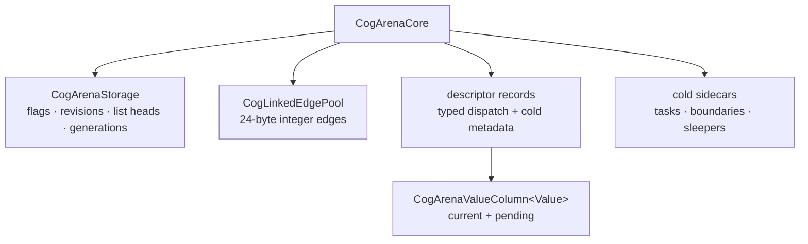

# Cog for Swift: architecture

_August 22, 2026_

This guide explains the implemented Swift runtime from the public declaration
to the arena row. Start here for the ten-minute model; follow the links when a
path needs source-level detail.

The guide uses one small thread throughout:

```swift
private let _temperatureCog = Cog<Double>.Manual { 68 }

let adviceCog = Cog<String> { c in
  let temperature = c[_temperatureCog]
  return temperature > 80 ? "Stay inside" : "Go outside"
}
```

`_temperatureCog` is writable state. `adviceCog` is a cached automatic
value. `Dashboard` is a UI boundary that may observe the result.

## The ten-minute model

One running app owns one MainActor-confined `Cogs`. `Cogs` owns the app's one
authoritative dependency graph. A test or preview may own a separate `Cogs`,
because it is a separate runtime rather than another island inside the app.

A declaration such as `_temperatureCog` is an immutable name and recipe.
It does not contain the temperature. A **state** is the mutable value,
dependencies, version stamps, and lifetime information that one `Cogs` creates
for a declaration and optional key. Copied references converge on the same
state inside that context.

The graph is lazy. A read resolves or creates a state, settles the exact path
needed for the answer, and returns the latest completed value. A write stages
source values inside a **turn**—one atomic publication. Async work selects its
dependencies synchronously, then publishes pending, success, or failure in
graph-owned turns.



The runtime has a cold, identity-facing side and a hot, integer-facing side.
Public references carry descriptor identity and an optional inline
`AnyHashable` key. Resolution maps that stable name to an internal slot. From
there, propagation and settlement walk dense integer rows and a shared edge
pool. Typed values remain in descriptor-owned columns.

## Three paths

### Read

`cogs[adviceCog]` resolves the automatic state, pulls stale dependencies
parent-first, computes only when needed, and returns the cached value. The UI
subscript also lazily attaches a Swift Observation boundary. `peek` performs
the same settlement but attaches neither Observation nor a graph dependency.

```swift
let advice = cogs[adviceCog]       // UI Observation access
let snapshot = cogs.peek(adviceCog) // current, deliberately untracked
```

Inside a selector or reaction, a reader subscript records a graph edge. Reads
made elsewhere do not become selector dependencies.

### Write

Application code calls a domain operation that wraps `turn`. A writer sees its
own staged source values. Ordinary readers continue to see the previous
completed revision until the outer turn body returns.

```swift
extension CogOps {
  func recordTemperature(_ value: Double) {
    turn(_temperatureCog, to: value)
  }
}
```

The flush publishes all sources together, pushes invalidation, settles only UI
roots that could have changed, notifies Observation, offers exported values,
runs effects, finishes the turn, and then drains turns queued during the flush.

### Async completion

A `Cog<Value>.Async` selector runs synchronously on the MainActor to choose a
`Work`.
The work may suspend elsewhere. Its completion returns to the context, proves
that both the slot and work generation are still current, then stages status in
a named graph-owned turn. Cancellation is advisory; generation and state
identity checks are the correctness boundary.

## One complete event

Suppose `Dashboard` reads `adviceCog`, then a button records 86 degrees.



In source terms, the handoff is:

1. A domain op reaches `Cogs.turn` and `CogArenaCore.writerStage`.
2. `CogTurn.flushPendingSources` advances the graph revision.
3. `CogArenaValueColumn.publishSource` publishes the final staged value and
   asks `CogArenaDirtyPropagation` to mark subscribers.
4. `CogArenaCore.flushObservationBoundaries` pulls `adviceCog` current.
5. `CogArenaCore.recompute` captures dependencies, compares the new value, and
   updates `changedAt` only if it changed.
6. The descriptor record notifies the lazily allocated
   `CogObservationBoundary`.
7. `Cogs.flushReactions` runs export terminals before effect terminals.
8. `Cogs.finishTurn` returns the context to idle; the FIFO then runs any
   write-back or async turns requested during the flush.

## What the arena is

An **arena** is context-owned storage that gives live states dense integer row
numbers. A **column** is one contiguous array indexed by those row numbers.
Scalar metadata—small graph facts such as flags and revisions—uses parallel
columns. Values of different Swift types cannot share one array, so each
descriptor owns a sparse typed column indexed by the same global rows.

A **revision** identifies one completed graph turn. `changedAt` records the
last revision in which a value actually changed; `checkedAt` records the last
revision through which a row was proved current. A **generation** distinguishes
the current occupant of a reusable row from a prior occupant at the same
index.



## Reading paths

- New to Cog: [State and graph](./state-and-graph.md), then
  [Turns](./turns.md), [Boundaries and effects](./boundaries-and-effects.md),
  and [Async and lifetime](./async-and-lifetime.md).
- Writing a feature: read those four concept chapters, then use the
  [codebase tour](./codebase-tour.md) to find examples and tests.
- Changing the runtime: continue through [Arena core](./arena-core.md),
  [identity and caching](./arena-identity-and-caching.md),
  [storage](./arena-storage.md), [edges](./arena-edges.md), and
  [settlement](./arena-settlement.md).
- Measuring code size or speed: finish with
  [specialization](./arena-specialization.md) and the authoritative
  [performance record](../perf.md).

## Glossary

| Term           | Meaning                                                                                       |
| -------------- | --------------------------------------------------------------------------------------------- |
| declaration    | Immutable descriptor and public reference recipe; it names state but stores no context value. |
| state          | One context's mutable record for a descriptor and optional key.                               |
| graph          | Producer-to-consumer dependency relationships inside one `Cogs`.                              |
| arena          | Dense, reusable row namespace and its context-owned storage.                                  |
| slot           | Internal row index plus occupant generation.                                                  |
| column         | Contiguous storage indexed by arena row.                                                      |
| metadata       | Non-domain data used to resolve, settle, observe, or release state.                           |
| turn           | One atomic publication and its ordered flush.                                                 |
| revision       | Monotonic number assigned to a turn's graph publication.                                      |
| generation     | Monotonic token rejecting stale row, async work, or sleeper use.                              |
| dependency     | A producer read by a selector or reaction.                                                    |
| subscriber     | The same edge viewed from its producer toward a consumer.                                     |
| settlement     | Pulling a requested row and stale ancestors to current values.                                |
| type erasure   | Storing differently typed descriptor resources behind a common runtime shape.                 |
| specialization | Client compilation of generic code for concrete value and key types.                          |
| boundary       | A cold object that adapts arena changes to Swift Observation.                                 |
| terminal       | A value-less arena consumer used by a reaction or export.                                     |

## Source of truth

This guide explains the implementation; it does not define a second runtime.
The public contracts remain in [core design](../../design/exploration.md),
[mechanisms](../../design/mechanisms.md), and the
[scenario ledger](../scenarios.md). Arena claims here follow the files under
`swift/Sources/Cog/Internal/` and their infrastructure tests. Historical or
rejected layouts remain in [impl/perf.md](../perf.md) and
[impl/perf-history.md](../perf-history.md).
