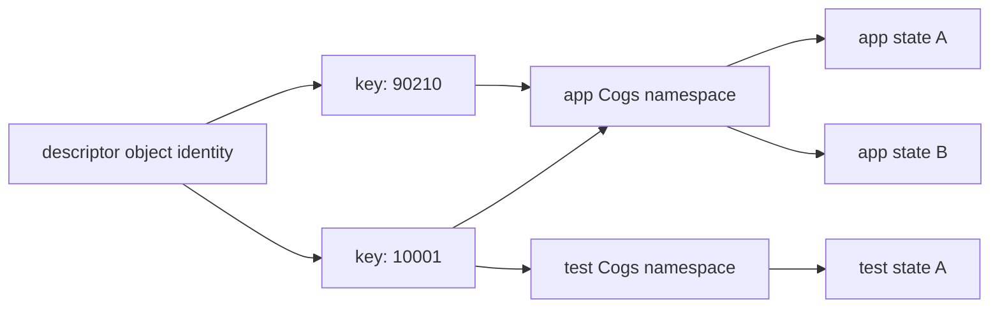
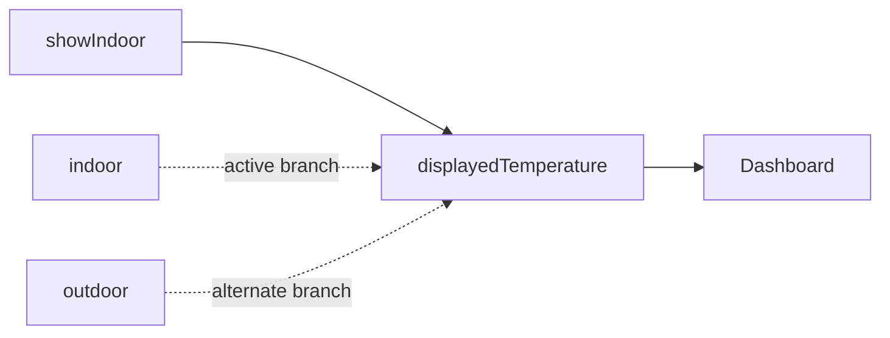

# State and graph

_August 22, 2026_

[Back to the architecture overview.](./index.md)

Cog separates declarations from the state they name. That distinction makes
one declaration reusable across the app, a test, and a preview without sharing
mutable values between those runtimes.

## Declaration shapes

`Cog<Value>.Manual` names one writable source. `Cog<Value>` names one cached
synchronous automatic value. `Cog<Value>.Async` names an async status state and
an internal equality-gated value projection. A box—`CogBox<Value, Key>.Manual`,
`CogBox<Value, Key>`, or `CogBox<Value, Key>.Async`—uses one public declaration
plus a key to name a family of independent states. Internally,
`CogBox<Value, Key>.Async` owns two descriptors: one for status and one for the
value projection.

```swift
private let _temperatureCog = Cog<Double>.Manual { 68 }
let adviceCog = Cog<String> { c in
  let temperature = c[_temperatureCog]
  return temperature > 80 ? "Stay inside" : "Go outside"
}
let forecastCogs = CogBox<Forecast, ZipCode>.Async(default: .empty) { _, zip in
  Work.run { try await service.forecast(for: zip) }
}
```

Read-only projections preserve ownership. `_someCog.readOnly` lets another
file read a source without gaining a writer spelling; the projection publishes
the source's name without its leading underscore. A projection shares the
source state identity; it is not mirrored state.

`Reader`, `ReactionReader`, and `Writer` are short-lived capabilities. A reader
records dependencies only during the selector or reaction run that created it.
A writer reads and replaces the pending overlay only during its turn. Escaped
use traps in every build.

## Identity

Each declaration retains an internal descriptor object. Within one `Cogs`, a
state is identified by that object's identity and an optional inline
`AnyHashable` key. Two declarations with the same label and initial value stay
different. Two copies of the same reference converge. Two different `Cogs`
give the same declaration independent state.



This identity rule is what “one graph” means at runtime. It is not a process
global. The app owns one namespace; each isolated test or preview owns another.

## Singular writable state

Every mutable domain fact represented in Cog has one source. Automatic values
derive from it; views pass normal values and identities, not copied sources or
`Cogs`. Do not create a view-local source to shadow app state.

Incorrect—two writable temperatures can disagree:

```swift
let _appTemperatureCog = Cog<Double>.Manual { 68 }
let _dashboardTemperatureCog = Cog<Double>.Manual { 68 }
```

Correct—one source and any number of derived views:

```swift
private let _temperatureCog = Cog<Double>.Manual { 68 }
let temperatureCog = _temperatureCog.readOnly
let celsiusCog = Cog { c in
  let temperature = c[_temperatureCog]
  return (temperature - 32) * 5 / 9
}
```

## Automatic cache and dependency graph

An automatic state's typed column stores its last completed value. Its arena
row stores graph metadata. On first demand Cog runs the selector and records
every reader subscript in order. Later demand returns the cache when the row is
clean. When upstream state changes, Cog marks possible paths and reruns only
the selectors needed by the requested boundary or reaction.

Dependencies are dynamic. Each completed run replaces the old read sequence
with the new one. A conditional selector may depend on `indoorCog` in one run
and `outdoorCog` in the next. The edge pool preserves the unchanged prefix and
replaces only the suffix from the first mismatch.

```swift
let displayedTemperatureCog = Cog<Double> { c in
  let showIndoor = c[_showIndoorCog]
  if showIndoor { return c[_indoorCog] }
  return c[_outdoorCog]
}
```



### Diamonds

A diamond is ordinary graph topology, not duplicate computation. If a source
feeds two arms and both feed a leaf, push invalidation may reach the leaf twice,
but flag strength and the shared row cut off duplicate branches. Pull settlement
makes each stale row current before its consumer and computes the leaf once.

```text
temperature → feelsHot ─┐
            → isSafe  ──┴→ advice
```

### Cycles

During automatic computation the row carries a `computing` bit and appears in
an ordered computing path. Reading a row already on that path is a cycle. Cog
formats the closed path with descriptor labels and keys and fails with
`fatalError`; it never returns a partial or previous value to disguise the
cycle.

## Tracked and untracked reads

The spelling determines future invalidation:

| Place        | Tracked                                            | Untracked                   |
| ------------ | -------------------------------------------------- | --------------------------- |
| SwiftUI body | `cogs[valueReference]` through Observation         | `cogs.peek(valueReference)` |
| selector     | `c[valueReference]` through an arena edge          | `c.peek(valueReference)`    |
| reaction     | `c[valueReference]` through an arena terminal edge | `c.peek(valueReference)`    |

All of them return a current value. “Untracked” means no future dependency, not
“possibly stale.”

Incorrect—this read occurs outside the supplied reader, so `adviceCog` does
not depend on temperature:

```swift
let adviceCog = Cog<String> { _ in
  let temperature = cogs.peek(_temperatureCog)
  return temperature > 80 ? "Stay inside" : "Go outside"
}
```

Correct—read through `c`:

```swift
let adviceCog = Cog<String> { c in
  let temperature = c[_temperatureCog]
  return temperature > 80 ? "Stay inside" : "Go outside"
}
```

Use `peek` only when the value should affect this run but should not schedule a
later run. In a reaction, for example, a tracked `enabledCog` may gate the body
while a peeked timestamp supplies context that does not itself trigger it.

## `curr`: previous value without a self-edge

Inside an automatic selector, `c.curr` returns that same state's previous
completed value, if one exists. It creates no self-dependency. This supports
stateful derivation without inventing another writable source.

```swift
let peakCog = Cog<Double> { c in
  let temperature = c[_temperatureCog]
  return max(c.curr ?? temperature, temperature)
}
```

Incorrect—reading `peakCog` through the reader while computing it is a cycle,
not a previous-value request:

```swift
// Pseudocode — the declaration cannot safely refer to itself this way.
return max(c[peakCog], temperature)
```

## Async value and status dependencies

`c[forecastCog]` reads an internal automatic value projection. It returns the
last accepted success or the declaration's default, and equality can keep a
consumer quiet across an equal reload. `c.status[forecastCog]` depends on the
async status row itself; pending, success, and failure each invalidate it.

At the UI boundary, the status lens is finer still: obtaining a `CogStatus`
observes nothing by itself, and reading `kind`, `value`, `hasSucceeded`,
`error`, or `isLoading` records that field's Observation key path.

## Key isolation

Box keys are part of state identity and edge topology. Reading
`forecastCogs[home]` creates no relationship with `forecastCogs[office]`.
Writing, invalidating, refreshing, cancelling, observing, and releasing one key
does not touch another.

```swift
let home = c[forecastCogs[homeZip]]
let office = c[forecastCogs[officeZip]]
return Comparison(home: home, office: office)
```

Use a box when the domain fact is truly keyed. Do not pack an entire keyed
dictionary into one source merely to look up one member: every change would
then publish the whole dictionary state and invalidate all consumers of it.

## Rules to keep

- Declarations name state; `Cogs` stores it.
- One mutable fact has one writable source.
- Use a reader subscript for dependencies and `peek` for intentional snapshots.
- Use `curr` for the active automatic state's previous value.
- Read each value flatly into a domain local; do not hide graph reads in a
  projection struct.
- Use boxes for per-key isolation, and pass keys—not `Cogs`—between views.

Next: [turns and publication order](./turns.md).
