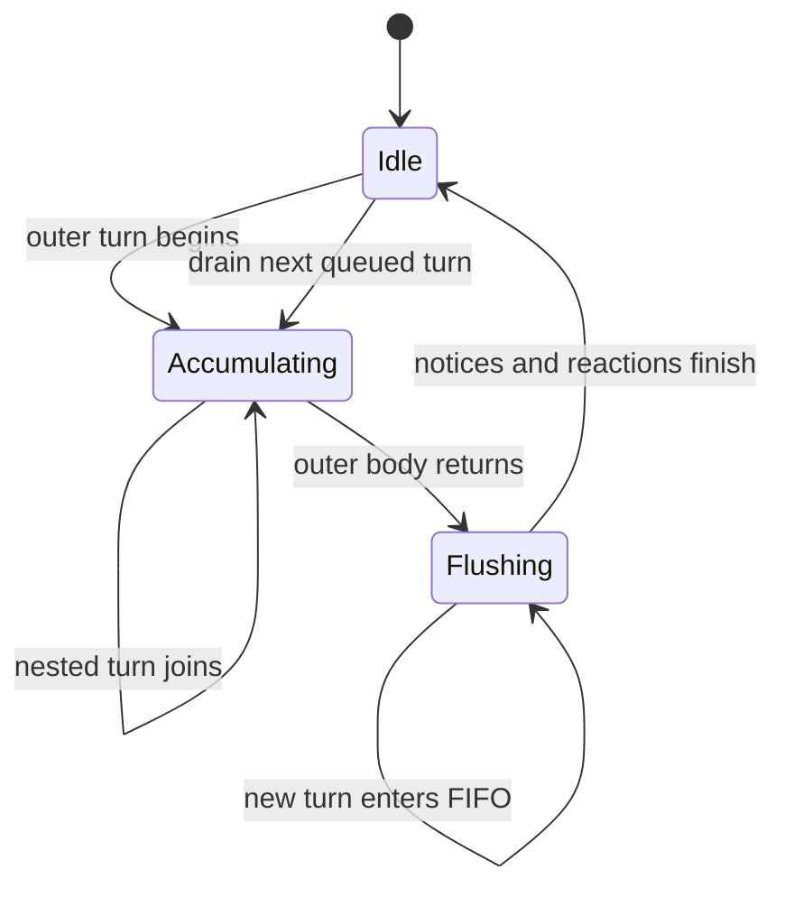
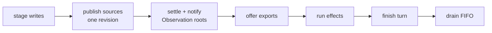
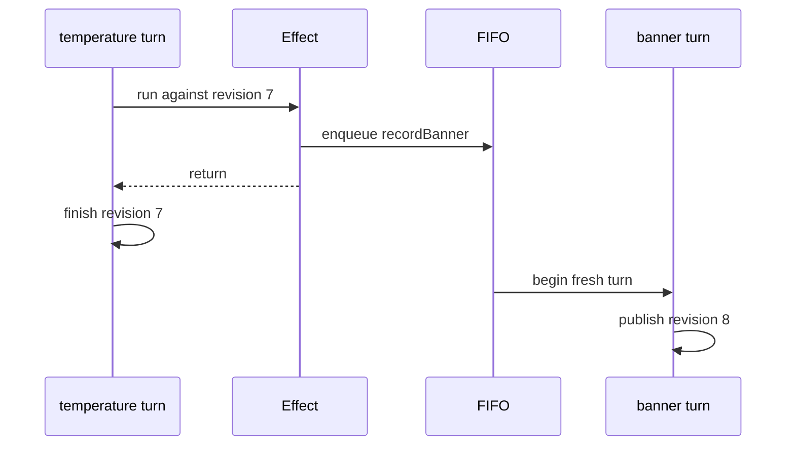

# Turns

_August 22, 2026_

[Back to the architecture overview.](./index.md)

A turn is one synchronous, atomic publication. Its body stages source values;
its flush makes the final values visible together and completes every boundary
and reaction phase before the next turn begins.

## `Cogs`, `CogTurn`, and `Writer`

`Cogs` owns one reusable `CogTurn`. Turns never overlap: a nested operation
joins the active accumulating turn, while a turn requested during a flush waits
in one FIFO. Reusing the turn object and its touched-source buffer preserves
their high-water capacity.

`Writer` carries the `Cogs` and a monotonic `CogTurnID`. Each read or write first
proves that ID still belongs to the accumulating turn. A saved writer cannot
operate in a later turn even if the reusable `CogTurn` object is the same.



Application code wraps the primitive in domain vocabulary:

```swift
extension CogOps {
  func recordTemperature(_ value: Double) {
    turn(temperatureSourceCog, to: value)
  }
}
```

Views and effects call `cogs.recordTemperature(86)`, not `turn` directly.

## Staging and read-your-writes

Each descriptor-owned value column has separate current and pending cells. An
ordinary read uses current—the latest completed turn. A writer read uses
pending when present, otherwise current. Repeated writes replace one pending
cell, and the row's `touched` bit adds its slot to the turn buffer only once.

```swift
cogs.turn(named: "increment twice") { c in
  c[countSourceCog] += 1
  c[countSourceCog] += 1
  #expect(c[countSourceCog] == 2)
  #expect(cogs.peek(countSourceCog) == 0)
}
```

Only the final staged value is compared with current. Writing `1`, then `0` to
a source whose current value is `0` consumes the pending cell but leaves the
current value and source revision stamps unchanged, sends no invalidation, and
produces no notice. The enclosing outer turn still advances the arena's global
revision.

## Atomic multi-source updates

A turn publishes every touched source under one new revision before it settles
UI roots or runs effects. Consumers never observe a half-updated pair.

```swift
cogs.turn(named: "move reading") { c in
  c[temperatureSourceCog] = 86
  c[humiditySourceCog] = 40
}
```

A selector that reads both values may run during the flush only after both
source publications. A reaction triggered by either reads the same completed
revision.

## Exact flush order

`Cogs.runOuterTurn` implements this order:

1. `CogTurn.flushPendingSources` advances the arena revision once and publishes
   every final staged source in writer order.
2. `flushObservationBoundaries` settles changed UI roots, then sends their
   Observation mutations in boundary-creation order.
3. `flushReactions` schedules and runs changed export terminals.
4. The same reaction flush runs changed effect terminals after all exports.
5. `finishTurn` returns the context to idle.
6. The caller drains queued application and graph-owned turns in FIFO order.



Exports and effects share value-less arena reaction terminals, but their
registries are separate. This guarantees phase order even when an export was
registered after a mechanism reaction. Within a phase, registration order is
stable.

## Revisions and equality

The arena's `UInt32` revision advances for every outer turn, including a named
empty system turn. A source's `changedAt` and `checkedAt` advance only when its
final staged value passes equality. An automatic recomputation always advances
`checkedAt`; it advances `changedAt` only when its computed value changes.

Example at revision 7:

| Row         | Before                       | Publication   | After    |
| ----------- | ---------------------------- | ------------- | -------- |
| temperature | `changedAt=4`, `checkedAt=4` | 68 → 86       | `7`, `7` |
| advice      | `changedAt=4`, `checkedAt=4` | “Go” → “Stay” | `7`, `7` |

If temperature changes from 68 to 70 while advice remains “Go,” advice becomes
`checkedAt=7` but keeps `changedAt=4`. A downstream row can then prove that its
dependency did not change since its prior check and skip its selector.

## Nested turns

A nested operation called while the phase is accumulating receives the same
`CogTurn`. It does not create another revision or publish early.

```swift
func recordComfort(_ c: Writer) {
  c[temperatureSourceCog] = 72
  c[humiditySourceCog] = 45
}

cogs.turn(named: "restore comfort") { c in
  recordComfort(c)
}
```

At the application surface, nested domain ops behave the same way: their
primitive turns join the outer accumulation. The outermost name owns the turn's
history entry.

## Flush-time queuing

Observation callbacks, exports, effects, and async completions may request
another turn while a flush is active. They cannot reenter publication. `Cogs`
stores the name and staging closure in `queuedTurns`; the outer turn completes,
then an indexed loop runs the FIFO. Entries appended while that loop runs join
its tail.

```swift
m.run { c in
  let advice = c[adviceCog]
  if advice == "Stay inside" {
    cogs.recordBanner("Heat advisory") // later FIFO turn
  }
}
```

That effect reads the completed temperature turn. Its write-back becomes a new
revision after all effects for the current revision finish.



This same queue carries graph-owned async status turns that arrive while a
selector or reaction is tracking. `canRunSystemTurnImmediately` requires both
an idle turn phase and idle settlement/capture stacks.

## Automatic computation is read-only

An application turn cannot start while an automatic or async selector is
computing. The guard runs before state lookup and names both the attempted turn
and active cog. This includes selector equality and dependency reconciliation,
not only the closure body.

Graph-owned pending publication is the narrow exception. An initial async read
may need to establish pending while its selector is active, so the runtime
queues an internal system turn and drains it after tracking and settlement
finish. Application code cannot access this path.

## Equal writes and empty turns

An equal write still has a turn boundary and therefore a revision, but the
source preserves its older stamps and sends no invalidation. This distinction
keeps global history ordered without manufacturing value changes.

```swift
cogs.recordTemperature(68) // current is already 68
// turn exists; temperature changedAt remains unchanged
```

An empty system turn can be meaningful because initial pending may have been
installed synchronously as the baseline before the named turn could safely
flush. Advancing the revision preserves named event order even when no pending
cell remains to publish.

## Rules to keep

- Normal reads see only completed turns; writer reads see their staged overlay.
- An outer body is synchronous and publishes all final source values atomically.
- Nested accumulation joins; flush-time work queues.
- Publication, UI notices, exports, and effects never reenter one another.
- Equal values consume pending storage but preserve old `changedAt`.
- Application selectors never write. Effects and event handlers call domain
  operations that open later turns.

Next: [boundaries and effects](./boundaries-and-effects.md).
